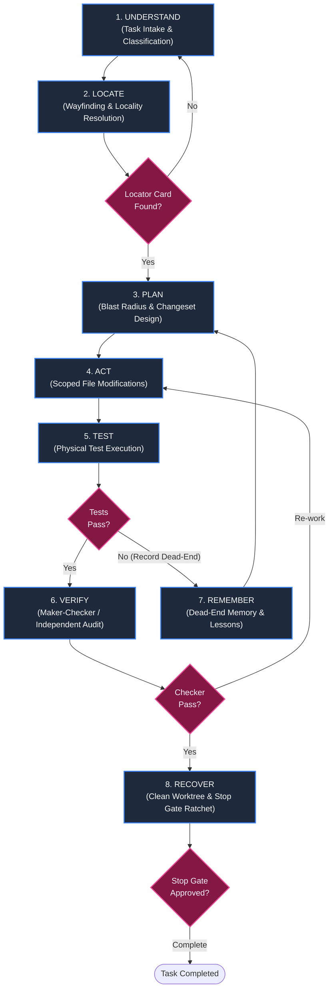

# AntiOS Agent Workflow Map (`PHASE27_AGENT_WORKFLOW_MAP.md`)

**Date**: 2026-09-04  
**Status**: APPROVED & OPERATIONAL  
**Version**: 2.7.0  
**Target Audience**: Autonomous AI Agents, Human Developers, Orchestration Frameworks  

---

## 1. The 8-Stage Agent Engineering Journey

AntiOS structures all software engineering operations into an 8-stage deterministic state machine.
Agents must never jump straight from an incoming request to code modification. They must **LOCATE FIRST**.



---

## 2. Detailed Stage Contracts

### Stage 1: UNDERSTAND (Task Intake)
- **Goal**: Ingest the user prompt, issue, or feature request. Classify intent (`FEATURE`, `BUG`, `REFACTOR`, `MAINTENANCE`) and determine initial risk tier (`LOW`, `MEDIUM`, `HIGH`).
- **Tools**: `view_file` (viewing issues, specs, or logs).
- **Invariants**:
  - Do NOT modify any files.
  - Do NOT spawn subagents.
- **Output**: Initial task understanding and search keywords.

---

### Stage 2: LOCATE (Cognitive Wayfinding)
- **Goal**: Answer *"Where should I look?"* before answering *"What should I change?"*.
- **Tool**: `python framework/scripts/tools/navigate_repo.py --query <keyword>` or `--file <path>`.
- **Engine**: `WayfindingEngine` (C-35) multi-key inverted index.
- **Output**: Bounded Locator Card ($\le 20$ lines):
  ```text
  === ANTIOS WAYFINDING LOCATOR ===
  Query:       billing (Confidence: 1.00)
  Subsystem:   billing (Billing & Payments) [Area: finance]
  Description: Processes customer invoices and Stripe subscriptions
  Entrypoints: src/billing/checkout.py
  Key Files:   src/billing/checkout.py, src/billing/types.py
  Tests:       tests/test_billing.py
  Runners:     pytest tests/test_billing.py
  Skills:      antios-engineer | Workflows: FEATURE, BUG
  Invariants:  Immutable: src/billing/crypto.py
  Rules:       Strict idempotency on payment charges
  Radius:      CAUTION: 3 downstream consumers depend on this component
  Docs:        docs/subsystems/billing.md
  =================================
  ```
- **Context Sync**: Synchronize `active_subsystem = "billing"` into `docs/ACTIVE_CONTEXT.md` ($\le 60$ lines).

---

### Stage 3: PLAN (Implementation & Blast Radius)
- **Goal**: Author minimal, surgical change specification.
- **Checks**:
  - Identify blast radius from Locator Card (`consumers`).
  - Verify protected invariants (`protected_invariants`).
  - Formulate Same Change Set payload: (1) code changes, (2) unit test additions, (3) documentation updates.
- **Artifact**: `implementation_plan.md` in session artifact directory.

---

### Stage 4: ACT (Scoped Modification)
- **Goal**: Execute code edits strictly inside the target subsystem boundary.
- **Tools**: `replace_file_content`, `write_to_file`.
- **Invariants**:
  - **Tool Execution Guard** (C-01): Fail-closed deny on `.agents/` and `framework/` or protected domain cores.
  - No edits outside the active subsystem boundary without explicit re-wayfinding.

---

### Stage 5: TEST (Physical Toolchain Execution)
- **Goal**: Execute the physical test suite targeting the modified component.
- **Tool**: `run_command` with runner discovered during Stage 2:
  ```bash
  pytest tests/test_billing.py
  ```
- **Invariants**:
  - Verbal assertions of success are zero-trust.
  - Test command must exit with code 0.
  - If tests fail, record root cause in Dead-End Memory (`framework/core/memory.py`) and return to Stage 3.

---

### Stage 6: VERIFY (Independent Maker-Checker Audit)
- **Goal**: Fresh-context independent verification for high-risk or cross-subsystem tasks.
- **Dispatch**:
  - Dispatch Checker subagent (`antios-verifier`) via `invoke_subagent`.
  - Checker operates at Shallow Depth 2 (no subagent spawning).
- **Checks**:
  - Audit `git status --porcelain` and `git diff`.
  - Re-run full test command in fresh context.
  - Validate boundaries and Same Change Set.
  - Emit machine-verifiable JSON verdict:
    ```json
    {
      "status": "PASS",
      "risk_tier": "HIGH",
      "files_audited": ["src/billing/checkout.py", "tests/test_billing.py", "docs/subsystems/billing.md"],
      "tests": [{"command": "pytest tests/test_billing.py", "exit_code": 0, "passed": true}],
      "same_change_set_verified": true,
      "summary": "Verified idempotency fix without regressions."
    }
    ```

---

### Stage 7: REMEMBER (Dead-End & Knowledge Capture)
- **Goal**: Capture failed hypotheses and distill reusable patterns to avoid repeated loops.
- **Tools**:
  - `DeadEndMemory` (C-29): Log dead-end approaches and failure reasons to disk.
  - `LessonDistiller` (C-30): Persist generalizable engineering insights.
- **Context Sync**: Update `ACTIVE_CONTEXT.md` with active blockers or distilled insights.

---

### Stage 8: RECOVER & COMPLETE (Stop Gate Ratchet)
- **Goal**: Final verification before concluding the task.
- **Pre-Completion Checks**:
  1. **Working Tree Cleanliness** (C-06): No untracked scratch files, uncommitted changes, or merge conflict markers.
  2. **Same Change Set** (C-09): Code accompanied by tests and docs.
  3. **Staleguard Layer 1 Reference Auditor** (C-37):
     ```bash
     python framework/scripts/tools/audit_docs.py --all
     ```
     Verifies zero dead links, missing files, or invalid test commands in modified documentation.
  4. **Stop Gate Ratchet** (C-02): Evaluates hook input. Denies task completion if any invariant fails.
- **Result**: Task marked `COMPLETE` with clean, verified working tree.

---

## 3. Tool Tiering Hierarchy

AntiOS enforces a clear distinction between tool layers:

| Tier | Characteristics | Examples | When Used |
|:---|:---|:---|:---|
| **Tier 1: Native Tools** | Built directly into Antigravity platform; fast, in-process, privileged. | `run_command`, `view_file`, `replace_file_content`, `write_to_file`, `invoke_subagent` | Universal primitives across all stages |
| **Tier 2: CLI Scripts** | Deterministic Python scripts in repository; zero dependencies, auditable, run via `run_command`. | `navigate_repo.py`, `audit_docs.py`, `run_all.py` | Agent wayfinding, documentation audits, test suite runner |
| **Tier 3: MCP Tools** | External Model Context Protocol servers; specialized integrations. | `github-mcp-server`, `playwright`, `gemini-api-docs` | External services and specialized browser/platform interaction |

Agents should always prefer **Native Tools** and **CLI Scripts** for core development workflows to maintain reproducibility and zero-dependency guarantees.
