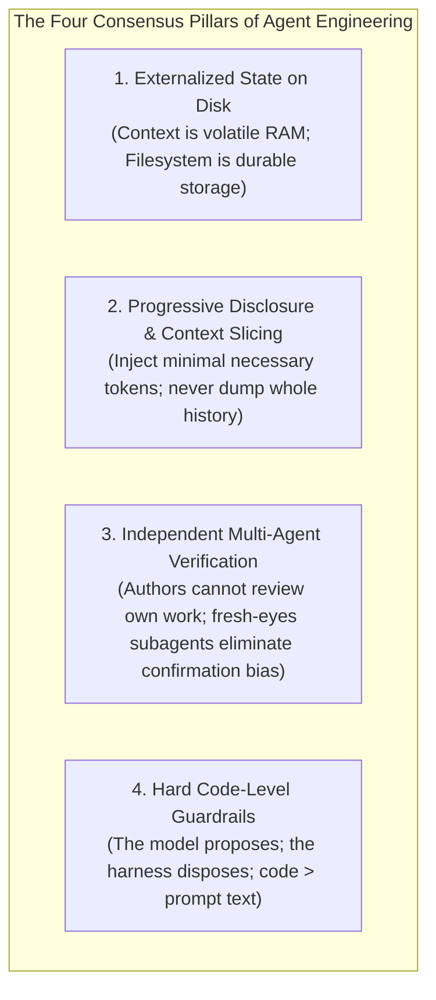

# PRIOR-ART RESEARCH SYNTHESIS: TOP-5 FORENSIC INVESTIGATION

## Executive Summary
This synthesis brings together the forensic evidence, architectural reverse-engineering, and empirical testing conducted across five premier open-source AI agent frameworks:
1. `eai-org/agent-toolkit` (Commit `5239bc9`)
2. `obra/superpowers` (Commit `b36e082`, Release `v6.3.0`)
3. `OthmanAdi/planning-with-files` (Commit `03128b2`, Release `v3.16.0`)
4. `anthropics/skills` (Commit `5304866`)
5. `nderman/agent-harness` (Commit `c0253dd`)

Across these repositories, we analyzed over 250 source and documentation files, ran live test and eval suites (such as `agent-harness` executing 104 tests in 2.91s offline), tracked git architectural evolutions, extracted 39 schema-compliant architectural ideas, and mapped patterns to StudyLab's mission: **building an agent-native engineering framework for a mathematics-focused Anki learning platform**.

---

## 1. What patterns repeatedly appear in strong agent systems?

Across all high-performing agent repositories, four architectural patterns appeared independently, proving they are foundational industry consensus rather than isolated clever tricks:

1. **Externalized State on Disk (Context is Volatile RAM)**:
   - `agent-toolkit` uses `.agents/plans/` markdown handoffs.
   - `superpowers` uses `.superpowers/sdd/<plan>/progress.md` ledgers.
   - `planning-with-files` uses the `task_plan.md` / `findings.md` / `progress.md` triad.
   - `agent-harness` uses committed JSON cassettes, baselines, and traces.
   - *Consensus Law*: Never rely on conversational in-memory context for long-term mission state. When context compacts, wipes, or crashes, the filesystem must hold the complete ground truth.

2. **Progressive Disclosure & Context Slicing**:
   - `anthropics/skills` pioneered the 3-tier catalog model (~100 token Tier 1 catalog -> <500 line Tier 2 instructions -> Tier 3 tools).
   - `superpowers` uses `task-brief` to slice *only* Task N to implementers and `review-package` to slice diffs to reviewers.
   - `planning-with-files` uses `inject-smart` to inject only the Title, Goal, Next Step, and active phase (~150-250 tokens).
   - *Consensus Law*: Saturated context windows produce the "Dumb Zone." High-performing systems strictly meter token exposure.

3. **Independent Multi-Agent Verification**:
   - `agent-toolkit` uses `/fresh-eyes-review` with stripped reasoning.
   - `superpowers` enforces a two-stage review with an independent review subagent.
   - `anthropics/skills` uses dual-arm subagent runs with randomized blind comparators.
   - *Consensus Law*: A model evaluating its own work suffers from systematic confirmation blindness. Verification must be executed by an isolated agent or deterministic code.

4. **Hard Code-Level Guardrails (The Model Proposes; The Harness Disposes)**:
   - `agent-harness` demonstrates a two-gate architecture (Gate 1 strict Zod schema + Gate 2 domain state policy).
   - `superpowers` maps rationalizations to non-negotiable Iron Laws.
   - `planning-with-files` uses Win32/POSIX OS-level symlink checks and SHA-256 attestation.
   - *Consensus Law*: Prompt instructions alone cannot guarantee safety. Safety boundaries must be enforced by deterministic code gates that the LLM cannot bypass.

---

## 2. Which patterns appear most mature?

The most mature patterns are those supported by rigorous automated test suites, measurable benchmarks, and production-tested error handling:

1. **Three-Tier Progressive Disclosure (`anthropics/skills`)**:
   - Mature because it is now an adopted open standard (`agentskills.io`).
   - Solves the scaling problem: an agent can have access to 100+ skills without token bloat, activating instructions only when triggered.
   - Clean separation of deterministic script execution (OOXML, PDF, Python calculations) in subshells with zero prompt context cost.

2. **Client-Seam Recording & Replay (`nderman/agent-harness`)**:
   - Proven by 18 test files and 104 vitest tests executing in 2.91 seconds with zero API calls.
   - Intercepting at the application interface (`ModelClient`) rather than the HTTP transport provides semantic, human-readable cassettes that diff cleanly in Git PRs.
   - Canonical fingerprinting converts subtle prompt regressions into loud CI build failures.

3. **Deterministic Faithfulness Checking (`nderman/agent-harness`)**:
   - Proves that safety-critical output validation does not require a nondeterministic LLM judge.
   - Structurally cross-checking the terminal resolution against the execution trace event array is fast, cheap, and 100% reproducible.

4. **Cognitive Defense Tables (`obra/superpowers`)**:
   - Matures prompt engineering from polite suggestions into binding behavioral constraints.
   - Directly tackles the psychological failure modes of frontier models (laziness, rationalization, premature completion claims).

---

## 3. Which patterns are unique but compelling?

Several patterns appeared in only a single repository but represent brilliant architectural innovations:

1. **Fault-Injection Model Client Decorator (`nderman/agent-harness`)**:
   - Solves the dilemma of testing safety guardrails when well-behaved models naturally refuse to do bad things.
   - Hijacks a specific model turn to force an unsafe tool call, proving end-to-end that downstream guardrails catch the violation and the agent recovers gracefully.

2. **Five-Round Fix Loop with Model Capability Escalation (`obra/superpowers`)**:
   - Solves infinite review nitpicking loops by escalating model reasoning power (Rounds 1-3 in-place -> Rounds 4-5 upgrade to Pro model -> Round 5 circuit breaker controller adjudication).

3. **Hardware-Aware Nonce-Delimited Context Framing (`OthmanAdi/planning-with-files`)**:
   - Solves delimiter confusion and prompt injection amplification when external untrusted data is ingested into persistent plan files.
   - Dynamic SHA-256 nonces combined with OS-level `O_NOFOLLOW` / `FILE_FLAG_OPEN_REPARSE_POINT` prevent directory traversal escapes.

4. **Automated Trigger Description Optimization Loop (`anthropics/skills`)**:
   - Solves undertriggering and overtriggering by treating prompt tuning as an empirical ML problem with 20 queries, train/test splits, and held-out validation.

5. **Memory-as-Inbox Pattern (`eai-org/agent-toolkit`)**:
   - Solves `MEMORY.md` rot by treating memory as a temporary inbox, regularly triaged into permanent project rules and documentation.

---

## 4. Which patterns are over-engineered?

We identified several patterns that introduce significant complexity, fragility, or operational friction without delivering commensurate architectural value:

1. **Manual Session Killing between Micro-Tasks (`eai-org/agent-toolkit`)**:
   - Halting the agent after every 15-minute task and demanding the human copy-paste a new CLI command destroys autonomous developer flow.
   - Context reset should be managed programmatically or via isolated subagent dispatch, not manual human terminal manipulation.

2. **Seven-File Plan Fragmentation (`eai-org/agent-toolkit`)**:
   - Splitting task state across `.REQUIREMENTS.md`, `.PLAN.md`, `.DECISIONS.md`, `.TICKET-STATUS.md`, `.SELF-REVIEW.md`, `.HANDOVER.md` creates directory clutter and parsing overhead.

3. **Dual-Stack POSIX Bash + Windows PowerShell Shell Duplication (`OthmanAdi/planning-with-files`)**:
   - Maintaining identical logic across Bash and PowerShell creates severe platform parity bugs (e.g. quote handling, regex dialect differences).
   - Core orchestrator tools must be built in a single unified cross-platform runtime (Python or TypeScript).

4. **Embedded Background WebSocket Servers in Toolkits (`obra/superpowers`)**:
   - Spawning background Node.js servers (`server.cjs`) for visual companion features causes orphan process leaks, port conflicts, and firewall warnings.
   - Desktop and visual capabilities should leverage native IDE webviews or static Generative UI artifacts.

5. **Order-Strict Trajectory Assertions (`nderman/agent-harness`)**:
   - Forcing tools to execute in an exact fixed sequence causes false test failures when an agent performs read-only lookups in a different but valid order.

---

## 5. What should StudyLab probably adopt?

These patterns have decisive empirical backing and directly address StudyLab's mathematics and Anki learning platform requirements:

1. **Deterministic Script vs LLM Reasoning Separation (`anthropics/skills`)**:
   - Mathematics card generation requires zero-error formatting. All SQLite database writes, `.apkg` ZIP packaging, LaTeX compilation checks, and cloze syntax validation must be handled by deterministic Python tools (`studysource-core`), freeing LLMs to focus entirely on mathematical pedagogy.
2. **Two-Gate Guardrail Architecture (`nderman/agent-harness`)**:
   - Gate 1 validates note schema, field count, and math markup; Gate 2 enforces domain invariants (deck namespace protection, Anki card model integrity, non-duplication).
3. **Cognitive Defense Anti-Rationalization Tables (`obra/superpowers`)**:
   - Prevent agents from taking shortcuts when generating complex mathematical proofs, derivations, and step-by-step flashcard explanations.
4. **Subagent Brief Slicing & Review Packages (`obra/superpowers`)**:
   - Prevent parent context bloat by passing only the single assigned curriculum unit to generation workers and only the generated cards/diff to reviewers.
5. **Durable 3-File Working Memory Triad (`planning-with-files`)**:
   - Externalize study lab generation state into Roadmap (`study_plan.md`), Knowledge Base (`subject_knowledge.md`), and Execution Progress (`generation_progress.md`).
6. **Client-Seam Recording/Replay Testing Harness (`nderman/agent-harness`)**:
   - Freeze agent interactions into semantic cassettes to run fast, deterministic, zero-cost regression tests in CI across Anki deck generation suites.

---

## 6. What should StudyLab probably adapt?

These concepts are structurally sound but must be tailored to StudyLab's specific domain:

1. **5-Guard Termination Oracle $\rightarrow$ StudyLab Pedagogical Completion Oracle**:
   - Adapt the stop gate to check: (1) target card quota satisfied, (2) cloze syntax valid via `validate_artifact`, (3) subject policy resolved via `resolve_subject_policy`, and (4) stall cap not exceeded.
2. **Structure-Aware Smart Injection (`inject-smart`) $\rightarrow$ Curriculum AST Slicing**:
   - For multi-unit math syllabi, inject only the current theorem/topic and immediate prerequisites, keeping turn context under 250 tokens.
3. **Teach-Back Verification Gate $\rightarrow$ Pedagogical Mastery Gate**:
   - Require agents to summarize mathematical prerequisites and core conceptual learning goals before authoring flashcard decks.
4. **Verbatim Requirement Status Ledger $\rightarrow$ Curriculum Coverage Matrix**:
   - Map every syllabus learning objective directly to generated Anki card IDs, proving complete curriculum coverage.
5. **Three-Path Router $\rightarrow$ StudyLab Complexity Classifier**:
   - Route math authoring into:
     - *Quick Exercise*: Simple single-card creation.
     - *Standard Topic*: 10-20 cloze cards with explanations.
     - *Deep Conceptual Module*: Interactive math visualizations with connected procedural cards.

---

## 7. What should StudyLab experiment with?

Promising capabilities that require empirical testing during Phase 5:

1. **Automated Skill Trigger Description Optimization Loop**:
   - Experiment with generating 20 student math prompts and optimizing StudyLab's skill descriptions to maximize triggering accuracy.
2. **Dual-Arm Blind A/B Comparator Benchmarking**:
   - Test flashcard quality: Compare cards generated with explicit step-by-step derivations against standard cloze cards using a blind evaluator agent.
3. **Fault Injection for Deck Integrity Testing**:
   - Inject corrupted Anki SQLite schemas and malformed LaTeX tags to test StudyLab's runtime error recovery.
4. **Cryptographic Attestation on Curriculum Plans**:
   - Evaluate whether SHA-256 plan locking prevents rogue worker agents from mutating approved mathematical curricula.

---

## 8. What should StudyLab explicitly avoid?

Patterns that must not be copied into StudyLab:

1. **Manual CLI Session Terminations**: Reject halting workflows to force human terminal copy-pasting.
2. **Dual-Stack Shell Scripting**: Reject maintaining dual Bash and PowerShell script suites. Build all tools in Python.
3. **Background Daemon Web Servers**: Reject background HTTP/WebSocket companion servers.
4. **Rigid Trajectory Sequence Matching**: Reject asserting exact tool invocation order in integration tests.
5. **Multi-File State Fragmentation**: Reject scattering state across 6-7 files per task.

---

## 9. What questions remain unanswered?

1. **Cross-Platform Hermetic Tool Replay**: How can we record and replay tool *outputs* (e.g. SQLite queries, Anki deck exports) alongside model responses so that the entire integration test runs hermetically without an active database?
2. **Dynamic Skill Loading at Scale**: When StudyLab supports hundreds of specialized mathematics sub-domains (Topology, Differential Geometry, Number Theory), how do we structure Tier 1 metadata without exceeding the system prompt budget?
3. **Subagent Context Token Allocation**: What is the optimal token ratio between parent orchestrator context and subagent worker context during large-scale curriculum generation?

---

## 10. What should be tested in Phase 5?

Phase 5 (Experimental Prototyping) should execute targeted experiments:

1. **Experiment 1 (The Offline Replay Harness)**:
   - Build a minimal `ModelClient` seam in Python/TypeScript. Record a 3-step StudyLab card generation session into a JSON cassette. Verify that Vitest/Pytest replays the session offline in <100ms with zero token cost.
2. **Experiment 2 (The Two-Gate Guardrail Prototype)**:
   - Implement Gate 1 (strict schema validation of Anki notes) and Gate 2 (database invariant and duplicate check). Test with both valid cards and fault-injected malicious/corrupt cards.
3. **Experiment 3 (Curriculum AST Slicing Benchmark)**:
   - Take a 50-card calculus syllabus. Compare token consumption between dumping the full syllabus vs injecting sliced single-unit briefs using smart injection.
4. **Experiment 4 (Blind A/B Pedagogical Comparator)**:
   - Generate two variants of a calculus card deck and run a blinded comparator subagent to score mathematical accuracy and educational utility.

---

> [!NOTE]
> **Boundary Adherence Note**: This document strictly synthesizes prior-art findings and identifies architectural implications. In accordance with instructions, the final StudyLab folder structure, skill hierarchy, rule hierarchy, agent topology, and verification architecture have **NOT** been decided and are reserved for the subsequent synthesis phase.
