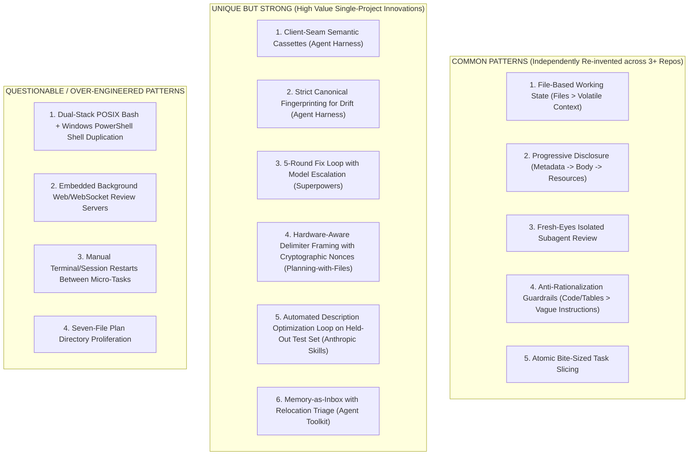

# TOP-5 PRIOR-ART ARCHITECTURAL COMPARISON & BEST-OF-BREED MATRIX

## Executive Summary
This document synthesizes forensic findings across five landmark open-source agent architectures:
1. `eai-org/agent-toolkit` (Commit `5239bc9`)
2. `obra/superpowers` (Commit `b36e082`, Release `v6.3.0`)
3. `OthmanAdi/planning-with-files` (Commit `03128b2`, Release `v3.16.0`)
4. `anthropics/skills` (Commit `5304866`)
5. `nderman/agent-harness` (Commit `c0253dd`)

---

## 1. Multi-Dimensional Comparison Matrix

| Capability / Dimension | 01: Agent Toolkit | 02: Superpowers | 03: Planning-with-Files | 04: Anthropic Skills | 05: Agent Harness |
| :--- | :--- | :--- | :--- | :--- | :--- |
| **Architecture** | Unidirectional phase pipeline (RPAC); manual session boundaries. | Persistent controller orchestrating transient implementer & reviewer swarms (SDD). | Hook-driven context framing with persistent disk working memory. | Three-tier progressive disclosure catalog; out-of-context script runner. | Seam-intercepted agent loop; two-gate guardrail layer; event-sourced trace. |
| **Skills Structure** | Task-oriented workflow folders; standard `SKILL.md`. | Action-oriented skills with strict Iron Laws & prompt checklists. | Single comprehensive skill with platform adapters. | Industry-standard `.skill` packaging; Tier 1 metadata, Tier 2 instructions, Tier 3 tools. | Embedded `shipit` pre-commit workflow skill. |
| **Rules Architecture** | Modular path-scoped rules; minimal root router `AGENTS.md`. | Global Iron Laws; cognitive defense tables mapping excuses to rules. | Embedded invariants in hook dispatchers and skill text. | Frontmatter YAML parameters (`name`, `description`, `allowed-tools`). | Hard rules in `AGENTS.md` (offline default, determinism). |
| **Planning System** | Markdown plan files (`.REQUIREMENTS.md`, `.PLAN.md`, `.TICKET-STATUS.md`). | Bite-sized 2-5 min TDD tasks with `Consumes:` and `Produces:` contracts. | `task_plan.md` with explicit phase checklists and decision logs. | Benchmark eval specifications (`evals/evals.json`). | Phased `TODO.md` with explicit must-have vs stretch cut lines. |
| **Task State** | Multi-file markdown artifacts in `.agents/plans/<slug>/`. | Ephemeral workspace `.superpowers/sdd/<plan>/` with `progress.md`. | Persistent `task_plan.md` + `.machine_ledger.jsonl`. | Standardized evaluation JSON artifacts (`timing.json`, `grading.json`). | In-memory DB + terminal typed `Resolution` tool output. |
| **Memory Architecture** | Memory-as-inbox (`MEMORY.md` triaged to rules); session clearing. | Plan-scoped progress ledger surviving context compaction. | Tripartite disk memory (`task_plan`, `findings`, `progress`) re-injected on turn. | Out-of-context execution in subshell; zero persistent memory pollution. | Event-sourced append-only JSONL trace + concise `MEMORY.md` (<200 lines). |
| **Verification System** | Teach-back active recall questioning; verbatim ticket audit. | Strict TDD (Red -> Green -> Refactor); fresh-eyes subagent review. | Attestation hash checks; 5-guard termination oracle. | Programmatic assertion scripts; blind A/B comparator subagents. | Two-gate guardrails; deterministic faithfulness checks; baseline diffs. |
| **Testing Paradigm** | Manual prompt execution; LLM-as-judge instruction evaluator. | Unit & integration tests for hooks, workspaces, and bisection tools. | End-to-end hook integration tests; Windows parity tests. | Automated dual-arm benchmark harness (`with_skill` vs baseline). | 100% offline Vitest suite (18 files, 104 tests) via semantic cassettes. |
| **Agent Evaluation** | Qualitative assessment. | Multi-turn prompt drills; token usage profiling. | Cross-framework benchmark against 6 alternative planning engines. | Dual-arm A/B testing with randomized comparator scoring rubrics. | Deterministic golden scenarios; live drift canary with N-run sampling. |
| **Failure Recovery** | Context reset (kill session, read `.PLAN.md`, relaunch). | 5-round fix loop with capability escalation (Flash -> Pro) & circuit breaker. | Re-injection on `/clear`; stop gate circuit breaker (cap 20). | Deterministic validator script re-prompts on syntax errors. | Clean error taxonomy (transport retry vs behavioral re-prompt); fault injection. |
| **Agent Coordination** | Asynchronous file-based handoffs; human-in-the-loop CLI launch. | Dynamic controller-worker hierarchy (Parent -> Implementer -> Reviewer). | Single-agent temporal persistence; isolated task slugs for multi-agent. | Parallel subagent dispatch for evaluation and comparison arms. | Single agent runtime loop; multi-agent review pipeline at pre-commit. |
| **Self Improvement** | `self-improve` skill diagnoses rule discoverability bugs. | Retrospective design specs iterating on failure logs; `/simplify`. | Evolutionary hardening across versions (prompt injection fixes). | Automated prompt description optimizer loop on held-out test sets. | Pre-commit multi-agent simplification pipeline; cassette regression updates. |
| **Documentation** | Minimal root router; philosophy on Smart Zone vs Dumb Zone. | Exhaustive release notes and architectural design decision logs. | Attestation, evals, and security specifications. | Formal Agent Skills open specification (`spec/agent-skills-spec.md`). | Exemplary `SPEC.md`, `DESIGN.md`, `GUARDRAILS.md`, `AGENTS.md`. |
| **Git Strategy** | Single-task commits; plan artifacts committed to repo. | Atomic TDD commits; git worktree native isolation. | Planning triad committed alongside code changes. | Monorepo capability suites. | Semantic cassettes and eval baselines committed; secrets scanner. |
| **Complexity** | Very Low (Pure prompt engineering + basic shell scripts). | Medium-High (Polyglot hooks, WebSocket server, swarm dispatch). | Medium (Dual-stack Bash/PowerShell maintenance). | Medium (Python eval tooling and OOXML/binary parsers). | Low-Medium (Lean TypeScript, 5 dependencies, zero heavy frameworks). |

---

## 2. Best-of-Breed Analysis by Architectural Layer

### 1. Skills Architecture $\rightarrow$ WINNER: `anthropics/skills`
- **Why**: Established the open standard for Agent Skills. The **Three-Tier Progressive Disclosure** model (Tier 1 Metadata -> Tier 2 Instructions -> Tier 3 Tools) is universally superior for scalability. Running heavy scripts in subshells without consuming prompt context is the definitive pattern for tool integration.

### 2. Planning System $\rightarrow$ WINNER: `obra/superpowers`
- **Why**: Breaking plans into bite-sized 2-5 minute TDD tasks with explicit `Consumes:` and `Produces:` contracts prevents agent drift. Incorporating cognitive defense tables directly into plan execution ensures that agents cannot rationalize skipping tests or verification.

### 3. Task State & Memory $\rightarrow$ WINNER: `OthmanAdi/planning-with-files`
- **Why**: The tripartite separation (`task_plan.md` for roadmap, `findings.md` for facts, `progress.md` for chronological execution) is the cleanest, most durable disk state pattern. Smart AST injection (`inject-smart`) providing constant ~150-250 token context footprint is a masterclass in efficiency.

### 4. Verification & Guardrails $\rightarrow$ WINNER: `nderman/agent-harness`
- **Why**: The **Two-Gate Guardrail model** (Gate 1 strict schema parsing + Gate 2 domain state invariants) operating *in code* is far safer than prompt-based rules. The deterministic structural faithfulness check (trace-to-action validation without an LLM judge) provides zero-flake CI reliability.

### 5. Agent Evaluation & Testing $\rightarrow$ WINNER: `nderman/agent-harness`
- **Why**: Semantic cassette record/replay at the `ModelClient` interface enables 104 unit and eval tests to execute in 2.91 seconds completely offline with zero API calls. Canonical fingerprinting turns prompt drift into loud CI failures.
- *Runner-Up*: `anthropics/skills` for its dual-arm blind A/B comparator benchmarking.

### 6. Failure Recovery $\rightarrow$ WINNER: `obra/superpowers`
- **Why**: The **5-round fix loop with capability escalation** (Rounds 1-3 in-place, Rounds 4-5 model upgrade from Flash to Pro, Round 5 circuit breaker controller ruling) directly solves the single most common real-world multi-agent failure mode: infinite review thrashing.

### 7. Documentation Architecture $\rightarrow$ WINNER: `nderman/agent-harness`
- **Why**: The documentation triad of `SPEC.md` (scope & non-goals), `DESIGN.md` (decisions & trade-offs), `GUARDRAILS.md` (safety model), and `AGENTS.md` (agent operating rules) is the gold standard for engineering with AI agents.

### 8. Context Window Hygiene $\rightarrow$ WINNER: `eai-org/agent-toolkit`
- **Why**: Pioneered quantitative context budgeting (`context-checkup`) and the `memory-as-inbox` pattern to prevent memory bloat and context corruption.

---

## 3. Pattern Consensus Analysis

### A. Common Patterns (High Consensus)
1. **Externalized State on Disk**: Found in `agent-toolkit`, `superpowers`, `planning-with-files`, and `agent-harness`. Every robust agent system treats the context window as lossy RAM and the filesystem as persistent storage.
2. **Context Slicing**: Passing only the relevant task or diff to subagents rather than dumping the entire conversational history.
3. **Multi-Agent Review Separation**: Separating the authoring agent from the verification agent to eliminate confirmation bias.

### B. Unique But Strong Patterns
1. **Deterministic Trace-to-Action Faithfulness (`agent-harness`)**: Verifies that claimed resolutions match actual tool calls in the trace, eliminating the need for expensive, flaky LLM judges.
2. **5-Condition Termination Oracle (`planning-with-files`)**: Prevents early task abandonment while providing hard stop-block caps to prevent infinite loops.
3. **Deterministic Scripts with Zero Context Cost (`anthropic-skills`)**: Executing binary parsers and calculations in external subshells.

### C. Questionable / Over-Engineered Patterns
1. **Dual-Stack Shell Scripting**: Trying to maintain parallel `.sh` and `.ps1` scripts for complex orchestrator logic inevitably leads to platform divergence bugs.
2. **Embedded WebSocket Servers in Agent Toolkits**: Running local web servers for visual companion features creates port collision, firewall, and process orphan risks.

---

## 4. Over-Engineering Detection Ledger

| Repository | Over-Engineered Element | Manifestation | Recommended StudyLab Posture |
| :--- | :--- | :--- | :--- |
| `agent-toolkit` | **Seven-file plan fragmentation** | Every feature requires creating `.REQUIREMENTS.md`, `.PLAN.md`, `.DECISIONS.md`, `.TICKET-STATUS.md`, `.SELF-REVIEW.md`, `.HANDOVER.md`. | **REJECT**: Consolidate into 2-3 dense, well-structured files. |
| `agent-toolkit` | **Manual CLI restarts between tasks** | Halting execution after every single task and asking human to copy-paste new CLI command. | **REJECT**: Run autonomous internal task loops with programmatic state checkpoints. |
| `superpowers` | **Embedded Node.js WebSocket server** | Running a persistent background web server (`server.cjs`) for browser visualization. | **REJECT**: Use static Generative UI artifacts or browser MCP tools. |
| `superpowers` | **Polyglot adapter sprawl** | Maintaining 8+ tool directories (`.cursor`, `.codex`, `.hermes`, `.kimi`, `.pi`). | **REJECT**: Target the standard `SKILL.md` format natively supported by Antigravity. |
| `planning-with-files` | **Dual-stack shell scripts** | Maintaining identical logic in Bash and PowerShell across all hooks and utilities. | **REJECT**: Implement all orchestrator tooling in a single cross-platform runtime (Python). |
| `anthropic-skills` | **Polyglot SDK documentation duplication** | Embedding full SDK documentation across 7 languages in a single skill repo. | **REJECT**: Use on-demand MCP documentation search tools. |
