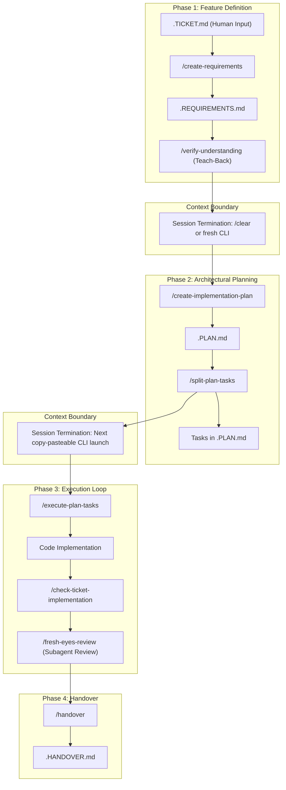

# PRIOR ART FORENSIC REPORT: REPO 01 — AGENT-TOOLKIT

## 01 — Repository Identity
- **Repository**: `eai-org/agent-toolkit`
- **URL**: https://github.com/eai-org/agent-toolkit
- **Revision / Inspected Commit**: `5239bc975e7cadd80a31b7a81d00b9609ee039c5`
- **Inspection Date**: 2026-09-03
- **License**: MIT License
- **Technologies**: Markdown, POSIX Shell (`bash`, `sh`), OpenPack plugin specification, Claude Code Agent Skills & Path Rules
- **Primary Purpose**: Provide a lightweight, context-efficient engineering methodology for AI coding agents based on unidirectional phase handoffs (Requirements -> Plan -> Task Execution -> Handover), strict context window budgeting, human-in-the-loop teach-back, and session-clearing execution boundaries.

---

## 02 — Architecture
The architectural thesis of `agent-toolkit` is **Context Leanness via Physical Session Boundaries (RPAC)**. Unlike autonomous swarm systems that keep a single long-lived agent session alive across an entire project, `agent-toolkit` assumes that attention degrades severely as the context window fills (the 'Smart Zone' vs 'Dumb Zone' dichotomy).

Key Architectural Mechanisms:
1. **RPAC (Requirements, Plan, Act, Check)**: Strict four-stage pipeline where each stage reads the previous markdown file and writes a new frozen file.
2. **Session-Clearing Step Execution**: When running `/execute-plan-tasks`, the agent executes **exactly one task**, updates the status in `.PLAN.md`, and prints a copy-pasteable command for the developer to run in a brand-new session (e.g. `claude --name task-2 ...`).
3. **Subagent Context Stripping**: `/fresh-eyes-review` invokes an isolated subagent specifically instructed with zero access to the author session's discarded attempts, preventing confirmation bias.

---

## 03 — Entry Points
- **Canonical Rules Entry**: `AGENTS.md` at repository root (<100 lines), functioning as a router to `rules/` and `docs/`.
- **Installation Scripts**: `install.sh` (symlinks or copies rules and skills into project `.claude/` or `.agents/`) and `install-opinionated-rules.sh`.
- **Key Slash Commands / Skills**: `/create-requirements`, `/create-implementation-plan`, `/verify-understanding`, `/split-plan-tasks`, `/execute-plan-tasks`, `/check-ticket-implementation`, `/fresh-eyes-review`, `/handover`, `/context-checkup`, `/memory-doctor`, `/self-improve`.

---

## 04 — Documentation Architecture
- `AGENTS.md`: Minimal root router referencing sub-documents.
- `docs/core-philosophy.md`: Detailed explanation of the Smart Zone (0-40k tokens), Dumb Zone (40k+ tokens), and why persistent long-lived sessions fail.
- `docs/target-structure.md`: Specification for organizing repository instructions into `rules/`, `skills/`, `plans/`, and `docs/`.
- `docs/rules-architecture.md`: Guidelines on path-based scoped rule triggers vs global rules.

---

## 05 — Skills
The repository packages 14 distinct Agent Skills in `skills/`:
1. `context-checkup`: Audits token counts of instructions, skills, and tools.
2. `create-requirements`: Transforms ambiguous ideas into structured `.REQUIREMENTS.md`.
3. `verify-understanding`: Teach-back active recall questioning.
4. `create-implementation-plan`: Formulates phased technical steps.
5. `split-plan-tasks`: Breaks phases into 15-30 minute bite-sized tasks.
6. `execute-plan-tasks`: Executes one task, updates state, terminates session.
7. `check-ticket-implementation`: Audits code against ticket requirements.
8. `fresh-eyes-review`: Stripped-context adversarial code review.
9. `handover`: Generates PR description and commit package.
10. `memory-doctor`: Triages notes from `MEMORY.md` into permanent rules.
11. `self-improve`: Diagnoses why rules were ignored and repairs them.
12. `generate-skills`: Scaffolds new skills.
13. `simplify`: Cleans up redundant code.
14. `learn-from-repo`: Onboarding skill scanning codebase patterns.

---

## 06 — Rules / Instructions
Organized in `rules/`:
- `always-apply-rules.md`: Global conventions (testing, git discipline).
- Path-scoped rules: Loaded conditionally when modifying matching paths (e.g. backend vs frontend).
- Precedence: Local plan files override general skills; general skills override root guidelines.

---

## 07 — Workflows
1. **Feature Planning Workflow**: `Ticket -> Requirements -> Verify Understanding -> Plan -> Split Tasks`.
2. **Execution Loop**: `Launch fresh session -> Execute single task -> Mark complete in .PLAN.md -> Print next command -> Exit`.
3. **Review & Handover**: `Check Ticket Implementation -> Fresh-Eyes Review -> Handover`.
4. **Maintenance Workflow**: `Context Checkup -> Memory Doctor -> Self-Improve`.

---

## 08 — Task State
State is managed exclusively through plain Markdown files stored in `.agents/plans/<id>-<slug>/`:
- `.REQUIREMENTS.md`: User needs, constraints, non-goals.
- `.PLAN.md`: Phase breakdowns, checkboxes (`- [ ]`, `- [x]`), decision logs.
- `.TICKET-STATUS.md`: Status table (`DONE`, `PARTIAL`, `NOT DONE`) with `file:line` citations.
- `.HANDOVER.md`: Final summary, verification proofs, manual test steps.

---

## 09 — Memory / Context
- Short-term working context is strictly bounded: sessions are intentionally cleared after each task.
- Project memory is split into an 'Inbox' (`MEMORY.md`) and 'Permanent Rules' (`rules/*.md`).
- The `memory-doctor` skill prevents memory rot by moving durable knowledge into rules and discarding transient noise.

---

## 10 — Verification
- **Teach-Back Verification**: Developer or agent must explain the plan in their own words before implementation begins.
- **Requirement Auditing**: `check-ticket-implementation` scans every acceptance criterion and requires proof in code before signing off.
- **Isolated Fresh-Eyes Review**: Independent review agent evaluates git diff without seeing intermediate agent thinking.

---

## 11 — Testing
- **Forensic Finding**: The repository itself contains **zero automated unit tests** for its shell scripts or skill logic.
- The `test/` folder contains only an LLM-as-a-judge script (`test/evaluate-instructions.py`) measuring instruction clarity, not functional execution.
- Quality is enforced through manual prompt adherence rather than automated test harnesses.

---

## 12 — Git Strategy
- Recommends single-task commits with semantic messages (`feat:`, `fix:`, `refactor:`).
- Plan artifacts in `.agents/plans/` are committed to git to preserve design history.
- Handover skill generates complete PR descriptions with proof citations.

---

## 13 — Failure Recovery
- If an agent gets lost or fails in the 'Dumb Zone', the remediation is simple: kill the session, read `.PLAN.md`, and launch a fresh session on the current incomplete task.
- The disk state survives session crashes and context limits.

---

## 14 — Self Improvement
- `self-improve` skill analyzes rule violations. If an agent violates a rule, it diagnoses whether the rule was: (1) undiscoverable, (2) ambiguously worded, (3) conflicting with another rule, or (4) buried in too much text, and rewrites the rule.

---

## 15 — Agent Coordination
- Flat, sequential handoffs mediated by human copy-pasting or CLI script calls.
- No autonomous runtime multi-agent supervisor; coordination occurs asynchronously via files.

---

## 16 — Evidence / Observability
- Observability is achieved through human-readable Markdown files (`.PLAN.md`, `.TICKET-STATUS.md`).
- No structured telemetry, token metrics, or JSONL event streams are produced.

---

## 17 — Complexity
- **Overall Complexity**: Very Low.
- No complex frameworks, compiled code, or heavy dependencies.
- Pure prompt engineering and bash script scaffolding.

---

## 18 — Security / Safety Boundaries
- Relies entirely on LLM compliance with text prompts.
- No programmatic sandbox, no hardware-level symlink defenses, no cryptographic attestation.

---

## 19 — What Is Genuinely Good?
1. **Context Window Hygiene**: The 'Smart Zone vs Dumb Zone' thesis is empirically validated; fresh sessions outperform bloated 100k-turn conversations.
2. **Memory-as-Inbox Pattern**: Prevents `MEMORY.md` from becoming an unreadable, contradictory garbage dump.
3. **Teach-Back Verification Gate**: Forces comprehension before coding, catching misalignment early.
4. **Verbatim Ticket Audit Ledger**: Requires explicit `file:line` citations for every acceptance criterion.

---

## 20 — What Is Over-Engineered?
- The excessive fragmentation into 7 distinct files per plan (`.REQUIREMENTS.md`, `.PLAN.md`, `.DECISIONS.md`, `.TICKET-STATUS.md`, `.SELF-REVIEW.md`, `.HANDOVER.md`) causes file proliferation for small changes.

---

## 21 — What Looks Fragile?
- **Manual CLI Restarts**: Requiring the human to copy-paste terminal commands after every single task breaks autonomous workflows.
- **Zero Automated Testing**: The toolkit has no CI test suite ensuring its scripts work across operating systems.

---

## 22 — What StudyLab Could Borrow
1. **Context Checkup Diagnostic**: Audit token usage of active MCP server schemas and instructions before running heavy generation tasks.
2. **Teach-Back Verification**: Require agents generating math curricula to summarize the mathematical prerequisites before generating cards.
3. **Verbatim Requirement Audit**: Ensure every learning objective in a syllabus is verified with line-number proof in the generated deck.
4. **Fresh-Eyes Review**: Use stripped-context subagents to review generated math questions for factual and formatting errors.

---

## 23 — What StudyLab Should NOT Borrow
1. **Manual Session Killing between micro-tasks**: StudyLab requires continuous autonomous execution, not constant human CLI intervention.
2. **Seven-file plan fragmentation**: Consolidate planning state into fewer, denser files.

---

## 24 — Interesting Individual Ideas
- `IDEA-EAI-01`: File-Based Phase Handoffs & Fresh Session Formulation
- `IDEA-EAI-02`: Quantitative Context Window Hygiene & Startup Audit
- `IDEA-EAI-03`: Memory-as-Inbox with Relocation Triage
- `IDEA-EAI-04`: Closed-Loop Self-Improvement & Discoverability Diagnosis
- `IDEA-EAI-05`: Teach-Back Active Recall Feature Gate
- `IDEA-EAI-06`: Verbatim Requirement Status Ledger
- `IDEA-EAI-07`: Fresh-Eyes Procedural Blindness Removal
- `IDEA-EAI-08`: Reviewer-Facing Intent Packaging
- `IDEA-EAI-09`: Progressive Disclosure Canonical Target Structure

---

## 25 — Open Questions
1. Can the fresh-session context benefits of agent-toolkit be achieved autonomously inside Antigravity via subagents without requiring manual user terminal restarts?
2. How to automate memory-doctor triage so rules evolve without human curation?

---

## 26 — Evidence Index
- Inspected Commit: `5239bc975e7cadd80a31b7a81d00b9609ee039c5`
- Core Philosophy Document: `docs/core-philosophy.md`
- Skills Inspected: `skills/context-checkup/SKILL.md`, `skills/verify-understanding/SKILL.md`, `skills/check-ticket-implementation/SKILL.md`, `skills/fresh-eyes-review/SKILL.md`
