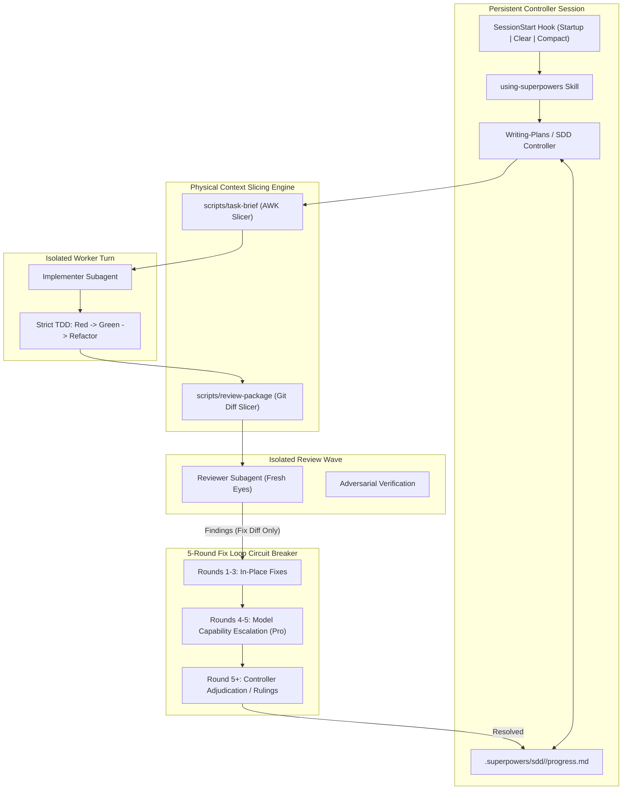

# PRIOR ART FORENSIC REPORT: REPO 02 — SUPERPOWERS

## 01 — Repository Identity
- **Repository**: `obra/superpowers`
- **URL**: https://github.com/obra/superpowers
- **Revision / Inspected Commit**: `b36e0829c6d0140e93cfef2ca599b1b07d4a7797`
- **Release Version Analyzed**: `v6.3.0`
- **Inspection Date**: 2026-09-03
- **License**: MIT License
- **Technologies**: Bash / POSIX Shell, Node.js / CommonJS (`server.cjs`, `helper.js`), Agent Skills, Multi-Host Lifecycle Hooks (`SessionStart`), Graphviz, Vitest/TAP test runners
- **Primary Purpose**: Provide an autonomous, disciplined software development methodology for AI agents based on strict Test-Driven Development (TDD), Subagent-Driven Development (SDD), psychological cognitive defense tables against LLM rationalizations, and persistent progress ledgers.

---

## 02 — Architecture
The architectural core of `superpowers` is **Autonomous Subagent-Driven Development (SDD) with Hard Cognitive Defenses**. A persistent controller agent manages the high-level plan and orchestrates isolated, transient subagents for implementation and review.

Key Architectural Principles:
1. **Iron Laws & Cognitive Defenses**: Tabular mapping of LLM excuses to non-negotiable behavioral boundaries (e.g. *NO PRODUCTION CODE WITHOUT A FAILING TEST FIRST*).
2. **Context Slicing (Task Briefs & Review Packages)**: Implementers are given only their single assigned task slice (`task-N-brief.md`); reviewers are given only the staged diff package (`review-package`). The controller never absorbs raw implementation logs.
3. **Plan-Scoped Scratch Workspaces**: Uses git-ignored `.superpowers/sdd/<plan>/` directories containing an append-only `progress.md` machine ledger that survives context compaction.
4. **5-Round Fix Loop with Model Escalation**: Scoped re-reviews focus exclusively on the fix diff; if rounds 1-3 fail, rounds 4-5 escalate to higher capability models before controller adjudication.

---

## 03 — Entry Points
- **Automated Lifecycle Hook**: `hooks/session-start` executes on `startup|clear|compact`, injecting `using-superpowers` into the context window across 8+ agent platforms (Claude Code, Cursor, Codex, OpenCode, Hermes, Kimi, Pi, Gemini).
- **Core Skills**: `using-superpowers`, `subagent-driven-development`, `test-driven-development`, `systematic-debugging`, `writing-plans`, `brainstorming`, `executing-plans`, `requesting-code-reviews`.
- **Scripts**: `scripts/task-brief`, `scripts/review-package`, `scripts/sdd-workspace`, `skills/systematic-debugging/find-polluter.sh`.

---

## 04 — Documentation Architecture
Exemplary architectural and operational documentation:
- `CLAUDE.md`: Comprehensive coding and testing guidelines for Claude Code agents.
- `RELEASE-NOTES.md`: Exhaustive changelog documenting architectural rationale for every release.
- `docs/polyglot-hooks.md`: Specification of cross-platform hook abstraction.
- Design specifications in `docs/`: e.g. `2026-07-15-sdd-fix-loop-redesign.md`, `2026-07-06-sdd-plan-scoped-workspace.md`.

---

## 05 — Skills
1. `using-superpowers`: Core meta-skill enforcing workflow discipline and cognitive defenses.
2. `subagent-driven-development`: Orchestration engine for subagent implementation and review.
3. `test-driven-development`: Mandatory red-green-refactor loop.
4. `systematic-debugging`: Multi-phase root-cause tracing and test polluter bisection.
5. `writing-plans`: Creates bite-sized 2-5 minute TDD tasks with `Consumes:` and `Produces:` signatures.
6. `brainstorming`: Three-path router for architectural vs bounded vs spike process ceremony.
7. `executing-plans`: Sequential execution protocol for single-session environments.
8. `visual-companion`: Real-time browser companion for visual brainstorming.

---

## 06 — Rules / Instructions
- **The Iron Law of TDD**: If code is written before a failing test, it MUST be deleted.
- **Verification Rule**: No completion claim may be made without fresh evidence from test commands.
- **Scope Discipline**: Implementer subagents are forbidden from modifying files outside their assigned task brief.

---

## 07 — Workflows
1. **Brainstorming & Planning**: User prompt -> Three-Path Router -> Plan authoring with bite-sized tasks.
2. **SDD Autonomous Loop**: Controller creates `.superpowers/sdd/<plan>/` -> generates `task-N-brief.md` -> dispatches implementer -> awaits completion -> packages diff via `review-package` -> dispatches reviewer -> resolves fix loop -> updates `progress.md` -> repeats until plan complete.
3. **Systematic Debugging**: Reproduce bug with minimal test -> trace root cause -> bisect test polluters if flaky -> patch -> verify.

---

## 08 — Task State
State is externalized into `.superpowers/sdd/<plan>/`:
- `progress.md`: Disk-backed state machine tracking task status, current wave, and resume checkpoints.
- `task-N-brief.md`: Sliced input specifications for subagents.
- `task-N-report.md`: Structured handoff deliverables from implementers.

---

## 09 — Memory / Context
- Controller context remains minimal because raw subagent execution trajectories are isolated in separate conversation spaces.
- Progress survives compaction because the controller re-reads `progress.md` on resumption.

---

## 10 — Verification
- **Test-Driven Red Phase**: Tests must be observed failing with expected error before implementation.
- **Test-Driven Green Phase**: Tests must pass cleanly after minimal implementation.
- **Two-Stage Review**: Every task is reviewed by an independent fresh-eyes subagent before being marked complete in the ledger.

---

## 11 — Testing
The repository contains robust testing infrastructure:
- `tests/`: Extensive test suites testing hooks, subagent workflows, workspace slicing, and platform adapters.
- Integration tests in Bash and Node.js testing hook triggers and workspace isolation.
- Continuous integration tests across multiple shell environments.

---

## 12 — Git Strategy
- Supports both branch-based workflows and Git Worktrees (`test-worktree-native-preference.sh`).
- Encourages atomic commits for each green TDD cycle.

---

## 13 — Failure Recovery
- **Stall & Review Loop Recovery**: The 5-round fix loop prevents infinite review thrashing:
  - Rounds 1-3: in-place review fixes.
  - Rounds 4-5: capability escalation (upgraded model tier).
  - Round 5: circuit breaker trips, controller adjudicates disputes directly.
- **Context Compaction Recovery**: `SessionStart` hook re-injects meta-skills and the controller reloads `progress.md`.

---

## 14 — Self Improvement
- Comprehensive design retrospective documents in `docs/` detailing improvements made from user feedback and agent failure logs.
- The `shipit` pre-commit pipeline enforces continuous code simplification and documentation maintenance.

---

## 15 — Agent Coordination
- Dynamic hierarchical orchestration: Controller (Parent) -> Implementer (Worker) -> Reviewer (Verifier).
- Strict separation of duties: Implementers cannot review their own code; reviewers cannot write implementation code.

---

## 16 — Evidence / Observability
- Execution logs and diff packages stored on disk in `.superpowers/sdd/<plan>/`.
- Graphviz dot visualizers for complex state machines.

---

## 17 — Complexity
- **Overall Complexity**: Medium to High.
- Significant complexity in polyglot hook compatibility across 8+ agent platforms.
- Includes a standalone Node.js WebSocket companion server for visual brainstorming.

---

## 18 — Security / Safety Boundaries
- Hard cognitive defense tables prevent models from rationalizing security or safety omissions.
- Pre-commit secrets filtering and git worktree isolation.

---

## 19 — What Is Genuinely Good?
1. **Cognitive Defense Tables**: The single most effective prompt engineering technique against LLM laziness and corner-cutting.
2. **Physical Context Slicing**: Using `awk` and `git diff` to create physical brief and review files keeps parent context lean.
3. **5-Round Fix Loop with Model Escalation**: Solves the real-world failure mode of agents getting trapped in endless review nitpicking.
4. **Bite-Sized TDD Task Breakdown**: Decomposing plans into 2-5 minute tasks with explicit inputs and outputs prevents agents from getting lost.

---

## 20 — What Is Over-Engineered?
- **Visual Companion Web Server**: Embedding a local Node.js WebSocket server and browser automation within an agent toolkit introduces substantial maintenance overhead and port collision risks.
- **Polyglot Hook Sprawl**: Supporting 8+ different AI coding tools (Claude, Cursor, Codex, Devin, Hermes, Kimi, Pi) requires maintaining dozens of adapter scripts.

---

## 21 — What Looks Fragile?
- **Bash Script Dependencies on Windows**: Many shell scripts (`task-brief`, `review-package`) rely on Bash, `awk`, and POSIX utilities, which require Git Bash or WSL on Windows environments.

---

## 22 — What StudyLab Could Borrow
1. **Cognitive Defense Tables**: Incorporate anti-rationalization tables into StudyLab agent prompts to prevent shortcuts in math formula derivation and card verification.
2. **SDD Isolated Brief Slicing**: Slice curriculum units into isolated task briefs for flashcard generation subagents.
3. **5-Round Fix Loop with Capability Escalation**: When generating complex math cards, use fast models (Flash) for initial generation and escalate to high-reasoning models (Pro) if LaTeX or schema validation fails.
4. **Bite-Sized TDD Task Structure**: Define flashcard models and parser functions using strict TDD contracts.

---

## 23 — What StudyLab Should NOT Borrow
1. **Embedded WebSocket Server**: Use standard Antigravity Generative UI artifacts instead of running background Node.js servers.
2. **Dual-OS Shell Maintenance**: Implement orchestrator utilities in cross-platform Python or TypeScript rather than POSIX Bash scripts.

---

## 24 — Interesting Individual Ideas
- `IDEA-SPW-01`: Cognitive Defense Rationalization Tables & Iron Laws
- `IDEA-SPW-02`: Subagent-Driven Development with Brief Slicing & Review Packages
- `IDEA-SPW-03`: Resilient Progress Ledger & Compaction Recovery Map
- `IDEA-SPW-04`: Five-Round Fix Loop with Capability Escalation & Circuit Breaker
- `IDEA-SPW-05`: Three-Path Router for Proportional Process Ceremony
- `IDEA-SPW-06`: Specification-Driven Bite-Sized TDD Task Breakdown
- `IDEA-SPW-07`: Polyglot SessionStart Hook Injection Engine
- `IDEA-SPW-08`: Automated Test Suite State-Polluter Bisection

---

## 25 — Open Questions
1. How best to implement superpowers-style context slicing natively within Antigravity without depending on external `awk` scripts?
2. Can the model capability escalation pattern (Flash -> Pro) be triggered automatically upon validation failure?

---

## 26 — Evidence Index
- Inspected Commit: `b36e0829c6d0140e93cfef2ca599b1b07d4a7797` (Release `v6.3.0`)
- Architectural Specs: `docs/2026-07-15-sdd-fix-loop-redesign.md`, `docs/2026-07-06-sdd-plan-scoped-workspace.md`
- Core Skills: `skills/using-superpowers/SKILL.md`, `skills/subagent-driven-development/SKILL.md`, `skills/test-driven-development/SKILL.md`
