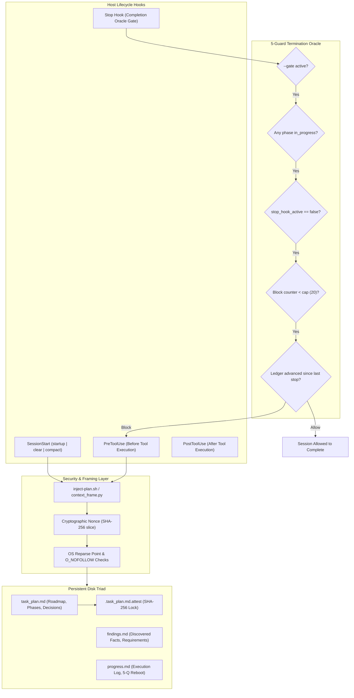

# PRIOR ART FORENSIC REPORT: REPO 03 — PLANNING-WITH-FILES

## 01 — Repository Identity
- **Repository**: `OthmanAdi/planning-with-files`
- **URL**: https://github.com/OthmanAdi/planning-with-files
- **Revision / Inspected Commit**: `03128b278b0926180854703e43abd7ea2ff18c00`
- **Release Version Analyzed**: `v3.16.0` (with backward compatibility to v2.43)
- **Inspection Date**: 2026-09-03
- **License**: MIT License
- **Technologies**: POSIX Shell (`bash`), PowerShell (`.ps1`), Python 3 (`context_frame.py`), Markdown, Claude Code Lifecycle Hooks (`claude-hook.sh`, `hooks.json`)
- **Primary Purpose**: Provide a durable file-based working memory pattern for long-running AI agent sessions, surviving context resets, token limits, and `/clear` operations through a triad of markdown files (`task_plan.md`, `findings.md`, `progress.md`), cryptographic nonce framing, SHA-256 plan attestation, and a 5-guard termination oracle.

---

## 02 — Architecture
The architectural thesis of `planning-with-files` is that **context memory is volatile RAM while the filesystem is durable storage**. To prevent goal drift and knowledge amnesia across long multi-turn sessions (10-100+ turns), the working state is externalized to disk and injected deterministically into the agent's context window on every turn.

Key Architectural Principles:
1. **Tripartite File Separation**:
   - `task_plan.md`: Roadmap, phase checklists, decisions table, errors table.
   - `findings.md`: Research findings, constraints, transcribed multimodal content.
   - `progress.md`: Chronological log, test results, 5-question reboot check.
2. **Hardware-Aware Nonce Framing**: Injected context is wrapped in dynamic SHA-256 nonces with byte bounding, combined with `O_NOFOLLOW` (POSIX) and Win32 `kernel32.CreateFileW` (`FILE_FLAG_OPEN_REPARSE_POINT`) to prevent prompt injection amplification and directory junction escapes.
3. **Plan Attestation & Monotonic Progress**: `attest-plan.sh` locks approved plans with a SHA-256 hash; unauthorized edits trigger immediate refusal. `ledger-append.sh` and monotonic checkbox tracking prevent parallel write clobbers.
4. **5-Guard Termination Oracle**: The stop hook prevents agents from abandoning tasks prematurely while avoiding infinite loops through block caps and ledger progress tracking.

---

## 03 — Entry Points
- **Lifecycle Hook Dispatcher**: `hooks/claude-hook.sh` and `hooks/hooks.json` intercepting `SessionStart`, `PreToolUse`, `PostToolUse`, and `Stop`.
- **Slash Commands**: `/plan-goal` (initiates session), `/plan-loop` (background driver), `/plan-attest` (locks plan), `/plan-doctor` (validates file schemas).
- **Core Utility Scripts**: `scripts/init-session.sh`, `scripts/inject-plan.sh`, `scripts/check-complete.sh`, `scripts/attest-plan.sh`, `scripts/ledger-append.sh`.

---

## 04 — Documentation Architecture
Comprehensive documentation covering operational mechanics and benchmark results:
- `docs/attestation.md`: Cryptographic plan locking and tamper detection.
- `docs/evals.md`: Formal evaluation benchmark against 6 alternative planning systems.
- `docs/long-running-tasks.md`: Operational guide for 50+ turn sessions surviving context compaction.
- `docs/security.md`: Prompt injection analysis and mitigation history.

---

## 05 — Skills
Packaged under `.agents/skills/planning-with-files/SKILL.md`:
- Full specification defining the 3-file convention, reboot protocol, phase checklist schemas, and security boundaries.
- Adapter manifests supporting 8+ platforms (`.cursor`, `.codex`, `.gemini`, `.hermes`, `.kiro`, `.opencode`, `.pi`).

---

## 06 — Rules / Instructions
- **The Golden Rule**: Never perform work without an active `in_progress` phase in `task_plan.md`.
- **PreToolUse Invariant**: Every tool call must be preceded by a verification of the current phase and next step.
- **Reboot Protocol**: If context resets or `/clear` occurs, run the 5-Question Reboot Check against `progress.md` before taking any action.

---

## 07 — Workflows
1. **Session Initialization**: `/plan-goal <prompt>` -> `init-session.sh` scaffolds `task_plan.md`, `findings.md`, and `progress.md` -> optional attestation lock.
2. **Execution & Turn Loop**: Agent selects phase -> marks `in_progress` -> PreToolUse injects smart plan summary -> Agent executes tool -> PostToolUse verifies monotonic progress.
3. **Termination Gate**: Agent issues stop request -> Stop hook evaluates 5-guard oracle -> if incomplete and advancing, denies stop and nudges next step; if complete or stalled, allows exit.

---

## 08 — Task State
State is externalized into root or slug-namespaced Markdown files:
- `task_plan.md`: Current goal, active phase, phase checklist (`- [ ]`, `- [x]`), decision log.
- `.task_plan.md.attest`: Hash record storing `sha256(canonical_plan_bytes)`.
- `.machine_ledger.jsonl`: Machine-readable event stream recording state transitions.

---

## 09 — Memory / Context
- Volatile memory loss is solved: `/clear` drops in-memory conversation history, but the `SessionStart` hook immediately re-injects `task_plan.md`, restoring orientation in 5 turns versus 13+ turns for unassisted agents.
- Smart injection (`inject-smart`) uses an AWK parser to inject only the Title, Goal, Next Step, and the single active `in_progress` phase, keeping token overhead at a predictable ~150-250 tokens per turn.

---

## 10 — Verification
- **Attestation Verification**: `attest-plan.sh --verify` compares the current plan hash against the recorded digest.
- **Completion Oracle (`check-complete.sh --gate`)**: Syntactically parses `task_plan.md` to confirm all tasks are marked complete before permitting session termination.
- **Monotonic Progress Guard**: Verifies that completed tasks are never silently unchecked during parallel operations.

---

## 11 — Testing
- Contains dedicated test suites in `tests/`:
  - Hook integration tests testing SessionStart, PreToolUse, and Stop behavior.
  - Windows PowerShell parity tests (`test-windows.ps1`).
  - Tamper injection tests verifying attestation refusals.
- Documented in `docs/evals.md`: Benchmark Test 5 demonstrated statistically significant improvements in multi-turn task completion rates over ad-hoc planning.

---

## 12 — Git Strategy
- Planning files (`task_plan.md`, `findings.md`, `progress.md`) are designed to be committed to version control alongside code changes.
- Preserves complete historical context of design decisions and error resolutions in the git log.

---

## 13 — Failure Recovery
- **Context Compaction / Clear**: `SessionStart` hook detects resume/clear and re-injects state.
- **Goal Drift**: `PreToolUse` hook constantly reminds the model of the active goal before every tool call.
- **Infinite Stop Loops**: Stop block counter caps at 20; if the agent is genuinely stuck, the gate yields to avoid burning infinite tokens.

---

## 14 — Self Improvement
- Evolutions documented in release notes:
  - v2.21: Prompt injection amplification mitigated by removing web tools from allowed hooks.
  - v3.0: Added smart injection and long-running session support.
  - v3.16: Resolved issue #239 (Claude Code hook contract fix: routing messages to model context rather than user UI).

---

## 15 — Agent Coordination
- Primarily single-agent persistence across time rather than multi-agent concurrency across threads.
- Supports isolated task slug directories (`.planning/<slug>/`) to allow multiple independent agents to operate without clobbering each other's plans.

---

## 16 — Evidence / Observability
- Append-only `.machine_ledger.jsonl` recording machine state transitions.
- Human-readable progress summaries in `progress.md`.

---

## 17 — Complexity
- **Overall Complexity**: Medium.
- Low conceptual complexity (Markdown files), but high implementation complexity in dual-stack shell maintenance (maintaining feature parity between Bash and PowerShell scripts).

---

## 18 — Security / Safety Boundaries
- **Highest security posture among prior-art repos**:
  - Dynamic cryptographic nonce framing (`sha256(...)[:24]`).
  - OS-level symlink and directory junction defenses (`O_NOFOLLOW` / `kernel32.CreateFileW`).
  - Plan attestation prevents malicious prompt injection from tampering with the task plan.

---

## 19 — What Is Genuinely Good?
1. **Durable 3-File Working Memory Pattern**: Clean separation of Roadmap (`task_plan.md`), Knowledge (`findings.md`), and Execution Log (`progress.md`).
2. **Hardware-Aware Nonce Framing**: Solves the real danger of delimiter confusion and prompt injection amplification.
3. **Smart AST Slicing (`inject-smart`)**: Prevents long plans from eating massive context by injecting only the active phase.
4. **5-Guard Termination Oracle**: Enforces task completion while providing safety circuit breakers against infinite loops.

---

## 20 — What Is Over-Engineered?
- **Dual-Stack Shell Maintenance**: Writing every single hook and utility twice (once in Bash, once in PowerShell) creates massive maintenance overhead and frequent platform divergence bugs.
- **Host Adapter Sprawl**: Maintaining 8+ different tool adapter directories (`.cursor`, `.codex`, `.gemini`, `.kiro`, etc.).

---

## 21 — What Looks Fragile?
- **Host Hook Dependency**: Relies on IDE-specific hook mechanisms (like Claude Code's `hooks.json`). If the host tool changes its hook API (as seen in v3.16 issue #239), the entire system breaks.
- **PowerShell / Bash Script Edge Cases**: Regex parsing of Markdown in shell scripts is prone to edge-case formatting failures.

---

## 22 — What StudyLab Could Borrow
1. **3-File Study Memory Triad**: Adopt `study_plan.md` (curriculum roadmap), `subject_knowledge.md` (syllabus/facts), and `generation_progress.md` (flashcard generation logs) for long-running study lab pipelines.
2. **5-Guard Termination Oracle**: Ensure procedural card generators cannot stop until all requested cards are generated and validated against subject policies.
3. **Smart Slicing**: When generating multi-chapter question banks, inject only the current unit into agent context.
4. **Hardware-Aware Nonce Framing**: Secure StudyLab's external study source ingestion against malicious injection.

---

## 23 — What StudyLab Should NOT Borrow
1. **Dual Bash/PowerShell Shell Scripts**: StudyLab should implement all orchestration tools in a single unified language (Python or TypeScript).
2. **IDE Hook Couplings**: Build the execution loop natively inside Antigravity rather than relying on external host IDE hooks.

---

## 24 — Interesting Individual Ideas
- `PWF-01`: Durable 3-File Working Memory Pattern
- `PWF-02`: Hardware-Aware Nonce-Delimited Context Framing
- `PWF-03`: SHA-256 Plan Attestation & Tamper Refusal
- `PWF-04`: 5-Guard Termination Oracle Completion Gate
- `PWF-05`: Structure-Aware Smart Injection (`inject-smart`)
- `PWF-06`: Monotonic Parallel-Write Progress Regression Guard
- `PWF-07`: Isolated Task Slug Namespacing

---

## 25 — Open Questions
1. Can the 3-file memory pattern be implemented with zero shell scripts, using pure Antigravity native file operations?
2. How to integrate plan attestation with git commit signing for verifiable agent provenance?

---

## 26 — Evidence Index
- Inspected Commit: `03128b278b0926180854703e43abd7ea2ff18c00` (Release `v3.16.0`)
- Forensic Evidence File: `prior-art-lab/evidence/repo03-planning-with-files-forensics.md`
- Documentation: `docs/attestation.md`, `docs/evals.md`, `docs/security.md`
- Core Scripts: `scripts/inject-plan.sh`, `scripts/check-complete.sh`, `scripts/attest-plan.sh`
