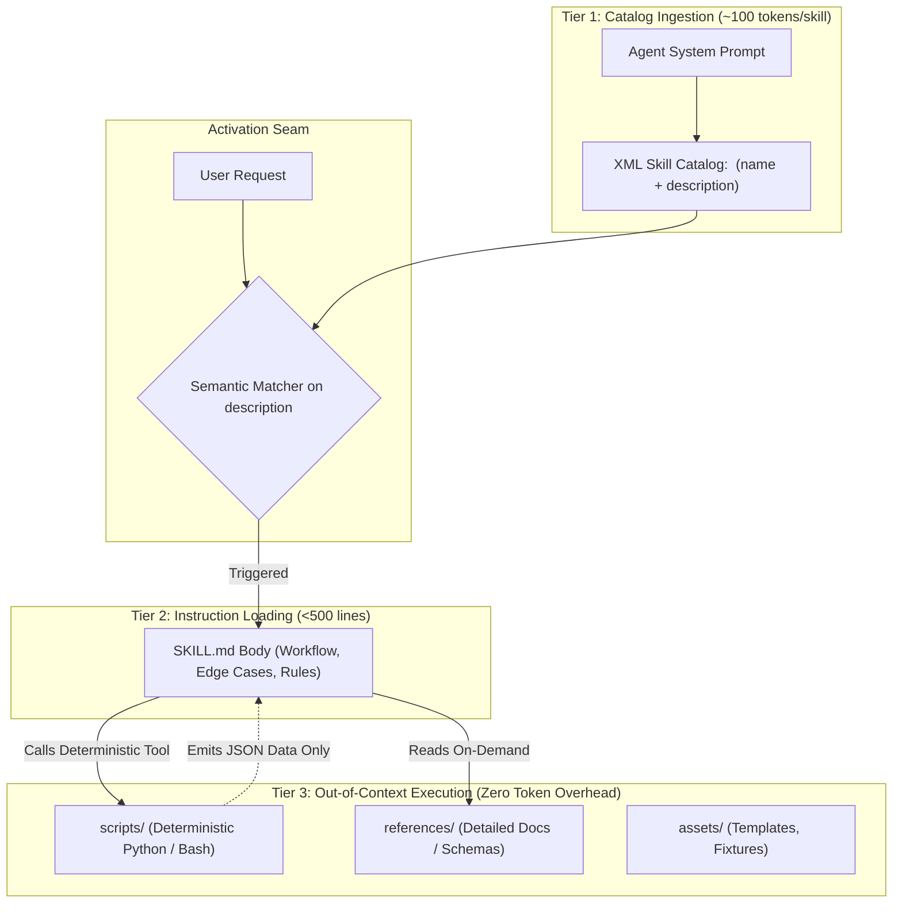

# PRIOR ART FORENSIC REPORT: REPO 04 — ANTHROPIC-SKILLS

## 01 — Repository Identity
- **Repository**: `anthropics/skills`
- **URL**: https://github.com/anthropics/skills
- **Revision / Inspected Commit**: `53048666b05b4799081517d00e09e0a2dd688678`
- **Historical Reference Commits**:
  - `be229a5d5124887bbe8615023061a6c55d3c045c` (contains in-tree authoring and integration specification text)
  - `69c0b1a0674149f27b61b2635f935524b6add202` (specification moved to `agentskills.io` standard)
- **Inspection Date**: 2026-09-03
- **License**: Apache 2.0 (open source skills) / Source-Available (document manipulation skills)
- **Technologies**: Python 3, Markdown, JSON, Bash, OOXML/docx/pdf/xlsx deterministic parsing scripts
- **Primary Purpose**: The canonical specification, reference implementations, authoring tooling, and evaluation framework for Agent Skills—reusable capability packages that extend AI agent capabilities through progressive disclosure, out-of-context deterministic script execution, and empirical trigger optimization.

---

## 02 — Architecture
The core architectural thesis of `anthropics/skills` is **Three-Tier Progressive Disclosure and Deterministic Script vs LLM Reasoning Separation**.

Key Architectural Principles:
1. **Three-Tier Progressive Disclosure**:
   - **Tier 1 (Catalog)**: Only YAML `name` and `description` are loaded into system prompts (~100 tokens).
   - **Tier 2 (Instruction)**: The full `SKILL.md` (<500 lines) is fetched into context *only* when activated.
   - **Tier 3 (Bundled Resources)**: Detailed documentation in `references/` is read on demand, while heavy computation in `scripts/` executes via subshells, returning only clean JSON/text to the LLM.
2. **Deterministic Script vs LLM Reasoning Separation**: Complex mathematical formulas, PDF geometry calculations, and OOXML packaging are handled by deterministic Python scripts. The LLM is never asked to parse binary files or format XML directly.
3. **Automated Trigger Optimization**: Uses train/test query sets with empirical repetition to optimize skill descriptions against undertriggering and overtriggering.
4. **Dual-Arm Blind Benchmarking**: Compares skill effectiveness by running parallel subagents (with vs without skill) and using a blinded comparator agent to score outputs without confirmation bias.

---

## 03 — Entry Points
- **Standard Skill Starter**: `template/SKILL.md` (canonical frontmatter and section layout).
- **Skill Authoring Engine**: `skills/skill-creator/SKILL.md` (metacognitive skill that authors, evaluates, benchmarks, and optimizes other skills).
- **Benchmark & Optimization Runners**:
  - `skills/skill-creator/scripts/run_loop.py` (runs optimization loop).
  - `skills/skill-creator/scripts/aggregate_benchmark.py` (statistical benchmark aggregation).
  - `skills/skill-creator/scripts/improve_description.py` (description search optimizer).

---

## 04 — Documentation Architecture
The repository established the open standard for Agent Skills:
- `spec/agent-skills-spec.md`: Pointers and standard definition.
- `template/SKILL.md`: Reference implementation showing recommended headings, frontmatter fields, and token limits.
- `skills/skill-creator/references/schemas.md`: Exact JSON schemas for eval suites, benchmarks, and grading criteria.

---

## 05 — Skills
Includes a diverse portfolio of production reference skills:
1. `skill-creator`: Meta-skill for authoring, evaluating, and optimizing skills.
2. `pdf`: Form filling, text extraction, coordinate inspection via Python scripts.
3. `docx`: Microsoft Word creation using OOXML validation tools.
4. `xlsx`: Spreadsheet manipulation with LibreOffice calculation verification.
5. `claude-api`: Multi-language SDK documentation and reference.
6. `brand-guidelines`, `internal-comms`, `canvas-design`: Specialized prompt workflows.

---

## 06 — Rules / Instructions
Frontmatter specification (`SKILL.md`):
- `name`: 2-5 words kebab-case identifier.
- `description`: Rich third-person trigger specification with explicit trigger keywords and negative boundaries.
- `allowed-tools`: List of tool permissions granted to the skill.
- Size constraint: `SKILL.md` body must remain under 500 lines to preserve context windows.

---

## 07 — Workflows
1. **Skill Discovery & Execution**: Catalog matches query -> `SKILL.md` loaded -> Skill instructs agent to run scripts or read references -> Task completed.
2. **Skill Creation & Optimization Loop**:
   - Developer/Agent draft initial `SKILL.md`.
   - Author 20 test cases in `evals/evals.json`.
   - Run dual-arm benchmark: Arm A (with skill) vs Arm B (baseline).
   - Collect wall-clock duration and token usage.
   - Run blind comparator evaluation (`agents/comparator.md`).
   - Run `improve_description.py` on held-out test queries to optimize triggering.
   - Package into portable `.skill` zip archive.

---

## 08 — Task State
State during skill evaluation is tracked in standardized JSON files:
- `evals/evals.json`: Test prompts and expected outputs.
- `evals/timing.json`: Telemetry capture (`duration_ms`, `total_tokens`).
- `evals/grading.json`: Assertion pass/fail results.
- `evals/benchmark.json`: Statistical aggregate metrics.

---

## 09 — Memory / Context
- Maximum context preservation: Loading `SKILL.md` costs tokens only during active use; Tier 3 scripts execute in external subshells with zero prompt context cost.
- Keeps system prompts ultra-lean (~100 tokens per available skill).

---

## 10 — Verification
- **Programmatic Assertion Graders**: Deterministic scripts check whether expected files, schemas, and outputs exist.
- **Blind A/B Comparator Agent**: An independent evaluator agent compares anonymized outputs from Arm A and Arm B against rubrics (Correctness, Completeness, Accuracy, Formatting).
- **Held-Out Test Set Verification**: Trigger descriptions must pass held-out queries to prove generalization.

---

## 11 — Testing
The repository contains complete eval frameworks inside `skills/skill-creator/`:
- `evals/` test suites across multiple reference skills.
- Scripts testing token efficiency, latency deltas, and triggering accuracy.
- Formal benchmark results demonstrating quantitative improvement over baseline agents.

---

## 12 — Git Strategy
- Monorepo structure with standardized `skills/<name>/` directories.
- Changes to skills are validated against committed `evals/` fixtures.

---

## 13 — Failure Recovery
- **Undertriggering / Overtriggering**: Recovered via the automated description optimization loop.
- **Malformed Outputs**: Document manipulation skills run deterministic validation scripts (e.g. `recalc.py`, OOXML validators); if invalid, the agent re-runs with the specific error.

---

## 14 — Self Improvement
- `skill-creator` is the archetypal self-improvement system: an agent skill designed to evaluate, benchmark, and iteratively improve other agent skills (including itself).

---

## 15 — Agent Coordination
- Multi-agent coordination during evaluation:
  - Parallel subagents for Arm A and Arm B execution.
  - Grader subagent for objective assertion checking.
  - Blind Comparator subagent for subjective rubric scoring.
  - Optimizer subagent for prompt description tuning.

---

## 16 — Evidence / Observability
- Rich structured benchmarking outputs: `timing.json`, `benchmark.json`, and human-readable `benchmark.md` reporting mean and standard deviation deltas for tokens and time.

---

## 17 — Complexity
- **Overall Complexity**: Medium.
- Clean separation between lightweight Markdown skill descriptions and deterministic Python utilities.

---

## 18 — Security / Safety Boundaries
- Tool authorization via `allowed-tools` frontmatter field.
- Document skills validate external inputs before passing them to system parsers.

---

## 19 — What Is Genuinely Good?
1. **Three-Tier Progressive Disclosure**: The industry standard for scaling tool and skill libraries without blowing out context windows.
2. **Deterministic Script vs LLM Reasoning Separation**: Offloading calculations, formatting, and binary processing to deterministic code prevents hallucination and saves tokens.
3. **Automated Description Optimizer**: Treats prompt tuning as an empirical optimization problem with held-out test splits.
4. **Dual-Arm Blind A/B Benchmarking**: Eliminates author confirmation bias when measuring agent skill improvements.

---

## 20 — What Is Over-Engineered?
- Maintaining full polyglot SDK documentation (`claude-api` with Python, TypeScript, Go, Java, C#, Ruby, PHP) inside a single agent skill repository creates heavy maintenance overhead as SDKs evolve.

---

## 21 — What Looks Fragile?
- **Prompt Trigger Sensitivity**: Skills rely heavily on exact wording in the YAML description; minor changes can cause undertriggering on realistic user prompts.
- **Subshell Dependency**: Tier 3 scripts require local Python runtime, virtual environments, and external libraries (e.g. `pypdf`, LibreOffice) to be present on the host system.

---

## 22 — What StudyLab Could Borrow
1. **Three-Tier Progressive Disclosure**: Package StudyLab capabilities (math derivation, Anki deck packaging, diagram rendering) as Agent Skills, loading full docs only when needed.
2. **Deterministic Script Separation**: Use deterministic Python tools for `.apkg` SQLite generation and cloze syntax validation (`export_anki_package`, `validate_artifact`), leaving LLMs free to focus on pedagogical reasoning.
3. **Dual-Arm Blind Benchmarking**: Test card generation prompt templates against blind comparators to objectively verify pedagogical quality.
4. **Automated Description Optimizer**: Optimize StudyLab skill descriptions so agents activate math solving skills accurately on user prompts.

---

## 23 — What StudyLab Should NOT Borrow
1. **Polyglot Documentation Duplication**: Do not bundle raw API documentation for multiple languages inside skills; use targeted MCP doc search servers instead.
2. **Heavy System Dependencies**: Avoid requiring LibreOffice or complex external desktop runtimes for card validation.

---

## 24 — Interesting Individual Ideas
- `ANTH-01`: Three-Tier Progressive Disclosure Architecture
- `ANTH-02`: Deterministic Script Execution vs LLM Reasoning Separation
- `ANTH-03`: Automated Skill Trigger Description Optimization Loop
- `ANTH-04`: Dual-Arm Parallel Subagent Benchmarking with Blind A/B Comparator
- `ANTH-05`: Portable Self-Contained Capability Packaging (`.skill` format)

---

## 25 — Open Questions
1. How best to package StudyLab subject policies as progressive disclosure skills that scale to hundreds of mathematics sub-disciplines?
2. How to run automated description optimization locally without high API token expenditure?

---

## 26 — Evidence Index
- Inspected Commit: `53048666b05b4799081517d00e09e0a2dd688678`
- Historical Commits: `be229a5` (in-tree spec), `69c0b1a` (agentskills.io migration)
- Meta-Skill: `skills/skill-creator/SKILL.md`
- Core Scripts: `run_loop.py`, `aggregate_benchmark.py`, `improve_description.py`
- Forensic Evidence File: `prior-art-lab/evidence/repo04-anthropic-skills-forensics.md`
