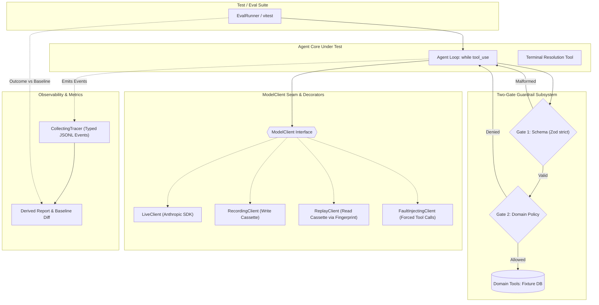

# PRIOR ART FORENSIC REPORT: REPO 05 — AGENT-HARNESS

## 01 — Repository Identity
- **Repository**: `nderman/agent-harness`
- **URL**: https://github.com/nderman/agent-harness
- **Revision / Inspected Commit**: `c0253dd6b0e9ada5e8bf45bded9c89f6c730daaa`
- **Inspection Date**: 2026-09-03
- **License**: Unspecified (Private Take-Home Engineering Submission / Sample)
- **Technologies**: TypeScript 5.9.3, Node.js (>=20), `@anthropic-ai/sdk` 0.68.0, Zod 4.1.12, Vitest 3.2.4/3.2.7, TSX 4.20.6, GitHub Actions + GitHub Pages
- **Primary Purpose**: A test and evaluation harness that makes an AI agent deterministic, testable, observable, and regression-resistant via record/replay semantic cassettes, two-gate runtime guardrails, deterministic faithfulness evaluation, and diffing against committed baselines.

---

## 02 — Architecture
The core architectural thesis of `agent-harness` is that the **agent depends on the harness interfaces (`ModelClient`, `Tracer`), never the reverse**.

Key Architectural Principles:
1. **ModelClient Interface Seam**: Record/replay intercepts at the application interface (`createMessage`), not at the raw HTTP socket layer. Cassettes store high-level conversational structures, making them clean in git diffs and immune to SDK protocol updates.
2. **Canonical Fingerprint Matching**: Strict SHA-256 hash over canonicalized `(model, system, messages, tools)` detects prompt drift immediately.
3. **Decoupled Safety Gates**: Strict syntax parsing (Gate 1) is isolated from domain business invariants (Gate 2). Denials return structured tool errors allowing recovery.
4. **Deterministic Faithfulness without LLM Judge**: Output validity is verified by comparing structured outcomes directly against trace event arrays.

---

## 03 — Entry Points
- **Unit & Eval Test Suite**: `npm test` (`vitest run`). Replays all 18 test files (104 tests) completely offline with zero API calls.
- **Eval Pipeline & Report Generator**: `npm run eval` (`tsx src/scripts/eval.ts`). Executes 7 golden scenarios, generates markdown/HTML report, and performs regression diffing against `evals/baseline.json`.
- **Single Scenario Live Demo**: `npm run demo` (`tsx src/scripts/demo.ts`). Runs the agent live against a sample scenario (requires API key).
- **Cassette Recorder**: `npm run record` (`tsx src/scripts/record.ts`). Re-records cassettes upon intentional prompt or tool schema updates.
- **Model Drift Canary**: `npm run canary` (`tsx src/scripts/canary.ts`). Re-runs golden scenarios live against the latest upstream model to detect upstream drift.

---

## 04 — Documentation Architecture
The repository exhibits exemplary documentation hygiene:
- `SPEC.md`: Defines problem statement, hard goals, explicit non-goals, and success criteria.
- `DESIGN.md`: Documents 8 explicit design decisions with rationale, alternatives considered, accepted trade-offs, and built-vs-designed reconciliation.
- `GUARDRAILS.md`: Dedicated documentation of the safety model, threat posture against prompt injection, and gate specifications.
- `AGENTS.md`: Operating manual and ground rules for AI agents coding within the repository.
- `TODO.md`: Phased execution plan with must-have vs stretch cut lines.
- `NOTES.md`: Chronological log of development decisions, human-in-the-loop checkpoints, and agent retrospectives.
- `SUBMISSION.md`: Verification checklist mapped to original requirements.

---

## 05 — Skills
Located in `.claude/skills/shipit/SKILL.md`:
- **Name**: `shipit`
- **Purpose**: Full pre-commit workflow: review changes, verify build/tests, check test coverage, simplify via multi-agent review, update docs/memory, scan for secrets, commit and push.
- **Dynamic Multi-Agent Sizing**: Diff < 50 lines -> single inline review; Diff > 50 lines -> three parallel subagents (Code Reuse, Code Quality, Efficiency).
- **Re-run Rule**: Any code change made during review forces a complete re-run of build and test suites.

---

## 06 — Rules / Instructions
Documented in `AGENTS.md`:
1. *Test-first, always*: No logic-bearing code without a test; green suite required at every commit.
2. *Offline by default*: Unit test suite must pass without API keys or network access.
3. *Determinism is load-bearing*: Prohibits `Date.now()`, `Math.random()`, or dynamic UUIDs in requests/fingerprints; requires dependency-injected clock and ID generators.
4. *Cassettes and baselines are reviewed fixtures*: Never hand-edit cassettes; intentional changes require git diff justifications.
5. *Mermaid diagrams mandatory*: Prohibits drifting ASCII art in documentation.

---

## 07 — Workflows
1. **Feature / Fix Workflow**:
   - Write failing test in `src/agent/` or `src/harness/`.
   - Implement minimal code.
   - Run `npm test` and `npm run typecheck`.
   - If prompt/tool changed: run `npm run record`, review cassette diff, update `evals/baseline.json`.
   - Execute `/shipit` skill.
2. **Evaluation & Release Workflow**:
   - Run `npm run eval`.
   - Compare output against baseline metrics (cost, tokens, latency, denials, pass rate).
   - Commit eval report artifact to GitHub Pages.

---

## 08 — Task State
Task state is managed immutably and event-sourced:
- The agent loop tracks conversational turns via `Anthropic.MessageParam[]`.
- Tool execution states are tracked in an in-memory fixture database (`PaymentsDb`).
- Terminal task state is captured in a typed `Resolution` object via the terminal `resolve` tool.

---

## 09 — Memory / Context
- Short-term session context: In-memory message history bounded by a 10-iteration loop cap.
- Long-term project memory: Human/agent curated `MEMORY.md` (strictly kept under 200 lines to avoid context rot).
- Execution memory: Cassette JSON files (`cassettes/*.json`) preserving exact past request-response trajectories.

---

## 10 — Verification
Verification is multi-tiered and uncompromisingly deterministic:
- **Tier 1 (Syntactic)**: TypeScript strict compilation (`tsc --noEmit`) and Zod schema validation.
- **Tier 2 (Unit & Replay)**: Vitest suite replaying cassettes with zero network calls.
- **Tier 3 (Structural Faithfulness)**: Trace-to-action validator checking that claimed resolutions match actual tool invocations.
- **Tier 4 (Regression Diff)**: `baseline.ts` diffing scenario pass rates and cost against committed baseline.
- **Tier 5 (Adversarial Review)**: Shipit multi-agent review pipeline before git commit.

---

## 11 — Testing
The repository contains 18 test files and 104 individual tests executed via Vitest in under 3 seconds:
- `fingerprint.test.ts`: Canonical serialization, key sorting, SHA-256 stability.
- `guardrails.test.ts`: Gate 1 schema parsing, Gate 2 ceiling and idempotency policies.
- `fault-injecting-client.test.ts`: Validates that hijacked turns trigger guardrail denials.
- `faithfulness.test.ts`: Verifies detection of unbacked refund claims.
- `loop.test.ts`: Full agent loop under mock and fault-injected scenarios.
- `runner.test.ts`: End-to-end scenario execution.

---

## 12 — Git Strategy
- Trunk-based with short-lived branches (e.g. `demo/prompt-regression`).
- Cassettes, eval baselines, and traces are committed directly to version control.
- Pre-commit secrets scanning via git diff inspection.
- Clear commit messaging enforcing the 'why' over the 'what'.

---

## 13 — Failure Recovery
- **Transport Failures (429, 503)**: Handled transparently by `LiveClient` with exponential backoff (max 3 retries).
- **Model Schema Violations (Gate 1)**: Structured tool error returned to model; bounded re-prompt (max 2 per run).
- **Domain Policy Violations (Gate 2)**: Structured error returned (`allowed: false, reason: ...`); model prompted to escalate.
- **Fingerprint Misses**: Immediate hard failure with diff reporting prompt changes.

---

## 14 — Self Improvement
- Retrospective feedback documented in `NOTES.md`: review agents caught a shared re-prompt counter bug in Phase 1 and a baseline diff flaw in Phase 4.
- `shipit` skill self-improvement: after initial runs revealed an untracked-file blindspot and lack of secrets scanning, the skill was updated and committed in the same repository.

---

## 15 — Agent Coordination
- Single agent loop during live customer interaction.
- Dynamic hierarchical multi-agent coordination during pre-commit development: the `shipit` workflow spawns 3 parallel specialized review agents (Code Reuse, Code Quality, Efficiency) to critique substantial diffs before committing.

---

## 16 — Evidence / Observability
- Append-only JSONL trace format recording every event (`run_started`, `model_request`, `model_response`, `tool_call`, `guardrail_decision`, `tool_result`, `run_completed`).
- Fine-grained token usage, latency (ms), and cost computation based on exact pricing tables.
- Rendered Markdown and static HTML dashboards.

---

## 17 — Complexity
- **Overall**: Low to Medium.
- **Code Size**: Clean and compact (~1,500 lines of application and harness TypeScript code).
- **Minimal Dependencies**: Strictly limited to 5 core packages (`@anthropic-ai/sdk`, `zod`, `vitest`, `tsx`, `typescript`).
- **No Heavy Frameworks**: No LangChain, LangGraph, or heavy abstractions. The loop is ~80 lines of transparent code.

---

## 18 — Security / Safety Boundaries
- **Prompt Injection Defense**: Untrusted user text is assumed adversarial. Safety is guaranteed by code-level Gate 2 policy enforcement, not by prompt filtering.
- **Blast Radius Caps**: Strict monetary ceiling (500 EUR) and state validations prevent catastrophic actions.
- **Staged Secrets Gate**: Automated pre-commit regex scanning prevents accidental credential exposure.

---

## 19 — What Is Genuinely Good?
1. **Client-Seam Recording/Replay**: Far superior to wire-level HTTP mocks; produces clean, human-reviewable diffs in pull requests.
2. **Deterministic Faithfulness Checking**: Replaces flaky, expensive LLM judges with structural assertions over execution traces.
3. **Strict Canonical Fingerprinting**: Converts silent prompt regressions into hard, reproducible CI build failures.
4. **Clean Error Taxonomy**: Disentangles transparent transport retries from bounded cognitive re-prompts.
5. **Fault Injection for Safety Verification**: Solves the dilemma of testing denial paths when models naturally refuse to misbehave.

---

## 20 — What Is Over-Engineered?
- Nothing in the core architecture is bloated. The system is remarkably lean and disciplined.
- One minor excess: Key sorting canonicalization in `fingerprint.ts` handles nested arrays and arbitrarily deep objects for a simple flat tool schema, though this provides future-proofing.

---

## 21 — What Looks Fragile?
- **Tool Determinism Assumption**: Replay freezes model responses but assumes tools execute against deterministic in-memory fixtures. If tools interact with real external APIs, clocks, or random generators, replay diverges.
- **Order-Strict Trajectory Assertions**: Requiring tools to execute in an exact fixed sequence can cause false test failures if an agent chooses an equally valid alternative order.

---

## 22 — What StudyLab Could Borrow
1. **ModelClient Seam & Replay Harness**: Freeze agent interaction trajectories for Anki deck modifications, math parsing, and UI changes to run offline CI regression suites.
2. **Two-Gate Guardrail Model**: Gate 1 (Zod strict schema) + Gate 2 (Anki database integrity, math card model invariants).
3. **Trace-to-Action Faithfulness Checks**: Ensure StudyLab agents cannot falsely report completion without corresponding file edits or test executions in the trace.
4. **Shipit Scaled Review Skill**: Multi-agent review pipeline (Code Reuse, Quality, Efficiency) with mandatory re-run rules for pre-commit verification.
5. **Staged Secrets Scanner**: Prevent Anki sync passwords, Mathpix keys, and API tokens from entering git.

---

## 23 — What StudyLab Should NOT Borrow
1. **Order-Strict Trajectory Matching**: StudyLab agent problem-solving workflows are too fluid; checking set membership and dependency satisfaction is better than strict sequence matching.
2. **In-Memory Fixtures for Real State**: StudyLab must test against actual SQLite schemas and filesystem structures rather than pure in-memory mock objects.

---

## 24 — Interesting Individual Ideas
- `IDEA-HARNESS-001`: Client-Seam Recording & Replay (Semantic Cassettes)
- `IDEA-HARNESS-002`: Strict Canonical Fingerprinting for Prompt Drift Detection
- `IDEA-HARNESS-003`: Two-Gate Guardrail Architecture
- `IDEA-HARNESS-004`: Recoverable Guardrail Denials via Structured Tool Errors
- `IDEA-HARNESS-005`: Deterministic Structural Faithfulness Evaluation
- `IDEA-HARNESS-006`: Fault-Injection Model Client Decorator
- `IDEA-HARNESS-007`: Terminal Tool-Forcing for Structured Output
- `IDEA-HARNESS-008`: Error Taxonomy Disentanglement
- `IDEA-HARNESS-009`: Scaled Multi-Agent Review Pipeline (Shipit Workflow)
- `IDEA-HARNESS-010`: Staged Pre-Commit Secrets Gate Scan

---

## 25 — Open Questions
1. How best to extend semantic cassettes to record tool *outputs* alongside model turns so external tool interactions (e.g. Anki SQLite calls) also replay hermetically?
2. How to balance strict canonical fingerprinting with agile prompt iteration during active research phases without excessive re-recording overhead?

---

## 26 — Evidence Index
- Test Suite Execution: 18 test files, 104 tests passed in 2.91s (`prior-art-lab/evidence/agent_harness_test_eval_output.txt`)
- Eval Suite Execution: 7/7 golden scenarios passed offline, $0.04673 cost, 34,231 tokens (`prior-art-lab/evidence/agent_harness_test_eval_output.txt`)
- Commit SHA: `c0253dd6b0e9ada5e8bf45bded9c89f6c730daaa`
