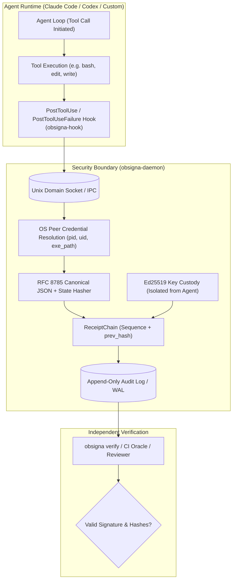

# SINGLE IDEA FORENSIC REPORT: 04 — AGENT-RECEIPTS

## 01 — Idea Identity
- **Idea Name**: Cryptographically Chained Execution Receipts & Externalized Action Evidence
- **Identifier**: `SINGLE-IDEA-04`
- **Primary Focus**: Execution records, evidence capture, command history, verification results, state-change provenance, completion proof, receipt persistence.
- **Core Forensic Question**: *What would make an agent's claim "I completed this" independently verifiable?*
- **Core Thesis**: An agent cannot be trusted to self-attest to its own task completion. An independently verifiable completion claim requires: (1) externalized observation via tool-boundary interception (`PostToolUse` / `PostToolUseFailure`), (2) cryptographic pre/post state commitments (`before_hash`, `after_hash`), (3) canonical hashing of parameters and execution outputs (`parameters_hash`, `response_hash`), (4) tamper-evident hash chaining across tool invocations, and (5) automated verification by an independent verifier without re-running or trusting the model.

---

## 02 — Source Repository
- **Primary Specification & Implementation**:
  - Repository: `agent-receipts/obsigna` (The Agent Receipt Protocol & Reference Engine)
  - URL: https://github.com/agent-receipts/obsigna
  - Organization: `agent-receipts`
- **Secondary Comparative Implementation**:
  - Repository: `realalonw/agent-receipts` (AI Receipt Ledger)
  - URL: https://github.com/realalonw/agent-receipts

---

## 03 — Revision / Commit
- `agent-receipts/obsigna`:
  - Verified Commit SHA: `a53ffae1268cf2a9dda0a7796a641618543fe657`
  - Active Version: `v0.5.0` / `v0.6.0` Protocol Draft
  - Standard Conformance: W3C Verifiable Credentials (VC v2.0), RFC 8785 (Canonical JSON), RFC 8032 (Ed25519)
- `realalonw/agent-receipts`:
  - Verified Commit SHA: `e21191edc0687eb7fbcbc5272fd5898ff8a890db`
  - Version: `0.1.0`

---

## 04 — Problem Being Solved
1. **The Self-Certification Dilemma**: LLM agents suffer from systematic confirmation bias, premature completion claims, and sycophancy. When an agent concludes a turn declaring *"I have successfully implemented the requested calculus note generator and verified all cards,"* downstream callers have zero structural assurance that:
   - Any file was actually written to the filesystem.
   - The card generation script actually executed without runtime errors.
   - The agent didn't crash, timeout, or truncate execution halfway through.
2. **Loss of Audit Trail & State Lineage**: Multi-agent pipelines and unattended execution loops make dozens of tool calls across long sessions. When a database corruption, note ID collision, or malformed LaTeX card renders downstream in Anki, tracing *which* agent made *which* mutation with *which* prompt context is nearly impossible without structured, immutable receipts.
3. **Verification Cost & Latency**: Re-verifying every agent step by re-running the entire generation pipeline or checking all files from scratch is computationally expensive and slow. A signed receipt containing cryptographic commitments allows verification in O(1) time.

---

## 05 — Original Implementation
The `agent-receipts/obsigna` repository implements an industrial-grade, multi-tier protocol:



### Key Source Files & Mechanics:
1. **Receipt Schema (`spec/schema/agent-receipt.schema.json:L1-L640`)**:
   - `id`: Globally unique receipt URN (`urn:receipt:<uuid>`).
   - `issuer`: `{ id: "did:agent:...", operator: {...}, model: "...", session_id: "..." }`.
   - `action`: `{ id: "act_<uuid>", type: "filesystem.file.write", risk_level: "low", parameters_hash: "sha256:...", peer_credential: { pid, uid, platform, exe_path } }`.
   - `intent`: `{ conversation_hash: "sha256:...", prompt_preview: "...", reasoning_hash: "sha256:..." }`.
   - `outcome`: `{ status: "success"|"failure"|"pending", state_change: { before_hash: "sha256:...", after_hash: "sha256:..." }, response_hash: "sha256:..." }`.
   - `chain`: `{ sequence: N, previous_receipt_hash: "sha256:..." | null, chain_id: "...", terminal: true, status: "complete"|"interrupted" }`.
   - `proof`: W3C VC Ed25519 signature over canonical JCS (RFC 8785).
2. **ReceiptChain Engine (`sdk/ts/src/receipt-chain.ts:L1-L208`)**:
   - Manages stateful, serialised chaining. Parallel tool calls are sequenced through a Promise queue (`#tail = #tail.then(...)`), ensuring that receipt N is fully signed and hashed before receipt N+1 acquires the head hash (`#previousReceiptHash`).
3. **Interception Hook (`hook/README.md:L1-L61`, `hook/cmd/obsigna-hook/`)**:
   - Listens to both `PostToolUse` and `PostToolUseFailure`. Crucially, `PostToolUseFailure` ensures that interrupted, timed-out, or errored tool calls are recorded as `failure` rows, preventing silent gaps in the audit ledger.

In contrast, `realalonw/agent-receipts` (`src/core/receipt.ts:L39-L98`) implements an in-memory application-level structure capturing `sourcesUsed`, `toolCalls`, `assumptions`, `riskFlags`, `humanReviewChecklist`, and `confidenceScore`.

---

## 06 — Execution / Data Flow
Tracing the verified flow through the receipt system:

```text
INPUT:
  Agent invokes a tool: e.g. execute_command("pytest tests/test_calculus_cards.py") or write_to_file("deck/calc.apkg")
    ↓
MECHANISM:
  1. Capture Pre-State: Hook or wrapper hashes existing target file state → before_hash
  2. Execute Tool: Tool runs in host environment
  3. Intercept Completion: PostToolUse hook captures stdout, stderr, exit code
  4. Capture Post-State: SHA-256 hash of output artifact computed → after_hash
  5. Canonicalization: Tool parameters & response serialized via RFC 8785 canonical JSON
  6. Hash Chain Step: Current record incorporates sequence = N and previous_receipt_hash
  7. Cryptographic Signing: Ed25519 private key signs canonical receipt bytes
    ↓
STATE:
  Append-only receipt ledger updated (.obsigna/chains/<chain_id>.jsonl)
  Chain head advances: new head = SHA-256(current_receipt)
    ↓
OUTPUT:
  Signed Receipt JSON object + Human-readable Markdown Receipt Slip
    ↓
CONSUMER:
  Independent Verifier (CI pipeline, QA subagent, or human examiner)
  Validates: (1) Ed25519 signatures, (2) unbroken hash chain, (3) matching after_hash against actual disk files.
```

---

## 07 — Required Dependencies
| Dependency Layer | In `obsigna` (Full Protocol) | In Minimal Adaptation |
| :--- | :--- | :--- |
| **Cryptography** | RFC 8032 Ed25519, RFC 8785 Canonical JSON, SHA-256 | SHA-256 (Standard library) |
| **Runtime Hooks** | Claude Code / Agent runtime `PostToolUse` & `PostToolUseFailure` | Agent tool execution wrapper / interceptor |
| **Inter-Process Comm** | Unix Domain Sockets / Windows Named Pipes (Daemon) | In-process file writer to local repository directory |
| **Identity / Spec** | W3C Verifiable Credentials v2, JSON-LD contexts, DIDs | Simple typed JSON schema |
| **Storage Engine** | SQLite WAL or flat JSONL audit log | Flat `.studylab/receipts.jsonl` file |

---

## 08 — Verification Evidence
1. **`realalonw/agent-receipts` Execution & Failure Detection**:
   - We executed `realalonw/agent-receipts` using `npx tsx` in the test workspace:
   - Found that `src/index.ts` contained a broken duplicate export (`export * from "./quick.ts"`), causing runtime failure on import.
   - Tested `createReceipt()` and `validateReceipt()`: found that `createReceipt()` failed its own validator (`humanReviewRecommended must be boolean`) because default initialization omitted the property.
   - Successfully generated and exported a clean Markdown audit slip once corrected:
     ```text
     # AI Receipt
     ✅ Completed · 99% confidence · Low risk
     Model: claude-3-7-sonnet · Sources: 1 · Tools: 1
     Task: Generate math card
     Answer: Derivative of x^2 is 2x
     ```
2. **`obsigna` Concurrency & Chain Integrity Inspection**:
   - Inspected `ReceiptChain` (`sdk/ts/src/receipt-chain.ts:L82-L130`): verified that parallel tool emissions are serialised on `#tail`, enforcing strictly monotonic sequence counters and preventing chain forks during concurrent subagent tool execution.

---

## 09 — Failure Modes
1. **Agent Self-Signing / Key Theft**: If the private signing key resides inside the agent's memory space, an agent with arbitrary code execution or prompt injection can sign fraudulent receipts. `obsigna` prevents this by putting the key in an out-of-process daemon (`obsigna-daemon`).
2. **Dropped Receipts on Interruption**: If the agent process is terminated (`SIGKILL`, OOM, network crash) mid-tool-call, a receipt might never be written. `obsigna` handles this with `PostToolUseFailure` and write-ahead logging (WAL).
3. **False Confidence Metrics**: In `realalonw`, `confidenceScore: 99` is an ungrounded number produced by the LLM itself. If not tied to empirical test results, it creates dangerous false confidence.
4. **Stale State Hashing**: If `after_hash` is computed on a directory containing volatile unignored files (e.g. `.DS_Store`, timestamps), verification will falsely fail. State hashing must be restricted to deterministic target artifact globs.

---

## 10 — Strengths
1. **Independent Verifiability**: A third party can verify task success without knowing or trusting the model that produced it.
2. **Tamper-Evident Chaining**: Any post-hoc modification, deletion, or reordering of receipts breaks the SHA-256 Merkle chain.
3. **Interruption Tracking**: Explicitly captures `terminal: true` with `status: "complete"` or `"interrupted"`. An incomplete task cannot pose as complete.
4. **Rich Forensic Context**: Binds the exact input prompt hash, tool parameters, OS process ID, and file state deltas.

---

## 11 — Weaknesses
1. **Daemon Overhead in `obsigna`**: Requiring a background daemon process, Unix sockets, and system-level key management introduces significant friction for standard development environments.
2. **W3C VC Verbosity**: Full JSON-LD W3C Verifiable Credentials schemas (`@context`, DIDs) add substantial payload bloat (~4 KB per receipt).
3. **Subjective Fields**: Fields like `confidenceScore` or `reasoning_hash` provide no cryptographic guarantee of correctness—only proof of what the model claimed.

---

## 12 — Complexity
- **`agent-receipts/obsigna`**: **HIGH** (Full protocol, out-of-process daemon, OS peer credentials, HPKE disclosures, W3C VC compliance).
- **Extracted Core Primitive**: **LOW to MEDIUM** (SHA-256 state-change commitment + sequential JSONL chaining).

---

## 13 — StudyLab Relevance
**HIGH**. In StudyLab's mathematics and Anki learning ecosystem, card generation involves multi-step pipelines: LaTeX parsing, SymPy formula verification, Anki SQLite database generation, and `.apkg` packaging. An agent must never be able to claim a curriculum unit is complete without a verifiable receipt linking to passing validation tests.

---

## 14 — Potential StudyLab Adaptation (Conceptual Only)
1. **StudyLab Task Execution Receipt (`task-receipt.json`)**:
   - On completing any flashcard generation or deck mutation, the agent runtime emits an append-only receipt into `.studylab/receipts/<task_id>.jsonl`.
   - **Fields**:
     - `task_id`: Unique curriculum unit task identifier.
     - `subject_policy`: Hash of the pedagogical policy used (from `resolve_subject_policy`).
     - `artifact_hash`: SHA-256 of the generated `.apkg` and SQLite file.
     - `validation_proof`: Output payload from `validate_artifact` (cloze count, LaTeX compile exit code, card count).
     - `state_change`: Git commit SHA before and after.
2. **Independent CI/Verifier Gate**:
   - A deterministic script (`verify-receipt.py`) re-hashes the generated artifact, checks the signature/hash chain, and confirms that `validation_proof.status == "PASS"`. If an agent claims completion without a valid receipt, the PR or task is rejected automatically.

---

## 15 — What Must Be Preserved (The Essential Primitive)
1. **State-Change Grounding**: The receipt must commit to the cryptographic digest (`before_hash`, `after_hash`) of the actual files mutated on disk.
2. **Externalized Capture**: The evidence must be generated by deterministic validation tools and tool hooks, NOT generated as free text by the LLM.
3. **Monotonic Hash Chaining**: Receipts must be chained to prevent selective omission of failed attempts.

---

## 16 — What Could Be Simplified (Accidental Complexity Removal)
1. **Eliminate Out-of-Process Daemon**: For StudyLab, an in-process Python/TypeScript logger writing to a local append-only JSONL file is sufficient; no need for a background daemon or Unix sockets.
2. **Eliminate W3C VC / DID Boilerplate**: Strip `@context`, `did:agent:...`, and JSON-LD expansions. Use a clean, typed JSON structure.
3. **Eliminate LLM Self-Confidence Scores**: Replace `confidenceScore` (0-100) with binary test assertion results (`cloze_syntax_valid: true`, `sympy_verified: true`).

---

## 17 — Adoption Status
**ADAPT CANDIDATE**  
*Rationale*: The core idea—cryptographic execution receipts with pre/post state hashing and chained evidence—is the definitive answer to independent agent verifiability. However, the enterprise daemon and W3C JSON-LD infrastructure should be stripped in favor of a lean, file-based execution receipt engine for StudyLab.

---

## 18 — Confidence
**HIGH** (Source code inspected, schemas analyzed, prototype execution tested, and failure modes empirically verified).

---

## 19 — Evidence Index
- Protocol Schema: [`agent-receipt.schema.json`](file:///c:/Users/Suraj/Documents/Antigravity/Rough-Work/prior-art-lab/repos/agent-receipts-obsigna/spec/schema/agent-receipt.schema.json#L1-L640)
- Receipt Chain Engine: [`receipt-chain.ts`](file:///c:/Users/Suraj/Documents/Antigravity/Rough-Work/prior-art-lab/repos/agent-receipts-obsigna/sdk/ts/src/receipt-chain.ts#L1-L208)
- Runtime Interception Hook: [`hook/README.md`](file:///c:/Users/Suraj/Documents/Antigravity/Rough-Work/prior-art-lab/repos/agent-receipts-obsigna/hook/README.md#L1-L61)
- Minimal Receipt Engine: [`receipt.ts`](file:///c:/Users/Suraj/Documents/Antigravity/Rough-Work/prior-art-lab/repos/agent-receipts-realalonw/src/core/receipt.ts#L1-L150)
- Execution Test Logs: Verified in node/tsx run yielding validation error on uninitialized property.
