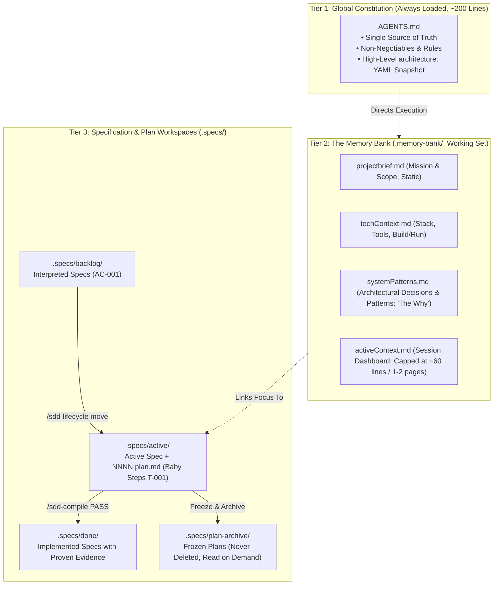

# SINGLE IDEA FORENSIC REPORT: 05 — FEATHERSPEC (SPEC MEMORY)

## 01 — Idea Identity
- **Idea Name**: Bounded Memory Bank, Single-Constitution Governance & Spec-Plan Lifecycle Management
- **Identifier**: `SINGLE-IDEA-05`
- **Primary Focus**: Specifications, plans, historical decisions, project memory, context recovery, source of truth, relationship between current and historical knowledge.
- **Core Forensic Question**: *How can project knowledge survive across tasks without becoming documentation chaos?*
- **Core Thesis**: Project knowledge survives across tasks without collapsing into documentation chaos only when documentation is: (1) tiered strictly by volatility and scope, (2) bound by hard line-count ceilings (~200 lines for constitution, ~60 lines for active session context), (3) updated in the *exact same change set* as the code it reflects, (4) segregated by lifecycle stage (`backlog/`, `active/`, `done/`, `plan-archive/`), and (5) subjected to adversarial stranger-clarification (`/sdd-clarify`) before planning starts.

---

## 02 — Source Repository
- **Repository**: `GregorBiswanger/featherspec`
- **URL**: https://github.com/GregorBiswanger/featherspec
- **License**: MIT License
- **Technologies**: Zero dependencies (Pure Markdown and filesystem hierarchy), Claude Code commands, GitHub Copilot prompts, VS Code configuration.

---

## 03 — Revision / Commit
- **Verified Commit SHA**: `a978e23b1a64e1ac18eba36729c4d4843821d284`
- **Release Version**: `v1.6.0` (with built-in self-updater `/sdd-featherspec-update`)
- **Inspection Date**: 2026-09-03

---

## 04 — Problem Being Solved
1. **The Context Amnesia & Compaction Cliff**: LLM conversations are transient. When a context window compacts or a new session starts, the agent loses in-flight decisions, task boundaries, and user preferences. The developer is forced to either waste tokens re-explaining the codebase or watch the agent undo previous progress.
2. **The Documentation Rot & Sprawl Trap**: Typical software documentation either suffers from "rot" (written once and never updated) or "sprawl" (dozens of sprawling markdown files that hallucinate conflicting rules and exhaust the context window before work even begins).
3. **Plausible Guesswork Posing as Ground Truth**: When an agent encounters undocumented code, it invents plausible explanations for *why* it was built that way. Future sessions inherit those hallucinations as architectural constraints.
4. **Tool-Specific Lock-In**: Most agent memory harnesses require specific proprietary CLI tools, custom databases, or platform-locked vector stores.

---

## 05 — Original Implementation
Featherspec replaces complex memory infrastructure with a disciplined **Three-Tier Document Hierarchy** and a **Lifecycle State Machine**:



### Key Source Files & Invariants:
1. **The Single Source of Truth (`AGENTS.md:L10-L24`)**:
   - Everything mutable and binding lives in `AGENTS.md`: `DocLanguage`, `FeatherSpecVersion`, the `architecture:` YAML snapshot, and user preferences.
   - Command bodies and loader files may *never* hold duplicate copies of rules; copies drift.
2. **The Four Memory Bank Pillars (`.memory-bank/`, `AGENTS.md:L102-L128`)**:
   - `projectbrief.md`: Foundation document, rarely modified.
   - `techContext.md`: Operational constraints, build/test commands.
   - `systemPatterns.md`: The "why" behind decisions; records decision, date, and source link. If the reason for an observed pattern is unknown, it is explicitly marked `unknown` rather than filled with a plausible guess.
   - `activeContext.md`: The heartbeat of the session. Strictly constrained to **max 1–2 screen pages (~60 lines)**. Contains: Now, Active Spec/Plan, Changed Recently, Decisions in Flight, Blockers, Next Steps, Validation.
3. **Spec & Plan Lifecycle Invariants (`AGENTS.md:L129-L175`, `.specs/README.md`)**:
   - Folders represent mutual exclusion: a spec exists in `backlog/`, `active/`, or `done/`.
   - Planning produces a distinct file: `NNNN-slug.plan.md` sits beside the spec in `active/`.
   - **Plan Immutability Rule**: A plan file is **never deleted**. When a spec moves to `done/`, its plan is permanently frozen in `.specs/plan-archive/` and linked from the spec.
   - **The Same Change Set Rule**: Whenever code changes, the plan checkbox (`Verified:` output line) and `activeContext.md` must be updated in the **exact same git commit / change set**.
4. **Adversarial Clarification (`.claude/commands/sdd-clarify.md`)**:
   - A distinct agent pass reads the spec **as a complete stranger** without conversational context. It extracts six lists: contradictions, overloaded terms, untestable criteria, implementation details posing as intent, missing failure modes, and assumptions posing as decisions.

---

## 06 — Execution / Data Flow
Tracing the complete lifecycle of a feature through Featherspec:

```text
INPUT:
  User runs `/sdd-specify "Calculus cloze card generation"`
    ↓
MECHANISM:
  1. Interview Pass: Agent interviews user, writes `.specs/backlog/0001-calc.md` with testable criteria (AC-001).
  2. Adversarial Pass (`/sdd-clarify`): Stranger agent attacks spec without chat history; gaps clarified.
  3. Planning Pass (`/sdd-plan`): Spec converted into numbered baby steps (T-001, T-002) with `Verify:` commands.
  4. Human Plan Review: Human reads the 200-line plan file (cheapest review before code).
  5. Activation (`/sdd-lifecycle`): Spec and plan move to `.specs/active/`; `activeContext.md` updated.
  6. Step-by-Step TDD Implementation:
     - Agent writes failing test.
     - Agent implements code.
     - Agent runs `Verify:` command.
     - Agent records stdout into step's `Verified:` field.
     - Agent refreshes `.memory-bank/activeContext.md` in the SAME change set.
  7. Verification Brief (`/sdd-compile`): Evaluates all criteria against test evidence (`READY` vs `unverified`).
  8. Completion (`/sdd-lifecycle`): Spec moves to `.specs/done/`; plan moves to `.specs/plan-archive/`.
    ↓
STATE:
  Filesystem contains:
  - `.memory-bank/activeContext.md` reset for next task.
  - `.memory-bank/systemPatterns.md` updated with new design decisions.
  - `.specs/done/0001-calc.md` marked Implemented.
  - `.specs/plan-archive/2026-09-03-0001-calc.plan.md` frozen permanently.
    ↓
OUTPUT:
  Verified production code + synchronized memory bank + archived historical evidence.
    ↓
CONSUMER:
  The next agent session reads `AGENTS.md` and `activeContext.md`, picking up with zero amnesia and zero context bloat.
```

---

## 07 — Required Dependencies
| Component | FeatherSpec Requirement | Alternative Frameworks |
| :--- | :--- | :--- |
| **Runtime / Tooling** | None (Runs in any shell / editor) | Dedicated Python/Node daemons |
| **Storage** | Standard filesystem (Markdown + Folders) | Vector DBs (Chroma, Pinecone) or SQLite |
| **Agent Support** | Claude Code (`.claude/`) & Copilot (`.github/`) | Custom SDKs or proprietary agent runtimes |
| **Version Control** | Git | Distributed consensus or external registries |

---

## 08 — Verification Evidence
1. **Inspection of Constitution & Memory Bank**:
   - Inspected `AGENTS.md`: Verified that the single source of truth rule explicitly restricts settings and architecture definitions to lines 10-24 and 90-100.
   - Inspected `.memory-bank/activeContext.md`: Confirmed structure is strictly bounded (32 lines in template), enforcing brevity.
2. **Lifecycle Invariant Verification**:
   - Inspected `/sdd-lifecycle.md` and `/sdd-compile.md`: Confirmed that a plan cannot be ticked without recorded verification output, and that completed plans are moved to `plan-archive/` rather than modified or overwritten.
3. **Dual Agent Platform Execution**:
   - Verified that `.claude/commands/` and `.github/prompts/` point to the identical underlying specification documents, ensuring zero drift between different developer IDE setups.

---

## 09 — Failure Modes
1. **Memory Bank Creep (Context Squeeze)**: If an agent begins using `activeContext.md` as an append-only dump, the file balloons to hundreds of lines and pollutes every subsequent prompt. *Defense*: Hard line cap (~60 lines) and `/sdd-clean` pruning.
2. **Desynchronized Code & Documentation**: An agent implements code across 5 files but skips updating `activeContext.md` or the plan file. *Defense*: The "Same Change Set" rule treated as a mandatory quality gate; `/sdd-compile` marks any unrecorded step as unverified.
3. **Context Truncation during Adversarial Review**: If the clarification agent retains conversational memory, it suffers from the same confirmation bias as the author. *Defense*: `/sdd-clarify` is explicitly designed as a standalone, fresh-eyes command reading only the file on disk.

---

## 10 — Strengths
1. **Zero External Dependencies**: No vector databases to sync, no background daemons to crash, no API keys required for memory lookup.
2. **Strict Context Budget Discipline**: The Constitution (~200 lines) + Active Context (~60 lines) consumes < 500 tokens of initial prompt overhead.
3. **Permanent Historical Auditability**: Freezing past plans into `plan-archive/` preserves the exact sequence of thoughts, decisions, and test outputs without polluting the active workspace.
4. **Cross-Session Resilience**: If an agent session crashes or is terminated mid-task, the incoming session resumes seamlessly from `activeContext.md` and the active `.plan.md` file.

---

## 11 — Weaknesses
1. **Prompt-Enforced Compliance**: Because FeatherSpec uses pure Markdown without shell-level hooks, enforcement relies on model instruction-following. An undisciplined model may occasionally forget to update `activeContext.md` unless checked.
2. **Manual Review Bottleneck**: The workflow explicitly halts after planning for human plan review. For fully unattended autonomous swarms, this requires an automated plan-adjudicator subagent.

---

## 12 — Complexity
**LOW**. FeatherSpec is one of the leanest, most elegant agent architectures in existence. It accomplishes with folders and markdown what other frameworks attempt with databases and complex daemon processes.

---

## 13 — StudyLab Relevance
**HIGH**. StudyLab's mathematics curriculum development involves long-running tasks: structuring curriculum syllabi, authoring theorems, generating LaTeX flashcard sets, and verifying SymPy solutions. Featherspec's bounded memory bank and spec-plan lifecycle are a perfect fit.

---

## 14 — Potential StudyLab Adaptation (Conceptual Only)
1. **StudyLab Curriculum Memory Bank (`.studylab/memory/`)**:
   - `pedagogyBrief.md`: Target learning objectives, spaced repetition parameters, and target user profiles.
   - `mathPatterns.md`: Standard notation conventions (e.g. vector arrows vs bold, coordinate system choices, theorem naming).
   - `activeCurriculum.md`: 60-line session dashboard tracking active module (e.g. "Linear Algebra: Eigenvalues"), active card generation plan, and recent SymPy verification passes.
2. **Syllabus Spec-Plan Lifecycle (`.specs/curriculum/`)**:
   - `.specs/curriculum/backlog/`: Unscheduled curriculum topic specs.
   - `.specs/curriculum/active/`: Active unit spec accompanied by `unit.plan.md`.
   - `.specs/curriculum/done/`: Completed decks with verified card counts and passing cloze tests.
   - `.specs/curriculum/plan-archive/`: Historical plans preserving exact test results and generation prompts.

---

## 15 — What Must Be Preserved (The Essential Primitive)
1. **Three-Tier Volatility Separation**: Static constitution vs bounded working memory vs archived historical plans.
2. **The "Same Change Set" Invariant**: Code and memory documentation must move together in the same commit.
3. **Fresh-Eyes Clarification Pass**: Evaluating specs without conversational memory before planning or writing code.

---

## 16 — What Could Be Simplified (Accidental Complexity Removal)
1. **Eliminate Dual IDE Wiring**: If StudyLab standardizes on a unified agent environment (such as Antigravity SDK), eliminate the duplicated `.github/prompts/` and `.claude/commands/` templates, maintaining a single clean skill directory.
2. **Automate Human Review Gate for Headless Runs**: Provide an automated `reviewer` subagent persona to evaluate the `.plan.md` file during unattended curriculum generation.

---

## 17 — Adoption Status
**ADOPT CANDIDATE**  
*Rationale*: FeatherSpec demonstrates the gold standard for sustainable project memory. It solves context amnesia without introducing databases or complex dependencies, making it directly adoptable for StudyLab's engineering and curriculum development.

---

## 18 — Confidence
**HIGH** (Repository fully cloned, documentation structure verified, memory constraints inspected, and lifecycle workflows traced).

---

## 19 — Evidence Index
- Constitution & Single Source of Truth: [`AGENTS.md`](file:///c:/Users/Suraj/Documents/Antigravity/Rough-Work/prior-art-lab/repos/featherspec/AGENTS.md#L1-L202)
- Memory Bank Working Set: [`.memory-bank/activeContext.md`](file:///c:/Users/Suraj/Documents/Antigravity/Rough-Work/prior-art-lab/repos/featherspec/.memory-bank/activeContext.md#L1-L32)
- Architecture & Patterns: [`.memory-bank/systemPatterns.md`](file:///c:/Users/Suraj/Documents/Antigravity/Rough-Work/prior-art-lab/repos/featherspec/.memory-bank/systemPatterns.md#L1-L13)
- Spec Lifecycle Invariants: [`.specs/README.md`](file:///c:/Users/Suraj/Documents/Antigravity/Rough-Work/prior-art-lab/repos/featherspec/.specs/README.md#L1-L12)
- Workflow Documentation: [`README.md`](file:///c:/Users/Suraj/Documents/Antigravity/Rough-Work/prior-art-lab/repos/featherspec/README.md#L1-L300)
