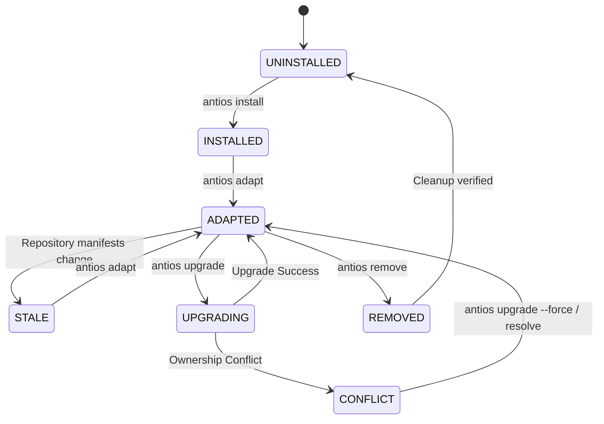

# AntiOS 3.x Project Instance Lifecycle & System B Operational Specification

## 1. Architectural Foundations: System A vs. System B Boundary

AntiOS governs the interaction between Google Antigravity and target software repositories. Under the Constitutional Architecture (`INV-01` through `INV-15`), operational data is divided into two sovereign systems:

```
+-----------------------------------------------------------------------------+
|                         TARGET PROJECT REPOSITORY                           |
|                                                                             |
|   [Native Code & Tests]          [AntiOS Instance: System A]                |
|   - src/, tests/, pyproject.toml  - .antios/manifest.json (Provenance)      |
|   - Zero runtime vendor lock     - .antios/project_profile.json (Identity)  |
|   - Runs without AntiOS          - .antios/tool_policy.json (Governance)    |
|                                  - .agents/routes.json, AGENTS.md (Turn-0)  |
|                                  - .agents/skills/ (Operating Skills)       |
+-----------------------------------------------------------------------------+
                                       |
                       Passive Telemetry Bridge (Non-blocking)
                       Byte-offset Checkpoint / Safe Sanitizer
                                       v
+-----------------------------------------------------------------------------+
|                     EXTERNAL SYSTEM B (Experience Plane)                    |
|                     Location: $ANTIOS_DATA_DIR/experience.db                |
|                     (Strictly OUTSIDE target repository)                    |
|                                                                             |
|   - ACID SQLite Experience Store                                            |
|   - Sanitized Engineering Events (FACT grade, Zero Bypass)                  |
|   - Multi-tenant Scoping (project_id isolated)                              |
|   - Pass/Fail Analytics, Friction Patterns, Strategy Discovery              |
+-----------------------------------------------------------------------------+
```

- **System A (Project Truth)**: Project-specific engineering intelligence, boundaries, route maps, and tool policies stored inside the target repo under `.antios/` and `.agents/`.
- **System B (External Experience)**: Sanitized, cross-session operational intelligence persisted exclusively in an external data directory (default `~/.antios/data/experience.db` or configured via `ANTIOS_DATA_DIR`). Target repositories are never polluted with cross-project learning stores or raw agent execution transcripts.

---

## 2. Instance Lifecycle State Machine

An AntiOS project instance transitions deterministically through well-defined lifecycle states:



### Formal States (`InstallationState`)
1. `UNINSTALLED`: Target repository has no AntiOS instance.
2. `PARTIAL`: Incomplete installation due to pre-existing file collisions or aborted operations.
3. `INSTALLED`: AntiOS files written, manifest initialized, and Turn-0 environment emitted.
4. `UPGRADING`: Atomic intermediate state while reconciliation plan is applied.
5. `ERROR`: Manifest corruption or unreadable state (fails closed with structured diagnostic).
6. `REMOVED`: Sovereign uninstallation completed; all AntiOS files cleanly pruned.

### Adaptation States (`AdaptationState`)
1. `UNADAPTED`: Initial state before project discovery.
2. `ADAPTED`: Static intelligence synchronized with project manifests and topology.
3. `STALE`: Upstream manifests (e.g. `pyproject.toml`, `package.json`) modified on disk since last adaptation.
4. `CONFLICT`: User edits clash with AntiOS management rules without resolution.

---

## 3. Manifest Specification & Artifact Ownership Tiers

The authoritative root of an instance is `.antios/manifest.json`. Every file within or related to the AntiOS environment is assigned an explicit **Artifact Ownership Tier**:

### Ownership Hierarchy
| Ownership Tier | Description | Overwrite Policy on Upgrade | Uninstallation Policy |
| :--- | :--- | :--- | :--- |
| `GENERATED` | Deterministically derived intelligence (`.antios/project_profile.json`, `tool_policy.json`, Turn-0 `routes.json`, etc.) | Safely regenerated IF unmodified by user. Preserved if user modified. | Reaped unless modified by user. |
| `MANAGED` | Adapter configuration and hooks (`antios.config.json`, `.agents/hooks.json`). | Merged / updated respecting user-declared overrides. | Removed unless marked user-owned. |
| `USER_AUTHORED` | User-created skills, tests, scripts, and documentation (`.agents/skills/custom/`, `src/`, etc.). | **NEVER** overwritten under any circumstance. | Strictly preserved intact. |
| `PROJECT_PROTECTED`| Native project source code, configurations, and git state. | Immutable boundary (`INV-10`). | Completely untouched. |
| `ANTIOS_IMMUTABLE` | Internal universal core policies and schemas. | Core reference only. | N/A (resides in framework). |
| `EXTERNAL` | System B telemetry databases, logs, and central configs. | Stored outside repo. | Preserved outside repo. |

### Schema Migration
The `ProjectManifest` schema supports automatic forward migration:
```python
def migrate_manifest_data(raw_data: Dict[str, Any]) -> Dict[str, Any]:
    # Schema 1.0.0 -> 2.0.0:
    # 1. Normalizes string ownerships into ArtifactRecord instances with sha256 & provenance.
    # 2. Ensures user_owned_paths, protected_paths, and metadata sections exist.
    # 3. Preserves reconciliation_state and external data directory pointers.
```

---

## 4. Reconciliation Engine Mechanics

When `antios upgrade` is invoked, the `ReconciliationEngine` calculates a complete diff between the target repository disk state and the proposed new release compilation.

### Deterministic Action Matrix
```
                           Disk File State vs Manifest Baseline
                                         |
            +----------------------------+----------------------------+
            |                                                         |
     Matches Manifest SHA                                      Differs from Manifest SHA
            |                                                         |
    +-------+-------+                                                 v
    |               |                                      PRESERVE_USER_MODIFIED
Disk SHA ==    Disk SHA !=                                (User customizations protected;
Target SHA     Target SHA                                  registered into user_owned_paths)
    |               |
    v               v
UNTOUCHED       REGENERATE
 (No-op)     (Safely updated to
               new release)
```

### Reconciliation Actions (`ReconciliationAction`)
- `UNTOUCHED`: Artifact matches the target release; zero disk write.
- `REGENERATE`: Unmodified generated artifact safely updated to the new release baseline.
- `CREATE`: New artifact introduced in the new AntiOS release.
- `PRESERVE_USER_MODIFIED`: User modified an AntiOS-generated file; AntiOS leaves the file intact on disk and records it in `manifest.user_owned_paths`.
- `PRESERVE_OBSOLETE_USER_MODIFIED`: An artifact removed in the new release was customized by the user; preserved as a user-owned file.
- `REAP_OBSOLETE`: An artifact removed in the new release was unmodified; cleanly and safely deleted from disk and pruned from the manifest.
- `RESTORE_MISSING`: A required AntiOS artifact was deleted from disk; restored from target release template.
- `CONFLICT`: An untracked pre-existing file occupies an AntiOS path; upgrade halts safely unless `--force` is provided.

### Checksum Idempotency
An upgrade is declared `IDEMPOTENT` when:
1. Installed version equals target version.
2. Manifest schema version equals target schema version.
3. No regenerations, creations, restorations, or reaps are scheduled.

Running `antios upgrade` twice consecutively produces zero progressive mutations, zero file writes, and returns `status="IDEMPOTENT"`.

---

## 5. System B Experience Ingestion Architecture

AntiOS connects to Antigravity runtime execution through the `AntigravityEventBridge` without background daemons (`INV-15`) and without altering host task exit codes (`INV-04`).

### Non-Blocking Telemetry Ingestion
1. **Source Signals**:
   - `PreToolUse` & `Stop` hook invocations (`.agents/hooks.json`).
   - Append-only event log: `.agents/telemetry.ndjson`.
   - Headless CLI streaming: `antios telemetry ingest`.
2. **Byte-Offset Checkpointing**:
   - Ingestion records `last_byte_offset` in `ingestion_checkpoints` table in `experience.db`.
   - Subsequent turns read ONLY newly appended bytes (~0ms overhead).
3. **Resilience Guarantees**:
   - Incomplete lines mid-write are safely buffered until the next turn.
   - Corrupt or truncated JSON lines are skipped without throwing exceptions.
   - If `experience.db` is locked, unconfigured, or fails, the bridge returns a structured failure and **NEVER** interrupts the user's coding or testing task.

---

## 6. Operator Runbook & CLI Reference

### 1. Inspect Instance
```bash
# Check instance health and configuration
antios status

# Run deep diagnostic doctor suite
antios doctor

# View active manifest details
antios manifest
```

### 2. Upgrade Instance
```bash
# Check whether an upgrade is available
antios upgrade --check

# Dry-run / review the deterministic reconciliation plan
antios upgrade --plan

# Execute upgrade (snapshot created, obsolete files reaped, user mods kept)
antios upgrade

# Overwrite conflicting untracked files if explicitly desired
antios upgrade --force
```

### 3. Reconcile & Repair
```bash
# Re-synchronize static environment with updated repository files
antios adapt

# Restore missing core runtime files
antios repair
```

### 4. Telemetry & Experience Intelligence
```bash
# Incremental ingestion of .agents/telemetry.ndjson into experience.db
antios telemetry ingest

# Check experience store status and event coverage
antios experience status

# Generate full project analytics report (Markdown / JSON)
antios experience report --project-id <PID>

# Synchronize / vacuum experience store
antios experience sync
```

### 5. Sovereign Uninstallation
```bash
# Remove AntiOS instance cleanly
antios remove
```
- Removes `.antios/runtime/`, `.antios/manifest.json`, and generated intelligence.
- Strictly preserves user-created skills (`.agents/skills/*`), user-modified files, and all project code.
- Native project test suites run 100% independently after uninstallation.
