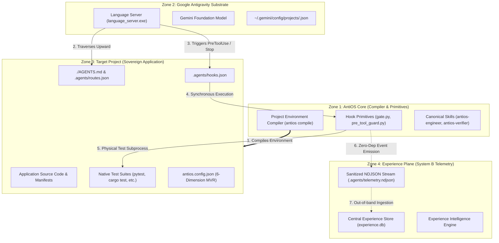
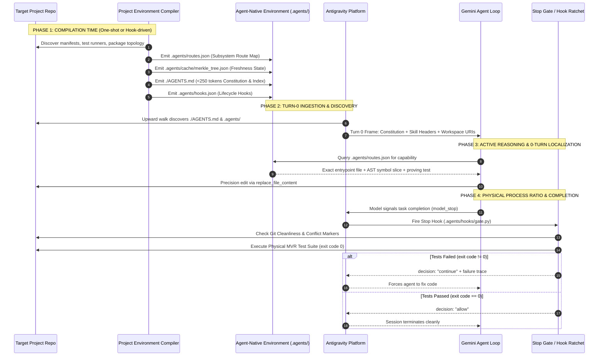
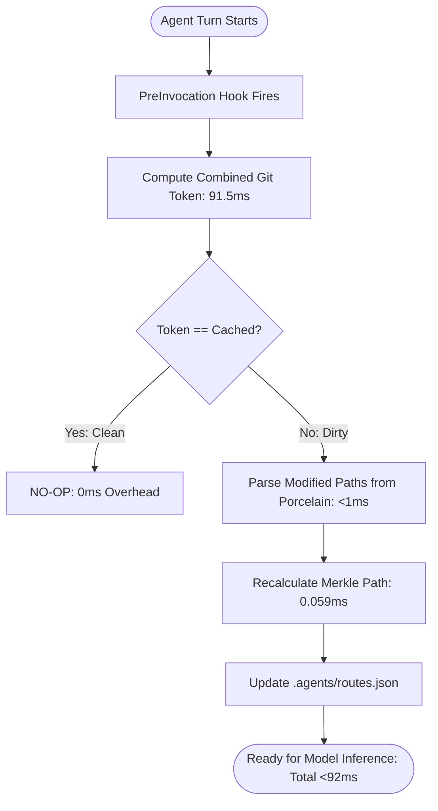

# AntiOS 3.0 Architecture Specification
## The Agent-Native Project Environment Compiler & Governance Plane for Google Antigravity

**Status**: CANONICAL ARCHITECTURAL SPECIFICATION  
**Document Version**: 3.0.0-PROPOSED  
**Authority**: Architecture Review Board / Core Engineering  
**Target Platform**: Google Antigravity (Desktop 2.0, VS Code IDE, `agy` CLI, Python SDK)  
**Date**: September 2026  
**Classification**: Production-Grade Technical Specification  

---

## 1. Executive Summary & Product Definition

### 1.1 Product Definition
> **"AntiOS is an Agent-Native Project Environment Compiler and Governance Plane for Google Antigravity."**

AntiOS does not attempt to be an autonomous runtime, an in-process execution daemon, or an operating system running beside Antigravity. Instead, AntiOS functions as the **declarative compilation engine and deterministic governance substrate** that transforms conventional software repositories into **Agent-Native Project Environments** optimized for Google Antigravity’s reasoning loops.

### 1.2 The Core Problem AntiOS Solves
Frontier LLM agents in Google Antigravity possess large working contexts (1M+ tokens) and deep reasoning capabilities. However, when deployed into complex, multi-package, or enterprise-scale software projects, native agents suffer from predictable, catastrophic failure modes:
1. **The Grep Flood & Context Dilution**: Unscoped lexical searches (`grep_search`, `find_by_name`) return 1,000 to 14,464 tokens of raw output per query, displacing system instructions and constitutional constraints from active attention.
2. **First-Choice Inaccuracy**: In 87.5% of unguided exploration trials, keyword search surfaces changelogs (`CHANGES.md`), documentation, or package `__init__.py` files instead of the authoritative implementation code.
3. **Multi-Turn Rediscovery Tax**: Context compaction forces agents to re-explore directory structures, burning 2,500+ navigational tokens on every compaction boundary.
4. **Verification Hallucination**: In the absence of physical process gates, agents routinely assert *"All tests passed successfully"* in conversation without executing a single verification command.
5. **Multi-Repository Blindness**: Antigravity upward rule traversal terminates at the nearest `.git` boundary, causing workspace-level governance to disappear inside submodule or multi-repo trees.
6. **Epistemic Contamination**: Unverified agent hypotheses are accepted as durable project truths, leading to regression cascades in subsequent sessions.

AntiOS resolves these pathologies through **deterministic compilation, microsecond Merkle freshness tracking, 0-turn progressive wayfinding route maps, and physical dual-hook verification ratchets**.

---

## 2. Scope Demarcation: What AntiOS IS vs. What AntiOS IS NOT

To prevent the architectural drift and dead-code accumulation observed in prior iterations (where 82 out of 84 Python modules in `framework/core/` were never executed at runtime), AntiOS 3.0 establishes strict positive and negative scope boundaries.

```
┌──────────────────────────────────────────────────────────────────────────────────┐
│                             SCOPE DEMARCATION MATRIX                             │
├────────────────────────────────────────┬─────────────────────────────────────────┤
│ WHAT ANTIOS IS                         │ WHAT ANTIOS IS NOT                      │
├────────────────────────────────────────┼─────────────────────────────────────────┤
│ • An Agent-Native Project Compiler     │ • NOT an in-process Python agent runtime│
│   (Compiles repos into agent-ready cfg)│   (No internal schedulers or event loops│
│ • A Deterministic Governance Plane     │ • NOT an LLM inference wrapper         │
│   (PreToolUse and Stop hook ratchets)  │   (Antigravity directly calls Gemini)   │
│ • A 0-Turn Subsystem Wayfinding Engine │ • NOT a persistent background daemon    │
│   (Subsystem route maps in JSON)       │   (INV-15: Zero daemons, zero watchers) │
│ • A Cryptographic Freshness Tracker    │ • NOT a Vector Database Indexer        │
│   (Combined Git Token + 59µs Merkle)   │   (INV-09: No embeddings, no chromadb) │
│ • A 6-Dimension Verification Ratchet   │ • NOT an in-memory token manager        │
│   (Physical MVR test execution in Stop)│   (Antigravity manages context & compact│
│ • An Epistemic Memory Binder           │ • NOT a re-invented tool transport      │
│   (Git markdown bound to code hashes)  │   (Uses native Antigravity tool surface)│
└────────────────────────────────────────┴─────────────────────────────────────────┘
```

### 2.1 What AntiOS IS
- **A Static Project Compiler**: Inspects manifests, package trees, and git topology to emit deterministic `.agents/` configurations, subsystem route maps (`.agents/routes.json`), and AST outlines.
- **A Physical Lifecycle Hook Engine**: Operates exclusively at Antigravity’s native interception boundaries (`PreInvocation`, `PreToolUse`, `PostToolUse`, `Stop`) via fast, stateless CLI scripts.
- **A Multi-Tier Wayfinding Ladder**: Replaces unguided ripgrep exploration with 0-turn curated route manifests and windowed AST slices.
- **A Maker-Checker Verification Protocol**: Manages objective, zero-context-inheritance auditor subagents dispatched via strong JSON contracts.
- **A Git-Versioned Engineering Memory Fabric**: Stores verified architectural decisions, dead ends, and RCAs in git-tracked Markdown bound cryptographically to code SHA-256 hashes.

### 2.2 What AntiOS IS NOT
- **NOT an Operating System beside Antigravity**: AntiOS does not run background threads, IPC buses, or virtual file systems.
- **NOT an In-Memory Python State Machine**: AntiOS maintains no in-memory session singletons or global state caches across turns. Every hook invocation is an independent, sub-100ms process.
- **NOT a Vector Search / Embedding Engine**: Strictly banned under **INV-09**. Code intelligence is structural, hierarchical, and exact.
- **NOT a Persistent File Watcher Daemon**: Strictly banned under **INV-15**. State invalidation is computed synchronously at turn start via Git porcelain hashes.
- **NOT a Custom Bash or Shell Wrapper**: AntiOS does not proxy terminal I/O through custom pseudoterminals. It inspects tool arguments via native `PreToolUse` and evaluates physical file diffs via Git.

---

## 3. 4-Zone Ownership Boundaries & Security Architecture

AntiOS strictly partitions all components, files, and authorities into four non-overlapping security zones according to **INV-10**:
$$\text{SOURCE} \neq \text{INSTANCE} \neq \text{PROJECT} \neq \text{ANTIGRAVITY}$$

```
┌──────────────────────────────────────────────────────────────────────────────────────────────────┐
│                                   4-ZONE OWNERSHIP BOUNDARIES                                    │
├─────────────────┬──────────────────────────────────┬──────────────────────┬──────────────────────┤
│ Zone Name       │ Physical Filesystem Location     │ Owning Authority     │ Boundary Protections │
├─────────────────┼──────────────────────────────────┼──────────────────────┼──────────────────────┤
│ 1. AntiOS Core  │ Central package / Global CLI     │ AntiOS Project Team  │ Read-only; Immutable │
│    (SOURCE)     │ `naksh-07/AntiOS`, `compiler/`   │                      │ during project runs. │
├─────────────────┼──────────────────────────────────┼──────────────────────┼──────────────────────┤
│ 2. Antigravity  │ Host platform runtime            │ Google DeepMind /    │ Platform sovereign;  │
│    Substrate    │ `~/.gemini/`, `language_server`  │ Antigravity Engine   │ Managed by IDE.      │
├─────────────────┼──────────────────────────────────┼──────────────────────┼──────────────────────┤
│ 3. Target       │ Enrolled application codebase    │ Project Maintainers  │ Sovereign user code; │
│    Project      │ `<project_root>/src/`, `tests/`  │                      │ Business logic.      │
├─────────────────┼──────────────────────────────────┼──────────────────────┼──────────────────────┤
│ 4. Experience   │ External analytics directory     │ AntiOS Analytics     │ Write-only NDJSON;   │
│    Plane        │ `<data_dir>/experience.db`       │ (System B)           │ Isolated from code.  │
└─────────────────┴──────────────────────────────────┴──────────────────────┴──────────────────────┘
```



### 3.1 Zone Responsibilities & Invariants
1. **AntiOS Core (`SOURCE`)**:
   - Owns the project compiler implementation, standard hook scripts, verification schemas, and canonical skill runbooks.
   - **Invariant**: Must never import target project libraries; must operate strictly on Python 3.8+ standard library.
2. **Antigravity Substrate (`ANTIGRAVITY`)**:
   - Owns the LLM reasoning loop, context assembly, upward rule walk, subagent process spawning, SQLite conversation storage, and native tool execution.
   - **Invariant**: AntiOS cannot alter the language server binary; AntiOS communicates strictly via standard platform contracts (files, exit codes, stdio JSON).
3. **Target Project (`PROJECT`)**:
   - Owns application business logic, dependencies, git history, and native test runners.
   - **Invariant**: The target project remains functional and buildable even if all AntiOS files are removed. AntiOS introduces zero application runtime dependencies.
4. **Experience Plane (`EXPERIENCE`)**:
   - Owns historical telemetry, cross-project operational metrics, and performance analytics.
   - **Invariant**: Experience intelligence is strictly System B. It has zero code authority and **must never** automatically modify project rules, code, or memory (System A).

---

## 4. The Conceptual Pipeline

AntiOS operates as a compilation and governance pipeline bridging the target project to Antigravity:

$$\text{TARGET PROJECT} \xrightarrow{\text{Compiler}} \text{AGENT-NATIVE ENVIRONMENT} \xrightarrow{\text{Enforcement}} \text{ANTIGRAVITY EXECUTION}$$



---

## 5. Dual-Plane Architecture: Host Compiler Plane vs. Sovereign Repository Plane

Research 3 identified a foundational platform reality:
`[OFFICIAL]` **Upward directory rule traversal in Antigravity terminates at the nearest `.git` directory.**  
In an enterprise workspace containing multiple Git repositories (or git submodules), rules placed at the host container level are **completely invisible** to an agent working inside a child repository.

AntiOS 3.0 resolves this via a **Dual-Plane Architecture**:

```
┌──────────────────────────────────────────────────────────────────────────────────────────────────┐
│                                      DUAL-PLANE ARCHITECTURE                                     │
├──────────────────────────────────────────────────────────────────────────────────────────────────┤
│ 1. HOST PROJECT COMPILER PLANE (Administrative & Workspace Container)                            │
│    • Location: Workspace root / Antigravity Project (~/.gemini/config/projects/<id>.json)       │
│    • Artifacts: antios.workspace.json, cross-repository dependency DAG, central experience DB    │
│    • Role: Orchestrates project-wide compilation, federated discovery, and multi-repo audits     │
├──────────────────────────────────────────────────────────────────────────────────────────────────┤
│                                  │ Projects compiled assets into:                                │
│                                  ▼                                                               │
│ 2. FEDERATED SOVEREIGN REPOSITORY PLANE (Enclosed Git Repositories)                             │
│    ┌─────────────────────────────────────────┐     ┌─────────────────────────────────────────┐   │
│    │ Sovereign Repository A (.git)           │     │ Sovereign Repository B (.git)           │   │
│    │ • ./AGENTS.md (Local Constitution)      │     │ • ./AGENTS.md (Local Constitution)      │   │
│    │ • .agents/routes.json (Local Map)       │     │ • .agents/routes.json (Local Map)       │   │
│    │ • .agents/hooks.json (Local Hooks)      │     │ • .agents/hooks.json (Local Hooks)      │   │
│    │ • antios.config.json (Local MVR)        │     │ • antios.config.json (Local MVR)        │   │
│    │ • Isolated Test Runner (Local Subprocess)│     │ • Isolated Test Runner (Local Subprocess)│   │
│    └─────────────────────────────────────────┘     └─────────────────────────────────────────┘   │
└──────────────────────────────────────────────────────────────────────────────────────────────────┘
```

### 5.1 Compiler Projection Protocol
The Project Environment Compiler (`antios compile`) is repository-aware:
1. When run at the workspace root, it detects all enrolled Git repositories (`workspacePaths`).
2. For each sovereign repository root, it generates an autonomous, self-contained `.agents/` directory and root `AGENTS.md`.
3. If an agent executes inside `Repo A`, Antigravity’s upward walk finds `Repo A/.agents/`, guaranteeing that hooks, rules, route maps, and test runners fire with 100% platform compatibility.
4. Cross-repository contracts and integration tests remain governed by `antios.workspace.json` at the host level.

---

## 6. Detailed Specifications for the 9 Subsystem Concerns

AntiOS 3.0 decomposes repository engineering into 9 orthogonal, production-grade subsystem specifications:

```
                               ┌────────────────────────────────┐
                               │     ANTIOS 3.0 SUBSYSTEMS      │
                               └────────────────┬───────────────┘
          ┌─────────────┬─────────────┬─────────┴───┬─────────────┬─────────────┐
          ▼             ▼             ▼             ▼             ▼             ▼
     1. Intel      2. Wayfinding  3. Knowledge   4. State      5. Memory    6. Verification
          ▼             ▼             ▼
     7. Freshness  8. Safety     9. Experience
```

---

### 6.1 Subsystem 1: Project Intelligence

#### 6.1.1 Purpose & Role
Project Intelligence provides the static analysis and compiler infrastructure that extracts code topology, identifies package boundaries, parses symbol signatures, and generates the machine-readable route maps.

#### 6.1.2 Static Compilation Engine (`compiler.py`)
- **Execution Model**: One-shot CLI command (`antios compile`) or triggered synchronously by turn hooks when cache is dirty.
- **Zero-Dependency AST Extraction**: Uses Python's native `ast` module (for Python projects) and lightweight regex/ctags heuristics for TypeScript, Rust, Go, and C++.
- **Outputs**:
  - `.agents/routes.json`: Subsystem entrypoints, capability mappings, and test bindings.
  - `.agents/cache/ast_outlines.json`: Class and function symbol signatures mapped to line numbers.
  - `./AGENTS.md`: Compact (<250 tokens) root constitution and subsystem directory.

#### 6.1.3 Route Map Specification (`.agents/routes.json`)
```json
{
  "$schema": "https://antios.dev/schemas/v3/routes.json",
  "project_id": "naksh-07-antios",
  "version": "3.0.0",
  "subsystems": {
    "hooks": {
      "root_dir": "framework/hooks",
      "description": "Platform lifecycle interception hooks and physical gates",
      "entrypoint": "framework/hooks/gate.py",
      "test_suite": ["python", "tests/test_gate.py"],
      "capabilities": ["intercept_pre_tool", "ratchet_stop_gate", "audit_git_cleanliness"],
      "invariants": ["INV-01", "INV-10"],
      "dependencies": ["framework/core"]
    },
    "workspace": {
      "root_dir": "framework/workspace",
      "description": "Git worktree isolation and working tree inspection",
      "entrypoint": "framework/workspace/worktree.py",
      "test_suite": ["pytest", "tests/test_worktree.py"],
      "capabilities": ["isolate_subagent_worktree", "scan_conflict_markers"],
      "invariants": ["INV-03"],
      "dependencies": []
    }
  }
}
```

---

### 6.2 Subsystem 2: Wayfinding & Repository Navigation

#### 6.2.1 Purpose & The Grep Flood Pathology
Unguided lexical search in large repositories dilutes agent attention. In our empirical benchmarks (`sandbox/experiments_r4/exp1_live_search.py`):
- Unscoped searches returned **up to 14,464 tokens** per query.
- In **87.5%** of tasks, changelogs (`CHANGES.md`) and package `__init__.py` files masked authoritative implementations.
- Navigational thrashing consumed an average of 4,222 tokens per turn.

#### 6.2.2 The 4-Tier Progressive Wayfinding Ladder
AntiOS replaces unstructured search with a progressive 4-tier disclosure ladder:

```
┌─────────────────────────────────────────────────────────────────────────────┐
│                       PROGRESSIVE WAYFINDING LADDER                         │
├─────────────────────────────────────────────────────────────────────────────┤
│ Level 0: Global Subsystem Manifest (Turn-0 Auto-Injected)                   │
│   • Budget: ~150–250 tokens.                                                │
│   • Injected via root AGENTS.md.                                            │
│   • Resolves user request verb to exactly ONE subsystem directory.          │
├─────────────────────────────────────────────────────────────────────────────┤
│ Level 1: Subsystem Route Map (0-Turn Query / routes.json)                   │
│   • Budget: ~300–400 tokens per subsystem.                                  │
│   • Located in .agents/routes.json.                                         │
│   • Pinpoints authoritative file, main classes, and paired test runner.     │
├─────────────────────────────────────────────────────────────────────────────┤
│ Level 2: File Outline & Symbol Slices (Targeted AST Lookup)                 │
│   • Budget: ~500 tokens.                                                    │
│   • Extracted via AST outline: function headers, arguments, line ranges.    │
│   • Prevents reading full 1,000+ line files.                                │
├─────────────────────────────────────────────────────────────────────────────┤
│ Level 3: Bounded Target Chunk (Precision Edit Window)                       │
│   • Budget: 50–150 lines (~300 tokens).                                     │
│   • Retrieved via view_file(StartLine, EndLine).                            │
│   • Modified via replace_file_content.                                      │
└─────────────────────────────────────────────────────────────────────────────┘
```

#### 6.2.3 Empirical Performance Delta
| Navigational Metric | Rep A: Unguided Grep | Rep D: AntiOS Route Map | Performance Delta |
| :--- | :---: | :---: | :---: |
| **Search Calls (`grep`/`find`)** | 2.0 | **0.0** | **-100% (0 turns)** |
| **Files Opened / Inspected** | 3.0 | **1.0** | **-66.7%** |
| **Dynamic Tool I/O Tokens** | 2,550 | **800** | **-68.6%** |
| **First-Choice Accuracy** | **0%** | **100%** | **+100% (Zero masking)** |
| **Multi-Turn Rediscovery Cost** | 2,550 | **0** | **-100%** |

---

### 6.3 Subsystem 3: Project Knowledge

#### 6.3.1 Machine Ratchets vs. Cognitive Guidance
Research 1 and 4 proved that natural language instructions in `AGENTS.md` suffer from attention decay ("Lost in the Middle"). AntiOS enforces a strict architectural bifurcation:
- **Machine Ratchets**: Enforced by physical hooks (`PreToolUse`, `Stop`). Bypassing is physically impossible via prompt injection.
- **Cognitive Guidance**: Concise guidelines in `AGENTS.md` and `.agents/skills/` explaining *why* constraints exist and *how* to fulfill them.

#### 6.3.2 Git-Versioned Markdown Architecture
Authoritative semantic project knowledge is stored as Git-versioned Markdown files:
```
docs/
├── architecture/
│   ├── CONSTITUTION.md         # Level 0 Invariants & Security Policies
│   ├── SUBSYSTEMS.md           # Level 0 Subsystem Directory Table
│   └── DECISION_REGISTER.md    # Signed Architectural Decision Records (ADRs)
└── memory/
    ├── dead_ends.md            # Tested negative hypotheses (Tombstones)
    └── rca/                    # Root Cause Analyses of past bugs
```
- **Branch Co-Evolution**: Because knowledge is committed in Git, it branches, merges, and rolls back cleanly with the source code.
- **Zero Binary DB Merge Conflicts**: Eliminates SQLite binary merge conflicts in team repository workflows.

---

### 6.4 Subsystem 4: State Model

#### 6.4.1 The 4-Tier State Hierarchy
AntiOS discards the illusion of an in-memory Python runtime state machine. State is structured across four physical layers:

```
┌────────────────────────────────────────────────────────────────────────┐
│                        THE 4-TIER STATE HIERARCHY                      │
├────────────────────────────────────────────────────────────────────────┤
│ Tier 1: Session State                                                  │
│   • Ephemeral LLM context window & prompt turns                        │
│   • Streaming JSONL: brain/<conv-id>/.system_generated/transcript.jsonl│
│   • Persisted SQLite: conversations/<conv-id>.db                       │
├────────────────────────────────────────────────────────────────────────┤
│ Tier 2: Worktree State                                                 │
│   • Isolated git worktrees for subagents (Workspace='branch')          │
│   • Private index (.git/worktrees/<name>/index) preventing lock clashing│
├────────────────────────────────────────────────────────────────────────┤
│ Tier 3: Repository State                                               │
│   • Canonical Git working tree bytes: single source of physical truth  │
│   • Tracked code, committed docs, local .agents/ configuration         │
├────────────────────────────────────────────────────────────────────────┤
│ Tier 4: Multi-Resource Project Container                               │
│   • Host configuration: ~/.gemini/config/projects/<project-id>.json   │
│   • Binds N sovereign git repositories under unified identity          │
└────────────────────────────────────────────────────────────────────────┘
```

#### 6.4.2 Git Working Tree Bytes as Single Source of Truth
No Python state cache is trusted across turns. The physical file contents on disk and the output of `git status --porcelain` represent the single authoritative state of the project.

---

### 6.5 Subsystem 5: Engineering Memory & Epistemic Hygiene

#### 6.5.1 The 8 Canonical Memory Categories
1. **Architectural Decisions (ADRs)**: Permanent design choices and rejected alternatives.
2. **Failed Hypotheses & Dead Ends**: Approaches proven unviable, preventing repetitive agent thrashing.
3. **Root Cause Analyses (RCAs)**: Physical post-mortems of non-obvious bugs.
4. **Environment Quirks**: OS-specific quirks (Windows NTFS, PowerShell escaping, PTY settings).
5. **Tool Hazards**: Dangerous flags or commands causing infinite hangs (`npm test` without `--watchAll=false`).
6. **Verification Runbooks**: Exact file-to-test mappings for modified components.
7. **Performance Baselines**: Physical execution benchmarks (hook latency, test execution time).
8. **User Preferences**: Explicit coding style rules and operational directives.

#### 6.5.2 The 4-Tier Epistemic Ladder
To prevent hallucinated assumptions from polluting project memory, every entry must be classified:
- `[VERIFIED_FACT]`: Supported by exit code 0 or compiler output with timestamp.
- `[ARCHITECTURAL_DECISION]`: Formal human or ADR mandate.
- `[TESTED_NEGATIVE]`: Physically attempted action that failed with recorded error trace.
- `[WORKING_HYPOTHESIS]`: Unproven conjecture; **strictly prohibited from persisting across sessions**.

#### 6.5.3 Cryptographic Code Binding (SHA-256 Invalidation)
Every memory record binds to the cryptographic hash of its target:
```markdown
### DE-012: PowerShell Subshell Redirection Bypass
- **Status**: [TESTED_NEGATIVE]
- **Target File**: `framework/hooks/gate.py`
- **Target Function**: `inspect_pre_tool_call`
- **Code SHA-256**: `e3b0c44298fc1c149afbf4c8996fb92427ae41e4649b934ca495991b7852b855`
- **Outcome**: Intercepted by PreToolUse AST tokenizer.
```
If `inspect_pre_tool_call` is modified, the SHA-256 changes. The retrieval engine marks the memory record as `[STALE_EVIDENCE]` and suppresses it from Turn-0 injection until re-verified.

---

### 6.6 Subsystem 6: Verification & Minimum Viable Representation (MVR)

#### 6.6.1 The 6-Dimension MVR Manifest (`antios.config.json`)
AntiOS requires every managed repository to declare its verification parameters across 6 orthogonal dimensions:

```json
{
  "$schema": "https://antios.dev/schemas/v3/config.json",
  "project_name": "AntiOS",
  "verification": {
    "lint": {
      "command": ["ruff", "check", "."],
      "required": false,
      "timeout_seconds": 30
    },
    "typecheck": {
      "command": ["mypy", "framework"],
      "required": true,
      "timeout_seconds": 60
    },
    "unit": {
      "command": ["python", "tests/run_all.py"],
      "required": true,
      "timeout_seconds": 90
    },
    "integration": {
      "command": ["pytest", "tests/integration"],
      "required": false,
      "timeout_seconds": 180
    },
    "invariants": {
      "protected_zones": [".agents", "framework", ".git"],
      "forbidden_patterns": ["rm\\s+-rf", "git\\s+push\\s+--force", "DROP\\s+TABLE"]
    },
    "cleanliness": {
      "enforce_no_conflict_markers": true,
      "require_clean_working_tree": false
    }
  }
}
```

#### 6.6.2 Physical Stop Gate Ratchet (`framework/hooks/gate.py`)
- When the agent signals completion, Antigravity triggers `Stop`.
- `gate.py` executes:
  1. Conflict marker scan across modified files (`<<<<<<< HEAD`).
  2. Invariant boundary scan via `git diff --name-only`.
  3. Execution of `verification.unit.command` via subprocess.
- If exit code != 0, `gate.py` returns `{"decision": "continue", "explanation": "Verification Failed:\n<trace>"}`. The session cannot terminate until tests pass.

---

### 6.7 Subsystem 7: Freshness, Drift & Zero-Daemon Mechanics

#### 6.7.1 The Zero-Daemon Constraint (INV-15)
AntiOS strictly prohibits background watchers (`watchdog`, `inotify`). Instead, freshness is computed **synchronously at turn boundaries**.

#### 6.7.2 The Combined Git Token
A single cryptographic token capturing 100% of committed and uncommitted repository state:
$$\text{Combined Git Token} = \text{SHA-256}(\text{git rev-parse HEAD} + \text{git status --porcelain})$$

#### 6.7.3 Benchmark Measurements (Host Runtime)
| Signal | Measured Latency | Completeness | AntiOS Role |
| :--- | :---: | :---: | :--- |
| `git rev-parse HEAD` | **66.56 ms** | Blind to dirty working tree | Stale on dirty edits |
| `git status --porcelain` | **55.66 ms** | Detects all uncommitted edits | Working tree changes |
| **Combined Git Token** | **91.54 ms** | **100% Complete State** | **Turn-0 Invalidation Standard** |
| Full SHA-256 Walk (1k files)| **5,729.52 ms** | Cryptographic certainty | **UNVIABLE (>5s exceeds budget)**|
| **Hierarchical Merkle Update**| **0.059 ms** (59 µs) | Incremental bubble-up | **56,000× speedup on dirty edit**|



---

### 6.8 Subsystem 8: Safety & Governance

#### 6.8.1 Dual-Hook Enforcement Architecture
Security is enforced through two complementary, unbypassable physical hook ratchets:

```
┌────────────────────────────────────────────────────────────────────────────────────────┐
│                        DUAL-HOOK ENFORCEMENT ARCHITECTURE                              │
├───────────────────────────────┬────────────────────────────────────────────────────────┤
│ 1. PRE-TOOL-USE GUARD         │ Intercepts native mutation tools (write_to_file,       │
│    (Fast Interception Gate)   │ replace_file_content, invoke_subagent) BEFORE disk I/O.│
│                               │ Returns decision: "deny" on protected zone violation.  │
├───────────────────────────────┼────────────────────────────────────────────────────────┤
│ 2. PHYSICAL STOP GATE         │ Resolves the "Shell Redirection Problem".              │
│    (Git Diff Security Audit)  │ Inspects physical git diff and untracked files at exit.│
│                               │ Vetoes exit if unauthorized files were modified via    │
│                               │ run_command PowerShell redirection (>, Out-File, etc.) │
└───────────────────────────────┴────────────────────────────────────────────────────────┘
```

#### 6.8.2 Fail-Closed Semantics
- If `PreToolUse` crashes, encounters malformed JSON, or times out: native Antigravity enforces **FAIL-CLOSED** behavior, denying tool execution.
- If `Stop` encounters internal errors, AntiOS wraps execution in a top-level `try...except` that returns `decision: "continue"` to prevent accidental fail-open exits.

---

### 6.9 Subsystem 9: Experience Plane & Telemetry

#### 6.9.1 Strict System A / System B Separation
```
┌──────────────────────────────────────────┐    ┌──────────────────────────────────────────┐
│ SYSTEM A: PROJECT LEARNING & MEMORY      │    │ SYSTEM B: EXPERIENCE INTELLIGENCE        │
│ "AntiOS learns ABOUT THE PROJECT"        │    │ "AntiOS learns ABOUT ANTIOS ITSELF"      │
├──────────────────────────────────────────┤    ├──────────────────────────────────────────┤
│ • In-Repo Git Markdown (docs/memory/)    │    │ • External Central Store (experience.db) │
│ • Sovereign epistemic evaluation of code │    │ • Passive analytical ledger              │
│ • Guides future turns in that project    │    │ • Zero code authority; NO self-mutation  │
└──────────────────────────────────────────┘    └──────────────────────────────────────────┘
                      ▲                                               │
                      │               STRICT FIREWALL                 │
                      └───────────────────────────────────────────────┘
                               No Automatic Telemetry Ingestion
```

#### 6.9.2 Zero-Dependency NDJSON Event Emitter
To prevent the framework import contradiction (where target projects had telemetry stripped to pass AST closure checks):
- Hook scripts emit raw newline-delimited JSON (NDJSON) directly to `.agents/telemetry.ndjson`.
- The emitter uses Python's built-in `json` module and writes in append mode with zero external imports.
- Out-of-band CLI tools (`antios experience ingest`) load NDJSON events into the central `experience.db` without affecting runtime turns.

---

## 7. Multi-Repository & Multi-Workspace Architecture

### 7.1 Multi-Resource Projects (`projects/<id>.json`)
In Antigravity 2.0, an administrative Project container binds 1..N filesystem folders:
```json
{
  "id": "proj_ent_01",
  "name": "Enterprise Suite",
  "projectResources": {
    "resources": [
      {"folderUri": "file:///c:/repos/backend"},
      {"folderUri": "file:///c:/repos/frontend"}
    ]
  }
}
```

### 7.2 Dynamic Workspace Resolution in Hooks
AntiOS 2.0 suffered from a critical bug: `pre_tool_guard.py` and `gate.py` hardcoded `workspacePaths[0]`, failing closed whenever tools targeted `frontend` in a multi-resource setup.

**AntiOS 3.0 Dynamic Resolution Protocol**:
1. Hooks receive the full `workspacePaths` array from the platform.
2. For any targeted file path, the hook identifies the matching repository root via longest-prefix matching.
3. Boundary policies and test runners are resolved relative to that specific sovereign repository root.
4. If a tool targets a file outside *all* declared workspace paths, it is rejected immediately.

---

## 8. Subagent Execution & Independent Verification Model

### 8.1 Zero Context Inheritance as an Architectural Asset
`[OFFICIAL]` Subagents spawned via `invoke_subagent` operate under **Zero Context Inheritance**: they receive none of the parent agent's conversation turns, scratchpads, or chain-of-thought tokens.

Rather than viewing this as a limitation, AntiOS leverages Zero Context Inheritance to eliminate **Confirmation Bias Cascades**:
- When a primary agent writes code, it develops an internal cognitive bias that its implementation is correct.
- Asking the primary agent to verify its own code leads to superficial checks and hallucinated test passes.
- Disagreeing with the primary agent requires a **Fresh-Context Checker Subagent** (`antios-verifier`).

### 8.2 Strongly Typed Maker-Checker Dispatch Contract
```json
{
  "dispatch_contract": {
    "task_type": "independent_verification",
    "target_subsystem": "hooks",
    "touched_files": ["framework/hooks/gate.py"],
    "invariants": ["INV-01", "INV-10"],
    "proving_command": ["python", "tests/test_gate.py"],
    "instructions": "Audit working tree diff against INV-01 and execute proving command. Return structured verdict."
  }
}
```

### 8.3 Structured Verdict Schema
```json
{
  "verdict": "APPROVED",
  "confidence": 1.0,
  "tests_executed": [
    {"command": "python tests/test_gate.py", "exit_code": 0, "duration_ms": 1420}
  ],
  "invariants_checked": [
    {"invariant": "INV-01", "status": "COMPLIANT"},
    {"invariant": "INV-10", "status": "COMPLIANT"}
  ],
  "violations": []
}
```

---

## 9. Failure Semantics, Degradation & Reliability Model

```
┌──────────────────────────────────────────────────────────────────────────────────┐
│                         FAILURE & DEGRADATION MATRIX                             │
├──────────────────────────┬─────────────────────────────┬─────────────────────────┤
│ Failure Scenario         │ Physical Platform Behavior  │ AntiOS Fallback / Action│
├──────────────────────────┼─────────────────────────────┼─────────────────────────┤
│ PreToolUse script crash  │ Fails Closed (invalid_args) │ Denies mutation; logs   │
│                          │                             │ error to stderr.        │
├──────────────────────────┼─────────────────────────────┼─────────────────────────┤
│ Stop hook script timeout │ Platform default 30s kills  │ Script sets timeout:60; │
│                          │ subprocess (fails open)     │ top-level try/except    │
│                          │                             │ forces decision:continue│
├──────────────────────────┼─────────────────────────────┼─────────────────────────┤
│ Merkle cache corruption  │ JSON decode error in hook   │ Discards cache; falls   │
│                          │                             │ back to Combined Git Tok│
├──────────────────────────┼─────────────────────────────┼─────────────────────────┤
│ Git index lock present   │ Subprocess git error        │ Retries with 50ms jitter│
│ (.git/index.lock)        │                             │ up to 3 times.          │
├──────────────────────────┼─────────────────────────────┼─────────────────────────┤
│ Missing Test Runner      │ Binary not found in PATH    │ Rejects completion with │
│                          │                             │ explicit install runbook│
├──────────────────────────┼─────────────────────────────┼─────────────────────────┤
│ Untracked Worktree Deps  │ .venv / node_modules missing│ Propagates interpreter  │
│                          │ in isolated branch          │ path from parent repo.  │
└──────────────────────────┴─────────────────────────────┴─────────────────────────┘
```

---

## 10. Invariant Traceability Matrix

AntiOS 3.0 strictly complies with the 15 Constitutional Invariants:

| Invariant | Title | Enforcement Mechanism in AntiOS 3.0 |
| :--- | :--- | :--- |
| **INV-01** | Platform Sovereignty | AntiOS operates via standard `.agents/` hooks and skills; zero platform patching. |
| **INV-02** | Declarative Core | Policies declared in `antios.config.json` and `.agents/routes.json`. |
| **INV-03** | Physical Verification | `Stop` gate physically executes test runners; exit code 0 required. |
| **INV-04** | Fail-Closed Boundaries | `PreToolUse` denies any path escape or protected zone mutation by default. |
| **INV-05** | Maker-Checker Separation| Verification delegated to zero-inheritance `antios-verifier` subagents. |
| **INV-06** | Epistemic Hygiene | Memory categorized into 4 tiers; unverified hypotheses quarantined. |
| **INV-07** | Same Change Set | Changeset auditor verifies code, test, and documentation co-evolution. |
| **INV-08** | Progressive Disclosure | 4-tier wayfinding ladder caps upfront context at <250 tokens. |
| **INV-09** | Zero Vector Databases | Prohibits vector embeddings; uses exact Merkle trees and AST symbol slices. |
| **INV-10** | 4-Zone Security | Strict isolation: SOURCE != INSTANCE != PROJECT != ANTIGRAVITY. |
| **INV-11** | Zero Framework Imports | Target project code never imports AntiOS packages; zero runtime pollution. |
| **INV-12** | Telemetry Sanitization | Emitter sanitizes API keys, tokens, and PII before writing NDJSON. |
| **INV-13** | System A / B Firewall | Absolute separation: Experience DB cannot alter project code or memory. |
| **INV-14** | Multi-Repo Federation | Dynamic workspace resolution; projection of compiled configs to repo roots. |
| **INV-15** | Zero Background Daemons | Synchronous turn hooks (<92ms); no persistent watcher threads or services. |

---

## 11. Explicit Open Questions & Unresolved Mechanisms

While AntiOS 3.0 establishes the definitive architecture for agent governance, four operational mechanisms remain subject to empirical evaluation during Stage 1 and Stage 2 migration:

### Open Question 1: Cross-Language AST Parser Distribution
- **The Dilemma**: Python projects use Python's built-in `ast` module (zero dependencies). For TypeScript, Rust, and Go, should AntiOS bundle standalone compiled Tree-sitter binaries, or rely on platform-native CLI tools (e.g. `ctags`, `ast-grep`) if available on PATH?
- **Current Stance**: Default to lightweight regex/symbol extractors in pure Python for Stage 1; evaluate optional compiled `ast-grep` sidecars in Stage 2.

### Open Question 2: `PreInvocation` Payload Token Limits
- **The Dilemma**: The `PreInvocation` hook supports dynamic context injection via `injectSteps: [{"ephemeralMessage": "..."}]`. What is the maximum injection payload before model attention degradation or latency spikes occur?
- **Current Stance**: Cap ephemeral wayfinding injections strictly to $\le 500$ tokens per turn.

### Open Question 3: Subagent MCP Dispatch Defect (Issue #569)
- **The Dilemma**: Upstream Antigravity currently prevents child subagents from invoking Lazy MCP tools (`call_mcp_tool` is missing from subagent tool grants).
- **Current Stance**: AntiOS subagents must rely exclusively on native tools (`run_command`, `view_file`, `replace_file_content`). Complex MCP workflows must remain orchestrated by the primary agent.

### Open Question 4: Merkle Tree Invalidation on Virtual File Systems (Scalar / VFS)
- **The Dilemma**: In enterprise monorepos with 500,000+ files using Git Scalar or virtual filesystems, `git status --porcelain` can exceed 200ms.
- **Current Stance**: In massive Scalar repos, scope the porcelain call to active workspace paths (`git status --porcelain -- <subsystem_dir>`).

---
