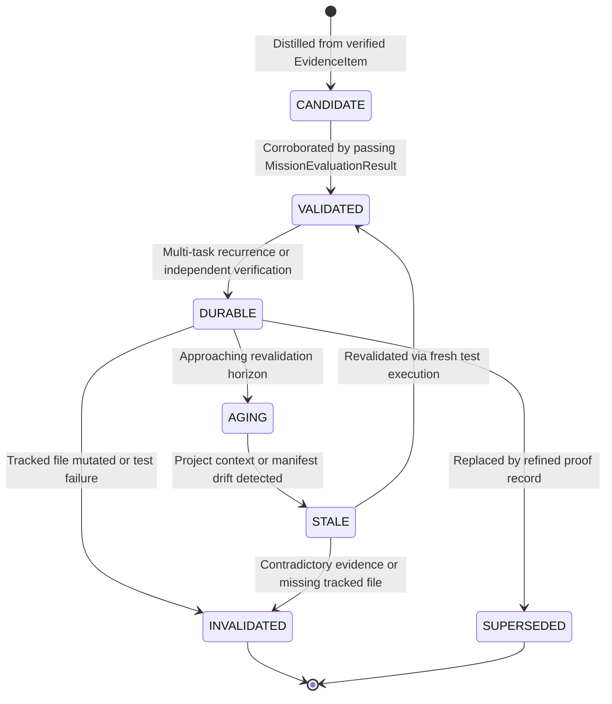

# AntiOS 2.0 Durable Project Proofs Architecture (Phase 93)

## 1. Architectural Purpose

AntiOS missions produce bounded, transient `EvidencePackage` containers that verify acceptance criteria for specific tasks. Durable Project Proofs bridge the gap between single-mission verification and long-horizon project intelligence by distilling only corroborated, reusable facts into permanent, physically grounded proof records.

## 2. Epistemic Separation & Distillation Axiom

AntiOS strictly prohibits conversational claims, raw observations, or ungrounded inferences from becoming durable project knowledge:

```text
MISSION EVIDENCE
       ↓ (independent validation + passing evaluation)
DURABLE PROJECT PROOF

OBSERVATION       -X-> DURABLE PROJECT PROOF
AGENT INFERENCE   -X-> DURABLE PROJECT PROOF
UNVERIFIED CLAIM  -X-> DURABLE PROJECT PROOF
```

## 3. Canonical Proof Subjects

The proof layer models 13 discrete subject domains:
1. `SUBSYSTEM_OWNERSHIP`: Verified component and subsystem ownership boundaries.
2. `VERIFIED_FILE_LOCATION`: Validated physical paths and content hashes.
3. `VALIDATED_ARCHITECTURE_RELATION`: Confirmed dependency and interface relationships.
4. `CONFIRMED_TEST_OWNERSHIP`: Verified test runner commands and test file ownership.
5. `VERIFIED_COMMAND`: Proven build, test, and lint execution commands.
6. `VERIFIED_INVARIANT`: Confirmed constitutional and runtime constraints.
7. `TOOL_CAPABILITY_MAPPING`: Validated tool definitions and capability pack bindings.
8. `REPOSITORY_CONVENTION`: Stable workspace conventions and policies.
9. `PROJECT_ADAPTER_ASSUMPTION`: Verified assumptions embedded in `project_adapter.json`.
10. `RECURRING_FAILURE_SIGNATURE`: Documented failure patterns and negative constraints.
11. `RECOVERY_PROCEDURE`: Tested state-recovery operations.
12. `DOCUMENTATION_OWNERSHIP`: Verified documentation indices and source paths.
13. `NAVIGATION_HINT`: Validated wayfinding entrypoints and locality resolvers.

## 4. Proof Lifecycle

Proofs transition through 7 bounded lifecycle states:


## 5. Physical Reality Grounding & Invalidation

A project proof is never self-authenticating. Every proof contains:
- `tracked_paths`: Relative file paths on disk ($\le 10$).
- `path_hashes`: SHA-256 digests computed at validation time.
- `project_fingerprint`: Cryptographic workspace/manifest hash.

Before injecting any proof into context, `ProjectProofStore.verify_physical_reality()` audits current on-disk hashes. If any tracked file is modified or deleted, the proof is immediately demoted to `INVALIDATED`.

## 6. Storage & Capacity Bounds

- Maximum Durable Proofs: 50 records (governed by retention priority `DURABLE > VALIDATED > CANDIDATE > AGING > STALE > SUPERSEDED > INVALIDATED`).
- Maximum References Per Proof: 10 items.
- Maximum Tracked Paths Per Proof: 10 paths.
- Diagnostic Card: `ProjectProofCard` strictly bounded to $\le 25$ lines.
