# Antigravity Execution Lifecycle: The Complete Runtime State Machine

**Status:** Canonical Architectural Monograph  
**Research Phase:** AntiOS Research 2 — Execution Primitives & Lifecycle Reality  
**Evidence Baseline:** `[OFFICIAL]` Upstream Antigravity SDK & Customization Specs, `[OBSERVED]` Empirical Windows Runtime Harness (`test_lifecycle_primitives.py`), `[EXTERNAL_REPORT]` Upstream Issue Tracker (#5358, #569, #528, #301)

---

## 1. Executive Summary

Research 1 established that Antigravity operates as an out-of-process LLM execution loop that acquires project cognition through deliberate tool interactions rather than static background daemon analysis. Research 2 investigates the foundational mechanics governing this loop: **What can Antigravity's actual execution lifecycle reliably observe, influence, transform, and enforce?**

This document establishes the canonical execution state machine of Antigravity. It maps the thirteen distinct operational phases from initial process bootstrap to final session termination, delineates the exact data availability boundaries across these phases, and classifies all runtime transitions under strict evidence standards.

---

## 2. End-to-End Lifecycle State Machine

The following state diagram details the precise execution path of Antigravity sessions across all hook trigger points, inference loops, and subagent forks:

```mermaid
stateDiagram-v2
    [*] --> SessionBoot: CLI / IDE / Desktop Invocation

    state SessionBoot {
        [*] --> DiscoverCustomizations: Read user & project configs
        DiscoverCustomizations --> UpwardRuleWalk: Scan GEMINI.md / AGENTS.md
        UpwardRuleWalk --> LoadMCPServers: Start stdio/SSE MCP processes
        LoadMCPServers --> FireSessionStart: Execute SessionStart hooks
        FireSessionStart --> [*]
    }

    SessionBoot --> AwaitUserInput: Initial Turn 0 Ready

    state TurnExecutionLoop {
        AwaitUserInput --> PreInvocation: User Prompt or Reactive Wakeup
        
        state PreInvocation {
            [*] --> ReadStdinPreInvoc: Receive invocationNum, initialNumSteps
            ReadStdinPreInvoc --> ExecPreInvocHook: Run external process (timeout=30s)
            ExecPreInvocHook --> ParseInjectSteps: Output ephemeralMessage / userMessage / toolCall
            ParseInjectSteps --> MutateActiveContext: Prepend/Append to Turn Messages
            MutateActiveContext --> [*]
        }

        PreInvocation --> ModelDispatch: Compile full prompt + tools

        state ModelDispatch {
            [*] --> LLMInference: Stream / Non-stream Gemini API call
            LLMInference --> ParseOutput: Split into Text and ToolCall items
            ParseOutput --> [*]
        }

        ModelDispatch --> EvaluateModelResponse: Inspect parsed outputs

        state ToolResolutionChain {
            EvaluateModelResponse --> CheckToolMatch: Model emitted ToolCall(s)
            CheckToolMatch --> PreToolUse: Matches hook matcher regex
            
            state PreToolUse {
                [*] --> ReadStdinPreTool: Receive toolName, toolArgs, stepIdx
                ReadStdinPreTool --> ExecPreToolHook: Run external process (timeout=30s)
                ExecPreToolHook --> EvaluateDecision: Parse allow | deny | ask | overwrite
                EvaluateDecision --> [*]
            }

            PreToolUse --> AbortToolCall: decision == "deny"
            PreToolUse --> PromptUserConfirmation: decision == "ask" / "force_ask"
            PreToolUse --> ApplyArgOverwrite: decision == "overwrite"
            PreToolUse --> ExecuteTool: decision == "allow" (or exit 0 empty)

            ApplyArgOverwrite --> ExecuteTool: Merged Tool Arguments
            PromptUserConfirmation --> ExecuteTool: User Approved
            PromptUserConfirmation --> AbortToolCall: User Rejected

            ExecuteTool --> PhysicalToolExecution: Run native / MCP / subagent
            AbortToolCall --> AppendToolError: Inject error into trajectory
            PhysicalToolExecution --> AppendToolResult: Inject tool result into trajectory

            AppendToolResult --> PostToolUse: Hook fires
            AppendToolError --> PostToolUse: Hook fires

            state PostToolUse {
                [*] --> ReadStdinPostTool: Receive stepIdx, error, metadata (NO ARGS/RESULT)
                ReadStdinPostTool --> ExecPostToolHook: Run external process (timeout=30s)
                ExecPostToolHook --> EnforceEmptyOutput: Require exit 0 and {}
                EnforceEmptyOutput --> [*]
            }

            PostToolUse --> CheckRemainingTools: More calls in this turn?
            CheckRemainingTools --> CheckToolMatch: Yes
            CheckRemainingTools --> ReInvokeModel: No -> Model re-inference with results
        }

        ReInvokeModel --> ModelDispatch: Model analyzes tool results

        EvaluateModelResponse --> PostInvocation: Model emitted pure text / stop
        
        state PostInvocation {
            [*] --> ReadStdinPostInvoc: Receive invocationNum, initialNumSteps
            ReadStdinPostInvoc --> ExecPostInvocHook: Run external process (timeout=30s)
            ExecPostInvocHook --> ParsePostInvocOutput: injectSteps & terminationBehavior
            ParsePostInvocOutput --> [*]
        }

        PostInvocation --> ReInvokeModel: terminationBehavior == "force_continue"
        PostInvocation --> TurnCompletion: terminationBehavior == "terminate" or default
    }

    TurnCompletion --> StopGateEvaluation: Exit condition triggered (Done / Quit)

    state StopGateEvaluation {
        [*] --> ReadStdinStop: Receive terminationReason, fullyIdle
        ReadStdinStop --> ExecStopHook: Run external process (timeout=30s)
        ExecStopHook --> ParseStopDecision: allow vs continue
        ParseStopDecision --> [*]
    }

    StopGateEvaluation --> ReInvokeModel: decision == "continue" (inject reason)
    StopGateEvaluation --> SessionTeardown: decision == "allow" (or exit 0 empty)

    state SessionTeardown {
        [*] --> TerminateSubagents: Kill orphaned child processes
        TerminateSubagents --> FlushLogs: Sync transcript.jsonl
        FlushLogs --> CloseMCP: SIGTERM stdio transports
        CloseMCP --> [*]
    }

    SessionTeardown --> [*]: Process Exit
```

---

## 3. Detailed Audit of the 13 Lifecycle Stages

### Stage 1: Boot / SessionStart `[OFFICIAL]`
- **Trigger**: Process invocation of `agy`, launch of Antigravity Desktop App, or attachment within Antigravity IDE.
- **Actions**:
  1. Discovery of global configurations (`~/.gemini/antigravity/` or `~/.gemini/config/`).
  2. Workspace root discovery (identifying `.git` boundaries and workspace roots).
  3. Discovery of project hooks (`<workspace>/.agents/hooks.json` or `.gemini/hooks.json`).
  4. Execution of configured `SessionStart` hooks.
- **Data Injected**: Environment variables, workspace URIs, CLI flags.
- **Failures Handled**: Missing directories fallback to defaults. Malformed `hooks.json` triggers warning or causes hook subsystem degradation.

### Stage 2: Context Assembly & Upward Rule Walk `[OFFICIAL]` `[OBSERVED]`
- **Trigger**: Prior to initial turn and refreshed per turn.
- **Actions**:
  1. Ascends directory tree from active workspace root to root filesystem looking for instructions (`GEMINI.md`, `AGENTS.md`, `.agents/skills/`).
  2. Reads static skill declarations (`SKILL.md` frontmatter) into system prompt tool descriptions.
  3. Resolves MCP server declarations and establishes stdio/SSE socket transports.
- **Data Injected**: System prompt framing, tool declarations, slash commands, available skills index.
- **Failures Handled**: Missing skill files or broken JSON-RPC connections on MCP startup disable corresponding tool definitions without crashing the main process.

### Stage 3: PreInvocation Hook Execution `[OFFICIAL]` `[OBSERVED]`
- **Trigger**: Immediately before an LLM invocation (both user-initiated turns and internal tool-loop turns).
- **Execution**: Subprocess spawned with JSON on `stdin`.
- **Input Payload**: `invocationNum`, `initialNumSteps`, `conversationId`, `workspacePaths`, `transcriptPath`, `artifactDirectoryPath`, `modelName`.
- **Intervention Capacity**: Returns JSON containing `injectSteps`.
  - Supports `ephemeralMessage`: Invisible in UI, omitted from `transcript.jsonl`, prepended only to immediate prompt.
  - Supports `userMessage`: Appended as a persistent user turn in the trajectory.
  - Supports `toolCall`: Injected synthetic tool execution step.
- **Failure Semantics**: Non-zero exit or malformed JSON logs an error to stderr/diagnostics; execution proceeds without injection (`[OBSERVED]` fail-open behavior for injection).

### Stage 4: Prompt Compilation & API Dispatch `[OFFICIAL]` `[INFERRED]`
- **Trigger**: Post-injection prompt ready for tokenization.
- **Actions**:
  1. Trajectory serialization (system prompt + history + ephemeral steps).
  2. Token count verification against model context window (e.g., 1M/2M limits for Gemini).
  3. Context compaction trigger if threshold exceeded (summarization or message dropping).
  4. TLS HTTP/2 streaming request dispatch to Gemini inference endpoints.

### Stage 5: LLM Inference & Generation `[OFFICIAL]`
- **Trigger**: In-flight model inference.
- **Actions**:
  1. Streaming token reception (`thought` tokens followed by `content` or `tool_call` blocks).
  2. Thought block encapsulation (hidden or displayed in thinking accordion).
  3. Structural validation of function call arguments against tool schema.

### Stage 6: Response Parsing (Text vs Tool Call) `[OFFICIAL]` `[OBSERVED]`
- **Branch A: Pure Text / Finish**: The model generated text and did not request function execution. Flow transitions directly to Stage 11 (`PostInvocation`) and subsequently Stage 12/13.
- **Branch B: Tool Calls Emitted**: The model produced one or more function call objects (e.g., `write_to_file`, `run_command`, `invoke_subagent`). Flow transitions to Stage 7 (`PreToolUse`).

### Stage 7: PreToolUse Hook Interception `[OFFICIAL]` `[OBSERVED]`
- **Trigger**: Before each individual tool execution whose name matches the hook's regex filter (`matcher`).
- **Input Payload**: `toolName`, `toolArgs` (as structured JSON object), `stepIdx`, and standard session metadata.
- **Intervention Capacity**: Hook emits structured decision JSON:
  - `{"decision": "allow"}`: Tool executes normally.
  - `{"decision": "deny", "reason": "..."}`: Tool execution blocked immediately. The string in `reason` is returned directly to the model as an error response.
  - `{"decision": "ask", "reason": "..."}`: Suspends execution and displays an interactive modal for the human user to approve or deny.
  - `{"decision": "overwrite", "toolArgs": {...}}`: Dynamically overwrites arguments passed to the tool before physical execution.
- **Failure Semantics**: **FAIL-CLOSED** `[OBSERVED]` `[EXTERNAL_REPORT]`. An invalid schema, missing decision field, or crash emitting non-JSON results in `invalid_args` error, and the tool call is denied.

### Stage 8: Tool Execution (Native / MCP / Subagent) `[OFFICIAL]` `[OBSERVED]`
- **Execution Subsystems**:
  - *Native Tools*: Built-in binaries/APIs (`view_file`, `run_command`, `replace_file_content`).
  - *MCP Server Tools*: JSON-RPC request over stdio/SSE to external MCP server processes.
  - *Subagent Tools*: Spawns isolated or shared child Antigravity execution session via `invoke_subagent`.
- **Output Handling**: Output text and status codes captured into memory.

### Stage 9: PostToolUse Hook Execution `[OFFICIAL]` `[OBSERVED]`
- **Trigger**: Immediately following physical tool execution (whether successful or errored).
- **Input Payload**: `stepIdx`, `error` (boolean or error string), and standard session metadata.
- **CRITICAL ARCHITECTURAL REALITY**: **The payload contains NO `toolName`, NO `args`, and NO `result`** `[OBSERVED]`.
- **Intervention Capacity**: **NONE**. The hook is purely observational and MUST output an empty JSON object `{}`. Any non-empty JSON or unrecognized key fails validation.
- **Observability Mechanism**: To inspect what tool ran, the hook process must read `transcriptPath` (`transcript.jsonl`) at offset `stepIdx`.

### Stage 10: Invocation Loop Check `[OFFICIAL]`
- **Logic**: If more tool calls remain from Stage 5, return to Stage 7. Once all tool calls in the current turn have completed and their results are appended to the conversation trajectory, dispatch a new inference call (Stage 4) so the model can inspect the results.

### Stage 11: PostInvocation Hook Execution `[OFFICIAL]` `[OBSERVED]`
- **Trigger**: After a tool execution sequence completes, or when the model finishes generating its text response.
- **Input Payload**: `invocationNum`, `initialNumSteps`, and standard session metadata.
- **Intervention Capacity**:
  - `injectSteps`: Injects additional steps into the trajectory.
  - `terminationBehavior`: Set to `"force_continue"` to force the agent back into the LLM inference loop, or `"terminate"` to halt the turn.
- **Role**: Dynamic feedback loop injection and external state settlement.

### Stage 12: Turn Completion / Wait For Message `[OFFICIAL]`
- **Trigger**: Model has completed its output, all tool calls have settled, and `PostInvocation` did not force continuation.
- **Actions**:
  1. Transcript flushed to disk (`transcript.jsonl` and `transcript_full.jsonl`).
  2. UI unlocks for user input.
  3. System enters reactive wakeup mode (monitoring for subagent completion messages, background tasks, or cron timers).

### Stage 13: Session Termination / Stop Gate `[OFFICIAL]` `[OBSERVED]`
- **Trigger**: Agent signals it is done, reaches step limit, or user requests termination.
- **Input Payload**: `terminationReason` (`"model_stop"`, `"max_steps_exceeded"`, `"error"`), `error`, `fullyIdle`, and standard session metadata.
- **Intervention Capacity**:
  - Hook evaluates project state (e.g., verifying test suite, checking git status, auditing diffs).
  - Emits `{"decision": "continue", "reason": "Verification failed: tests are red"}` to cancel exit, forcing the model back into Stage 4 with the injected reason.
  - Emits `{"decision": "allow"}` or `{}` to permit clean session shutdown.

---

## 4. Comprehensive Data Availability Across Stages

The table below delineates what data is physically accessible to external processes at each stage of the lifecycle:

| Lifecycle Stage | Hook Trigger | In-Memory Model State | Disk Trajectory State (`transcript.jsonl`) | Hook `stdin` Payload Contents | Hook Output Modification Capabilities |
|---|---|---|---|---|---|
| **1. SessionBoot** | `SessionStart` | Uninitialized | Empty / New File | Workspace URIs, Configs | None (Environment setup only) |
| **2. Context Assembly** | None | System Prompt, Rules, MCP tools | Unchanged | N/A | Static rule injection via filesystem |
| **3. PreInvocation** | `PreInvocation` | Pre-inference tokens assembled | Historical turns only | `invocationNum`, `initialNumSteps`, metadata | `injectSteps`: `ephemeralMessage`, `userMessage`, `toolCall` |
| **4. Prompt Dispatch** | None | Ephemeral steps merged | Ephemeral steps NOT written | N/A | N/A |
| **5. Model Inference** | None | Streaming tokens & thoughts | Partial stream in-flight | N/A | N/A |
| **6. Response Parsing** | None | Parsed tool call structs | Turn appended to memory | N/A | N/A |
| **7. PreToolUse** | `PreToolUse` | Tool call arguments staged | Partial turn written | `toolName`, `toolArgs`, `stepIdx`, metadata | `decision`: `allow`, `deny`, `ask`, `overwrite` (`toolArgs`) |
| **8. Tool Execution** | None | Tool process executing | Awaiting tool completion | N/A | N/A |
| **9. PostToolUse** | `PostToolUse` | Tool result returned | Step written to transcript | `stepIdx`, `error`, metadata (**NO toolName, NO args, NO result**) | **None** (Must return empty `{}`) |
| **10. Loop Check** | None | Multi-tool chain iterating | Incremental tool records | N/A | N/A |
| **11. PostInvocation** | `PostInvocation` | Text generation complete | All turn steps persisted | `invocationNum`, `initialNumSteps`, metadata | `injectSteps`, `terminationBehavior` (`force_continue`/`terminate`) |
| **12. Turn Complete** | None | System idle / reactive wait | Full transcript synced | N/A | N/A |
| **13. Session Stop** | `Stop` | Final response delivered | Full transcript closed | `terminationReason`, `error`, `fullyIdle`, metadata | `decision`: `continue` (blocks exit + injects reason) or `allow` |

---

## 5. Architectural Implications for AntiOS

1. **The Telemetry Blindspot in `PostToolUse`**: Because `PostToolUse` receives neither the tool name nor the execution output on `stdin`, an automated observer cannot function purely as a stream filter. It **must parse `transcript.jsonl`** at the provided `stepIdx` to extract execution artifacts.
2. **Deterministic Governance Points**: The Antigravity runtime provides exactly **three active deterministic control gates**:
   - `PreInvocation`: Can inject steering instructions (`ephemeralMessage`) before inference.
   - `PreToolUse`: Can block (`deny`) or mutate (`overwrite`) dangerous actions before physical execution.
   - `Stop`: Can veto exit (`continue`) if engineering invariants (tests, linting, git cleanliness) are violated.
3. **Execution Sandboxing Reality**: While `PreToolUse` intercepts native tool declarations, arbitrary shell execution (`run_command`) allows models to bypass file-level filters unless the command string is rigorously parsed or shell execution is strictly sandboxed.
