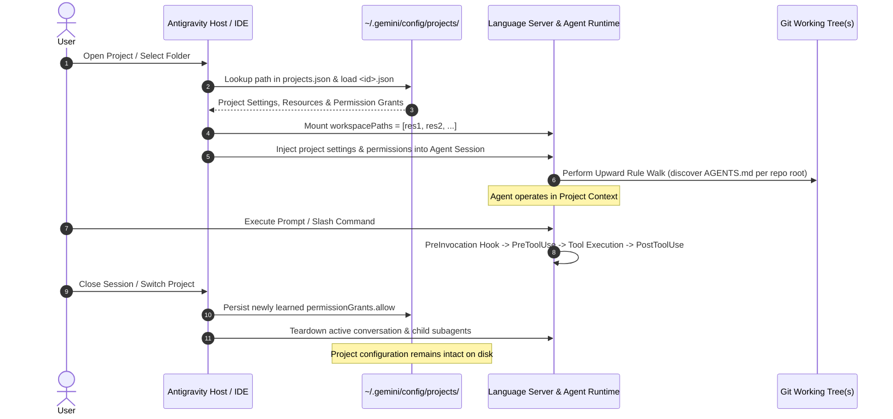

# Antigravity Project Model: Container Architecture, Configuration & Lifecycle

**Status:** Canonical Platform Research Monograph  
**Research Phase:** AntiOS Research 3 — Project, Workspace, Repository & Scope Reality  
**Author:** Antigravity Pairing Agent  
**Repository:** `naksh-07/AntiOS`  
**Evidence Standard:** `[OFFICIAL]` Upstream Docs/SDK, `[OBSERVED]` Local AppData Inspection & Test Suite, `[EXTERNAL_REPORT]` Verified Public GitHub Issues/Forums, `[INFERRED]` Deductive Architectural Analysis, `[HYPOTHESIS]` Proposed Theoretical Models

---

## 1. Executive Summary

In legacy AI engineering tooling, a "project" was frequently conflated with a single local working directory or a single Git repository. Antigravity 2.0 fundamentally breaks this 1:1 assumption `[OFFICIAL]`.

Under the Antigravity 2.0 platform architecture, an **Antigravity Project** is a persistent, logical management container. It decouples the management of security boundaries, permission allowlists, auto-execution policies, and execution environments from physical filesystem paths and Git repository structures. A single Antigravity Project can encompass multiple physical directories, multiple independent Git repositories, or standalone folders.

This monograph documents the official project model, its persistent storage schema on disk, its sparse configuration pattern, and its complete operational lifecycle.

---

## 2. The Architectural Decoupling: Project vs Workspace vs Repository

The Antigravity platform establishes a strict three-layer separation between the administrative container, the runtime mounted filesystem, and the version-controlled code stores:

```
┌────────────────────────────────────────────────────────────────────────┐
│                      ANTIGRAVITY PROJECT CONTAINER                     │
│  Location: ~/.gemini/config/projects/<project-id>.json                  │
│  Owns: Security Settings, Sandbox Policy, Permission Grants,           │
│        Project Resources Definition, Global ID & Name                  │
└──────────────────────────────────┬─────────────────────────────────────┘
                                   │ Binds 1..N Resources
         ┌─────────────────────────┴─────────────────────────┐
         ▼                                                   ▼
┌─────────────────────────────────┐         ┌──────────────────────────────────┐
│      PROJECT RESOURCE 1         │         │       PROJECT RESOURCE 2         │
│  Type: gitFolder                │         │  Type: folderUri                 │
│  Path: /path/to/frontend_repo   │         │  Path: /path/to/shared_docs      │
│  Backing: Git VCS (.git/)       │         │  Backing: OS Filesystem          │
└────────────────┬────────────────┘         └────────────────┬─────────────────┘
                 │                                           │
                 └────────────────────┬──────────────────────┘
                                      ▼
             ┌──────────────────────────────────────────────────┐
             │            ACTIVE RUNTIME WORKSPACE              │
             │  Represented in Prompt: [URI] -> [CorpusName]    │
             │  Represented in Hooks: workspacePaths: [...]     │
             │  Owns: Auto-Allowed File Boundary, Language      │
             │        Server Indexing, Root Rule Walks          │
             └──────────────────────────────────────────────────┘
```

### Definitional Comparison:
1. **Antigravity Project** `[OFFICIAL]`: The persistent administrative entity. Survives across agent sessions, IDE restarts, and machine reboots. Identified by a UUID and a human-readable display name.
2. **Workspace** `[OFFICIAL]`: The active set of filesystem paths mounted into the Language Server and agent runtime during a specific conversation. Defines the boundary within which file operations (`read_file`, `edit_file`, `create_file`) are auto-allowed without external-path prompts.
3. **Repository** `[OFFICIAL]`: A physical directory containing a `.git` database. Owns version control objects, commits, refs, and the staging index. Upward rule walks stop at the repository root.

---

## 3. Persistent Configuration Schema & Storage

The Antigravity Project model is backed by two primary on-disk stores in the user's global application data directory (`~/.gemini/` on Unix, `%USERPROFILE%\.gemini\` on Windows):

### 3.1 Project Mapping Registry (`~/.gemini/projects.json`)
Maps canonical local directory paths to project identifiers `[OBSERVED]`:
```json
{
  "projects": {
    "c:\\users\\suraj\\documents\\antigravity\\antios": "antios",
    "c:\\users\\suraj\\documents\\vibeaudio": "vibeaudio",
    "c:\\users\\suraj\\documents\\learn\\vlc": "vlc",
    "c:\\users\\suraj\\downloads\\studyflow": "studyflow"
  }
}
```

### 3.2 Project Configuration Document (`~/.gemini/config/projects/<project-id>.json`)
Each project maintains an independent JSON configuration document named by its UUID. 

**Observed Physical Configuration (AntiOS Target Instance)**:
```json
{
  "id": "70a4eea3-f6f5-4ba1-a97b-b554e64ecba7",
  "name": "AntiOs",
  "projectResources": {
    "resources": [
      {
        "gitFolder": {
          "folderUri": "file:///c%3A/Users/Suraj/Documents/Antigravity/AntiOs"
        }
      }
    ]
  },
  "settings": {
    "fileAccessPolicy": "AGENT_SETTING_POLICY_ALLOW",
    "sandboxMode": false,
    "autoExecutionPolicy": "CASCADE_COMMANDS_AUTO_EXECUTION_EAGER",
    "artifactReviewMode": "ARTIFACT_REVIEW_MODE_TURBO"
  },
  "isWorkspaceOnly": false
}
```

### 3.3 Schema Field Breakdown

| JSON Field | Type | Description | Observed Valid Values |
|---|---|---|---|
| `id` | `string` | Unique UUID or canonical slug identifying the project. | UUIDv4 (e.g. `70a4eea3-...`) or `outside-of-project` |
| `name` | `string` | Human-readable project display name. | e.g. `"AntiOs"`, `"AI Notes"`, `"StudyFlow"` |
| `projectResources.resources` | `array[object]` | Declared folders and repositories comprising the project. | `gitFolder: { folderUri, defaultBranch }`, `folderUri: string` |
| `settings.fileAccessPolicy` | `string` | Policy governing agent access to files outside workspace roots. | `AGENT_SETTING_POLICY_ALLOW`, `ask`, `deny` |
| `settings.sandboxMode` | `boolean` | Whether terminal commands execute inside an isolated container sandbox. | `true`, `false` |
| `settings.autoExecutionPolicy` | `string` | Automation tier for shell and tool execution. | `CASCADE_COMMANDS_AUTO_EXECUTION_EAGER`, `OFF`, `request-review` |
| `settings.artifactReviewMode` | `string` | Review strictness for generated markdown artifacts. | `ARTIFACT_REVIEW_MODE_TURBO`, `agent-decides`, `asks-for-review` |
| `permissionGrants` | `object` | Project-scoped allowlist/denylist for tools, commands, and files. | `permissionGrants: { allow: ["command(...)", "read_file(...)"] }` |
| `isWorkspaceOnly` | `boolean` | When true, strictly confines agent actuation to declared workspace paths. | `true`, `false` |

### 3.4 The Sparse Persistence Pattern
Antigravity uses a **sparse persistence model** `[OFFICIAL]`. Project configuration files do not store a complete copy of every possible system setting. Instead, they store **only values that intentionally deviate from global user defaults** (`~/.gemini/config/config.json`) or application hardcoded baselines. Unset fields fall back through the precedence hierarchy: Project Setting $\to$ User Global Setting $\to$ Application Default.

---

## 4. Multi-Folder & Multi-Repository Project Representation

A defining capability of the Antigravity Project container is its ability to bundle multiple disjoint directories into a single engineering context:

### 4.1 Multi-Folder Declaration
```json
"projectResources": {
  "resources": [
    { "folderUri": "file:///c%3A/Users/Suraj/Projects/FrontendApp" },
    { "folderUri": "file:///c%3A/Users/Suraj/Projects/BackendService" },
    { "folderUri": "file:///c%3A/Users/Suraj/Projects/SharedContracts" }
  ]
}
```

### 4.2 Multi-Repository Declaration
```json
"projectResources": {
  "resources": [
    {
      "gitFolder": {
        "folderUri": "file:///c%3A/Users/Suraj/Projects/CoreRepo",
        "defaultBranch": "main"
      }
    },
    {
      "gitFolder": {
        "folderUri": "file:///c%3A/Users/Suraj/Projects/PluginsRepo",
        "defaultBranch": "master"
      }
    }
  ]
}
```

### 4.3 Runtime Implications of Multi-Resource Projects
When a project with multiple resources is opened in Antigravity:
1. **Workspace Mounting**: All declared resource paths are mounted into the runtime `workspacePaths` array.
2. **Auto-Allowed File Boundary**: File access tools (`view_file`, `write_to_file`, `replace_file_content`) treat all declared resource paths as internal to the workspace. No security prompt is triggered when reading or writing across these folders.
3. **Sandbox Inclusion**: If terminal sandboxing is active (`sandboxMode: true`), all declared project folders are mounted into the sandbox container.
4. **Independent Git Boundaries**: Git operations remain strictly bounded by each repository's `.git` directory. Running `git status` in `CoreRepo` does not show changes in `PluginsRepo`.

---

## 5. The Complete Project Lifecycle



### 5.1 Project Creation
Occurs via:
- Antigravity IDE: "File > Open Folder" or "New Project".
- Antigravity CLI (`agy`): Executing `agy` inside a directory automatically creates a mapped entry in `projects.json` if unmapped.
- SDK: Instantiating `Agent(project_id="...")`.

### 5.2 Project Activation
When activated, Antigravity loads the project configuration, initializes the Language Server workspace index across all declared resources, and sets up session logging under `brain/<conversation-id>/`.

### 5.3 Project Switching
Switching projects (via UI sidebar or CLI directory change) cleanly unmounts the previous `workspacePaths`, loads the new project settings, and clears active conversational memory.

### 5.4 Project Persistence
All project-level configuration changes (such as toggling sandbox mode or granting permanent tool permissions) immediately persist to `~/.gemini/config/projects/<project-id>.json`. This data survives indefinitely across reboots.

---

## 6. Project Permissions & Security Sovereignty

Project permissions allow fine-grained access control over tool execution:
- Grated syntax: `command(<pattern>)` (e.g. `command(git status)`), `read_file(<path>)`, `write_file(<path>)`.
- Evaluation precedence:
  $$\text{Deny} \succ \text{Ask} \succ \text{Allow}$$
- Scope boundary: Project permission grants apply strictly when that project is active. Global grants in `config.json` act as a system-wide fallback.

---

## 7. Conclusion: What the Platform Considers the Engineering Boundary

The Antigravity platform officially defines the boundary of an engineering environment as:
> **The set of declared `projectResources` bound to a specific `project-id` configuration document, evaluated against project-scoped settings and permission grants.**

A project is **not** a single Git repository. A Git repository is merely a storage and versioning provider that can be enrolled as a resource inside an Antigravity Project container. AntiOS must adapt its architecture to embrace this multi-resource container reality.
