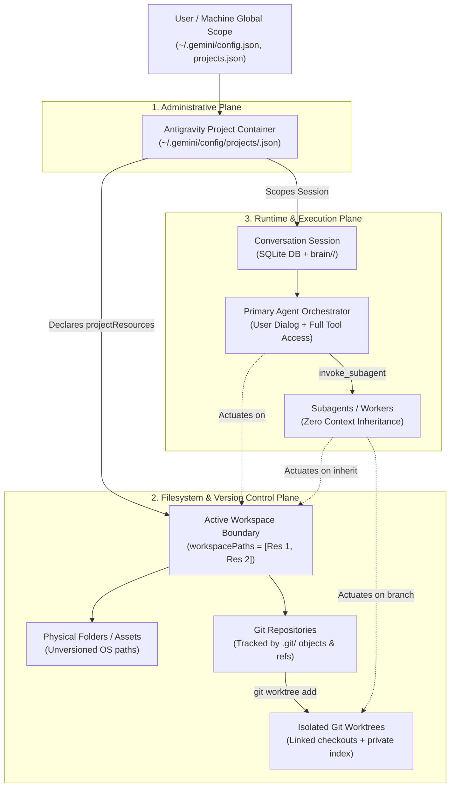

# Antigravity Scope Model: Formal Hierarchy & Ownership Reality

**Status:** Canonical Platform Research Monograph  
**Research Phase:** AntiOS Research 3 — Project, Workspace, Repository & Scope Reality  
**Author:** Antigravity Pairing Agent  
**Repository:** `naksh-07/AntiOS`  
**Evidence Standard:** `[OFFICIAL]` Upstream Docs/SDK, `[OBSERVED]` Local AppData & Runtime Test Harness, `[EXTERNAL_REPORT]` Verified Public GitHub Issues/Forums, `[INFERRED]` Deductive Architectural Analysis, `[HYPOTHESIS]` Proposed Theoretical Models

---

## 1. Executive Summary

To govern engineering workflows reliably, AntiOS must understand the precise scope hierarchy of its host execution environment. Conflating orthogonal scopes—such as treating a Git repository as synonymous with an Antigravity Project, or treating an agent conversation as synonymous with a workspace—leads to catastrophic boundary breaches, broken hook dispatch, and fragmented project intelligence.

This monograph formally defines the **Eight Scopes of Antigravity**, constructs their rigorous structural hierarchy, and resolves the **Ten Canonical Ownership Questions** with empirical and official platform evidence.

---

## 2. The Eight Scopes of Antigravity Formally Defined

```
┌──────────────────────────────────────────────────────────────────────────────────┐
│                                 THE EIGHT SCOPES                                 │
├────┬─────────────────────┬───────────────────────────────────────────────────────┤
│ #  │ Scope Entity        │ Formal Platform Definition                            │
├────┼─────────────────────┼───────────────────────────────────────────────────────┤
│ 1  │ Antigravity Project │ Persistent administrative container defining          │
│    │                     │ resources, security settings, and permission grants.   │
├────┼─────────────────────┼───────────────────────────────────────────────────────┤
│ 2  │ Workspace           │ Runtime set of active directory paths mounted into    │
│    │                     │ the agent session (`workspacePaths`).                 │
├────┼─────────────────────┼───────────────────────────────────────────────────────┤
│ 3  │ Folder              │ Physical operating system directory path on disk.     │
├────┼─────────────────────┼───────────────────────────────────────────────────────┤
│ 4  │ Repository          │ Version-controlled directory tree backed by a `.git`  │
│    │                     │ database tracking commits, refs, and index.          │
├────┼─────────────────────┼───────────────────────────────────────────────────────┤
│ 5  │ Worktree            │ Linked, isolated Git working tree (`git worktree`)    │
│    │                     │ with a private staging index for concurrent branches. │
├────┼─────────────────────┼───────────────────────────────────────────────────────┤
│ 6  │ Conversation        │ Stateful, multi-turn reasoning and tool session       │
│    │                     │ recorded in SQLite and streaming JSONL transcripts.   │
├────┼─────────────────────┼───────────────────────────────────────────────────────┤
│ 7  │ Primary Agent       │ Top-level orchestrator process interacting with human │
│    │                     │ user, capable of delegating subagents and MCP tools.  │
├────┼─────────────────────┼───────────────────────────────────────────────────────┤
│ 8  │ Subagent            │ Headless, asynchronous child execution session with a │
│    │                     │ pristine context window (Zero Context Inheritance).   │
└────┴─────────────────────┴───────────────────────────────────────────────────────┘
```

---

## 3. Formal Scope Hierarchy Diagram

The relationships between these eight entities form a hybrid hierarchy combining administrative containment, filesystem mounting, and execution lifecycles:



---

## 4. The Ten Structural Ownership Questions Resolved

```
┌────────────────────────────────────────────────────────────────────────────────────────┐
│                        TEN STRUCTURAL OWNERSHIP RESOLUTIONS                            │
├────┬────────────────────────┬─────────────────────────────┬───────────────────────────┤
│ #  │ Dimension              │ Owning Scope                │ Evidence Classification   │
├────┼────────────────────────┼─────────────────────────────┼───────────────────────────┤
│ 1  │ Configuration          │ Project Scope (Overrides) / │ [OFFICIAL] / [OBSERVED]   │
│    │                        │ Global Scope (Defaults)     │                           │
├────┼────────────────────────┼─────────────────────────────┼───────────────────────────┤
│ 2  │ Rules                  │ Directory / Workspace Scope │ [OFFICIAL] / [OBSERVED]   │
│    │                        │ (Upward Traversal)          │                           │
├────┼────────────────────────┼─────────────────────────────┼───────────────────────────┤
│ 3  │ Skills                 │ Workspace Scope (.agents/)  │ [OFFICIAL]                │
│    │                        │ & Global Scope (~/.gemini/) │                           │
├────┼────────────────────────┼─────────────────────────────┼───────────────────────────┤
│ 4  │ Hooks                  │ Workspace Scope (.agents/)  │ [OFFICIAL] / [OBSERVED]   │
├────┼────────────────────────┼─────────────────────────────┼───────────────────────────┤
│ 5  │ Permissions            │ Project Scope / Global      │ [OFFICIAL] / [OBSERVED]   │
├────┼────────────────────────┼─────────────────────────────┼───────────────────────────┤
│ 6  │ Project Context        │ Workspace Filesystem on Disk│ [OFFICIAL] / [OBSERVED]   │
├────┼────────────────────────┼─────────────────────────────┼───────────────────────────┤
│ 7  │ Git State              │ Repository (Objects) &      │ [OFFICIAL] / [OBSERVED]   │
│    │                        │ Worktree (Index & Head)     │                           │
├────┼────────────────────────┼─────────────────────────────┼───────────────────────────┤
│ 8  │ Persistent Metadata    │ Global AppData & Conversat. │ [OFFICIAL] / [OBSERVED]   │
├────┼────────────────────────┼─────────────────────────────┼───────────────────────────┤
│ 9  │ Visible to Subagents   │ Workspace Files, Root Rules,│ [OFFICIAL] / [OBSERVED]   │
│    │                        │ Hooks & Skills ONLY         │                           │
├────┼────────────────────────┼─────────────────────────────┼───────────────────────────┤
│ 10 │ Survives Conversations │ Global, Project, Workspace  │ [OFFICIAL] / [OBSERVED]   │
│    │                        │ & Git Scopes (Memory Wipes) │                           │
└────┴────────────────────────┴─────────────────────────────┴───────────────────────────┘
```

### Detailed Ownership Analysis:

### 4.1 Which scope owns configuration?
- `[OFFICIAL]` `[OBSERVED]` **Two-Tier Precedence Architecture**:
  - Global user defaults (`artifactReviewMode`, `autoExecutionPolicy`, terminal sandboxing) are owned by **Global Scope** (`~/.gemini/config/config.json`).
  - Project overrides (`fileAccessPolicy`, project-specific autoExecution tiers, sandbox mode) are owned by **Project Scope** (`~/.gemini/config/projects/<project-id>.json`).
  - Project configuration strictly supersedes global configuration during active project execution.

### 4.2 Which scope owns rules?
- `[OFFICIAL]` `[OBSERVED]` **Directory & Workspace Scope via Upward Traversal**:
  - Rules (`AGENTS.md`, `GEMINI.md`, `.agents/rules/*.md`) are attached to physical directory nodes.
  - When an agent accesses a file or sets its CWD, the Language Server traverses upward from that directory to the repository root (`.git`).
  - Subdirectory rules apply only when operating within that subtree.
  - Upward traversal stops dead at the `.git` boundary `[OBSERVED]`, preventing instructions from sibling repositories or parent folders from leaking across repo boundaries.

### 4.3 Which scope owns skills?
- `[OFFICIAL]` **Workspace Scope & Global Scope (Progressive Resolution)**:
  - Discovered hierarchically:
    1. Workspace Project Skills: `<workspace_root>/.agents/skills/<name>/SKILL.md` (Highest precedence, team-shared in Git).
    2. Workspace Declared Skills: `.agents/skills.json`.
    3. Global Machine Skills: `~/.gemini/config/skills/<name>/SKILL.md`.
    4. Built-in Applications: `antigravity_guide`, `generative_ui`.
    5. Global Declared Skills: `~/.gemini/config/skills.json`.
  - Registration injects YAML frontmatter (`name`, `description`) into prompt headers; procedural content is read dynamically via `view_file`.

### 4.4 Which scope owns hooks?
- `[OFFICIAL]` `[OBSERVED]` **Workspace Scope**:
  - Registered strictly via `<workspace_root>/.agents/hooks.json`.
  - Checked into VCS, ensuring deterministic guard enforcement across all engineers and subagents.
  - Runtime execution invariant: Hook commands execute with `cwd = .agents/`.

### 4.5 Which scope owns permissions?
- `[OFFICIAL]` `[OBSERVED]` **Project Scope & Global Scope**:
  - Evaluated on syntax: `action(target)` (e.g. `command(...)`, `read_file(...)`).
  - Strict priority order: `Deny` > `Ask` > `Allow`.
  - Project-level allowlists live in `config/projects/<id>.json -> permissionGrants`. Global user-wide allowlists live in `config/config.json -> globalPermissionGrants`.

### 4.6 Which scope owns project context?
- `[OFFICIAL]` `[OBSERVED]` **Workspace Filesystem Scope on Disk**:
  - Antigravity maintains **no ambient cognitive memory or passive background daemon**.
  - All project facts, architecture docs, and codebases reside on disk. The agent retrieves context strictly via active tool calls (`list_dir`, `grep_search`, `view_file`).
  - The root `AGENTS.md` is the only file auto-injected into the prompt at Turn 0.

### 4.7 Which scope owns Git state?
- `[OFFICIAL]` `[OBSERVED]` **Repository Scope & Worktree Scope**:
  - Commit history, tree objects, blobs, and canonical branches are owned by the **Repository Scope** (`.git/objects/`, `.git/refs/`).
  - Working tree state and staging index:
    - In `Workspace='inherit'`, owned by the parent working tree (subject to `.git/index.lock` contention if concurrent).
    - In `Workspace='branch'`, owned by the isolated **Worktree Scope** (`.git/worktrees/<name>/index`), granting zero lock collisions.

### 4.8 Which scope owns persistent metadata?
- `[OFFICIAL]` `[OBSERVED]` **Split across Global AppData and Conversation Scopes**:
  - Project registry, mappings, and settings: **Global AppData Scope** (`~/.gemini/projects.json`, `~/.gemini/config/projects/`).
  - Conversational trajectories, step logs, tool outputs, and compaction summaries: **Conversation Scope** (`brain/<conv-id>/.system_generated/logs/transcript.jsonl` and SQLite DB).

### 4.9 Which scope is visible to subagents?
- `[OFFICIAL]` `[OBSERVED]` **Workspace Filesystem, Root Rules, Hooks & Skills ONLY**:
  - Under the **Zero Context Inheritance** law, subagents inherit:
    - The active filesystem workspace (or branched worktree).
    - The root `AGENTS.md` and `.agents/rules/`.
    - Active hooks registered in `.agents/hooks.json`.
    - Declared skills in tool schema.
    - The task `Prompt` string.
  - Subagents **CANNOT see**:
    - Parent conversation turns, reasoning, thoughts, or scratchpad files.
    - Parent in-memory context or variables.

### 4.10 Which scopes survive new conversations?
- `[OFFICIAL]` `[OBSERVED]`
  - **Survives**:
    - Global Scope (user settings, global plugins, permissions).
    - Project Scope (project settings, project resources, project permissions).
    - Workspace / Repository Scope (all code, committed/uncommitted files, `.agents/` rules, skills, hooks).
    - Conversation Storage on Disk (SQLite and `brain/` logs persist indefinitely on disk, though inactive).
  - **Destroyed / Reset at Turn 0**:
    - Active conversational memory (in-memory token window wipes completely).
    - Ephemeral injections (`ephemeralMessage` from `PreInvocation` leaves no trace).
    - Subagent execution threads (terminated upon parent completion).

---

## 5. Architectural Invariants for AntiOS 3.0

1. **AntiOS Must Not Assume Repository == Project**:
   An Antigravity Project can encompass multiple repositories. AntiOS governance must operate cleanly whether a project contains 1 repo, 3 repos, or unversioned folders.
2. **Deterministic Upward Rule Boundary**:
   Because upward rule traversal stops at `.git`, rules placed above a Git root in a multi-repo parent folder are ignored by agents operating inside child repositories. Rules must be anchored at the repository root.
3. **Workspace Isolation Leverages Worktrees**:
   AntiOS subagent delegation for concurrent writers must leverage `Workspace='branch'` to prevent `.git/index.lock` contention and working tree collisions.
