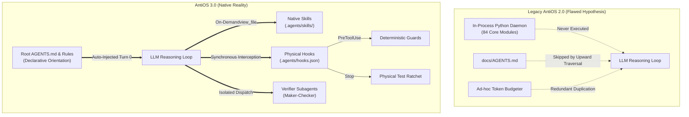

# AntiOS Research 1: Antigravity Context Construction & Agent Cognition
## Executive Synthesis & Architectural Foundation

**Mission Date:** September 2026  
**Status:** COMPLETE  
**Evidence Standard:** Strict classification across `[OFFICIAL]`, `[OBSERVED]`, `[INFERRED]`, `[HYPOTHESIS]`, `[UNKNOWN]`, and `[CONFLICT]`.

---

## 1. Executive Conclusion

The central question of Research 1 was:
> **"How does an Antigravity agent actually get the context it uses to understand and work on a software project?"**

### The Core Finding
An Antigravity agent is **NOT** a persistent in-process software runtime, nor does it have continuous cognitive awareness of a repository. 

Instead, Antigravity operates as an **out-of-process, stateless LLM reasoning loop** mediated entirely by:
1. **A Structured Turn-0 Static Frame**: Fixed system identity, tool declarations, user metadata, and progressive disclosure catalogs (skills, MCP, subagents).
2. **Deterministic Directory Upward Traversal**: Ingestion of `AGENTS.md` / `GEMINI.md` discovering files **only** in the working directory and its ancestor tree toward repository root.
3. **Active, Tool-Mediated Exploration**: Codebase topology, file contents, and project state are acquired strictly on-demand through tool execution (`list_dir`, `view_file`, `grep_search`).
4. **Platform-Managed State Persistence**: Trajectories are committed synchronously to SQLite (`conversations/<id>.db`) and streaming JSONL logs (`brain/<id>/.system_generated/logs/transcript.jsonl`), with native compaction generating structured `<CONTEXT_SUMMARY>` rollups when token thresholds are approached.
5. **Physical Lifecycle Hooks**: The only true deterministic enforcement surface in the entire platform (`.agents/hooks.json`), capable of physically blocking (`deny`), continuing past exit (`continue`), or rewriting arguments before execution.

### The Foundational Architectural Realization for AntiOS
Previous iterations of AntiOS (v1.x through v2.1) suffered from an architectural illusion: **building complex in-memory Python state machines, token budgeting algorithms, and subagent dispatch frameworks inside `framework/core/` that were physically disconnected from the LLM execution loop.** Out of 84 Python modules in `framework/core/`, only **two** (`guard.py` and `gate.py`) were ever executed in practice.

AntiOS does not need to build an operating system *beside* Antigravity; AntiOS must become the **configuration and governance layer *for* Antigravity**.

---

## 2. Definitive Answers to the 16 Core Questions

### Q1: What does the agent's context actually contain at Turn 0?
- `[OFFICIAL]` / `[OBSERVED]` The Turn-0 prompt contains:
  1. `<identity>`: Core agent identity and DeepMind pairing model.
  2. `<user_information>`: Host OS (Windows), workspace URIs, conversation ID, app data paths.
  3. `<mcp_servers>`: Registered eager and lazy MCP server tools.
  4. `<skills>`: Progressive disclosure catalog containing **only** `name` and `description` of available workspace and global skills.
  5. `<subagents>`: Available delegation personas (`self`, `research`).
  6. `<messaging>`: Reactive wakeup and communication rules.
  7. `<conversation_transcript>`: Transcript logging paths and querying guidance.
  8. `<artifacts>`: Artifact creation rules and file paths.
  9. `<slash_commands>`: User shortcut recommendations (`/goal`, `/boost`, `/learn`).
  10. `<planning_mode>` / `<planning_mode_artifacts>`: Workflow instructions for implementation plans and walkthroughs.
  11. Active Constitution: Root `AGENTS.md` / `GEMINI.md` content (if present at root).

### Q2: What gets injected automatically vs what requires agent action?
- `[OFFICIAL]` / `[OBSERVED]`
  - **Auto-Injected**: System prompt, active workspace metadata, tool declarations, skill metadata headers (`name` + `description`), and root/ancestor `AGENTS.md`.
  - **Requires Agent Action**: Full skill procedures (`SKILL.md`), skill scripts (`scripts/`), repository subdirectories (`src/`, `tests/`, `docs/`), configuration files (`antios.config.json`), active context trackers (`docs/ACTIVE_CONTEXT.md`), and past session transcripts.

### Q3: How does Antigravity discover files in a project?
- `[OFFICIAL]` Upward directory traversal from CWD: `CWD -> CWD/.. -> Workspace Root`.
- `[OBSERVED]` Files in sibling directories or subdirectories (e.g. `docs/AGENTS.md`) are completely invisible to Turn-0 auto-injection. Internal codebase files are discovered strictly through active tool calls (`list_dir`, `find_by_name`, `grep_search`).

### Q4: How do skills get loaded into context?
- `[OFFICIAL]` **Two-Tier Progressive Disclosure**:
  - Tier 1 (Turn 0): Metadata (`name`, `path`, `description`) is parsed from YAML frontmatter and injected into `<skills>` (~20–50 tokens per skill).
  - Tier 2 (On Demand): When the model identifies relevance or the user invokes a slash command, the agent calls `view_file` on `SKILL.md`.

### Q5: How do rules get loaded into context?
- `[OFFICIAL]` / `[OBSERVED]` Directory rules in `.agents/rules/` are merged into system instructions during upward traversal. Rules can declare path matchers/globs to bind to specific file patterns.

### Q6: How do instructions/system prompts get constructed?
- `[OFFICIAL]` Assembled deterministically by the Antigravity Language Server prior to invoking the model backend. It combines base system configuration, environment metadata, MCP tool schemas, skill headers, and merged `AGENTS.md` files.

### Q7: What is the lifecycle of context across turns within a session?
- `[OFFICIAL]` / `[OBSERVED]` Context accumulates chronologically in working memory: `USER_INPUT -> PLANNER_RESPONSE (thoughts + tool_calls) -> TOOL_RESPONSE`. Concurrently, every step is synchronously committed to SQLite (`conversations/<id>.db`) and streaming JSONL (`transcript.jsonl`).

### Q8: What is the lifecycle of context across sessions?
- `[OFFICIAL]` / `[OBSERVED]` Sessions are strictly isolated in memory. A new session begins at Turn 0. Historical sessions persist on disk indefinitely in `conversations/` and `brain/`, but can only be accessed if explicitly referenced by conversation ID or read via file tools.

### Q9: How does context compaction work?
- `[OFFICIAL]` / `[OBSERVED]` Triggered automatically when cumulative tokens approach model context limits (firing SDK `@hooks.on_compaction`). Intermediate tool calls, thoughts, and outputs are evicted from active prompt memory and replaced by a structured `<CONTEXT_SUMMARY>` preserving chronological user prompts, an executive progress summary, active context paths, and artifact pointers.

### Q10: What does an agent "know" when it enters a repository for the first time?
- `[OBSERVED]` Exactly zero domain facts about the codebase. It knows only its general programming knowledge, system instructions, and whatever is declared in the root `AGENTS.md`.

### Q11: How does an agent find files when asked to work on a feature?
- `[OBSERVED]` Follows an empirical 5-stage top-down cascade:
  `list_dir(root) -> view_file(README/arch) -> list_dir(subsystems) -> view_file(implementation) -> grep_search(tests)`.

### Q12: What context injection surfaces exist that an architecture could leverage?
- `[OFFICIAL]` / `[OBSERVED]`
  1. Root `AGENTS.md` (Constitutional orientation, auto-injected).
  2. Modular Rules (`.agents/rules/*.md`) (Path-scoped policies, auto-injected).
  3. Skill Descriptions (`name` + `description` in YAML) (Semantic activation triggers).
  4. `PreInvocation` Hook Injection (`injectSteps: [{"ephemeralMessage": "..."}]`) (Dynamic runtime context injection).
  5. Ephemeral Brain Scratchpads (`brain/<id>/scratch/`) (High-speed working storage).

### Q13: How do subagents receive context?
- `[OFFICIAL]` / `[OBSERVED]` **Zero Context Inheritance**. Subagents do not receive parent turns, thoughts, or scratchpads. They receive only the dispatch prompt, system instructions, active workspace path, and granted tools.

### Q14: Can an agent's context be poisoned, corrupted, or degraded?
- `[INFERRED]` / `[OBSERVED]` Yes:
  - Long tool outputs (e.g. giant logs) consume context budget.
  - Skill description collisions cause semantic confusion.
  - Subdirectory constitutional placement leaves the agent unanchored.
  - Excessive compaction evicts critical implementation nuances.

### Q15: What are the context size limits, token budgets, and compaction triggers?
- `[OFFICIAL]` Context limits are governed by the underlying model (typically 1M tokens for Gemini 1.5 Pro). Compaction occurs automatically when cumulative conversation history approaches working limits.

### Q16: How does Antigravity handle large projects where the codebase cannot fit in context?
- `[OFFICIAL]` / `[OBSERVED]` Antigravity relies on **externalized storage and tool actuation**: the codebase remains on disk; the agent retrieves only minimal slices via `grep_search`, `find_by_name`, and bounded `view_file` ranges.

---

## 3. Detailed Deliverables & Dossier Index

The detailed findings of Research 1 are documented across four specialized monographs and two empirical records in `docs/research/`:

1. [`ANTIGRAVITY_CONTEXT_MODEL.md`](file:///c:/Users/Suraj/Documents/Antigravity/AntiOs/docs/research/ANTIGRAVITY_CONTEXT_MODEL.md):
   The comprehensive 12-source context model, execution lifecycle, pipeline matrix, and cognitive vs deterministic boundary definitions.
2. [`ANTIGRAVITY_SKILL_LIFECYCLE.md`](file:///c:/Users/Suraj/Documents/Antigravity/AntiOs/docs/research/ANTIGRAVITY_SKILL_LIFECYCLE.md):
   Two-tier progressive disclosure, discovery hierarchies, relevance matching algorithms, description collision hazards, and AntiOS skill suite audit.
3. [`ANTIGRAVITY_INSTRUCTION_MODEL.md`](file:///c:/Users/Suraj/Documents/Antigravity/AntiOs/docs/research/ANTIGRAVITY_INSTRUCTION_MODEL.md):
   Upward traversal mechanics, modular rule triggers, precedence chains, deduplication rules, and the physical hook enforcement boundary.
4. [`ANTIGRAVITY_SUBAGENT_CONTEXT.md`](file:///c:/Users/Suraj/Documents/Antigravity/AntiOs/docs/research/ANTIGRAVITY_SUBAGENT_CONTEXT.md):
   Mathematical proof of zero-context inheritance, workspace branching semantics, Maker-Checker audit protocols, and recursion limits.
5. [`ANTIGRAVITY_SESSION_CONTINUITY.md`](file:///c:/Users/Suraj/Documents/Antigravity/AntiOs/docs/research/ANTIGRAVITY_SESSION_CONTINUITY.md):
   SQLite schema analysis (`conversations/<id>.db`), JSONL streaming logs, compaction mechanics (`<CONTEXT_SUMMARY>`), and cross-session retrieval.
6. [`ANTIGRAVITY_CONTEXT_EXPERIMENTS.md`](file:///c:/Users/Suraj/Documents/Antigravity/AntiOs/docs/research/ANTIGRAVITY_CONTEXT_EXPERIMENTS.md):
   Raw empirical logs, methodology, and trace analysis for Experiments A through E.

---

## 4. AntiOS Assumptions: Validated vs Disproven

### A. Assumptions Disproven by Empirical Evidence

| # | Disproven Assumption | What AntiOS Assumed | What Evidence Proved | Impact on AntiOS |
| :- | :--- | :--- | :--- | :--- |
| **D1** | **Subdirectory Constitution Ingestion** | `docs/AGENTS.md` is auto-injected on Turn 0. | Language server only traverses upward. Subdirectories like `docs/` are **never** auto-injected. | **FATAL**: AntiOS started every session with zero constitutional context. |
| **D2** | **In-Process Python Runtime** | AntiOS maintains an active Python state machine in `framework/core/state.py`. | LLM agent is an external API loop; `framework/core/` Python code never runs unless triggered by a hook or tool. | **FATAL**: 82 of 84 Python modules in `framework/core/` were dead code. |
| **D3** | **Active Context Auto-Load** | `docs/ACTIVE_CONTEXT.md` maintains turn-to-turn working continuity automatically. | File is not auto-loaded; requires explicit `view_file` calls by the agent. | **HIGH**: Context continuity broke whenever the model skipped reading it. |
| **D4** | **Modular Rule Deployment** | AntiOS rules were active in `.agents/rules/*.md`. | Directory `.agents/rules/` did not exist in the repository; `compiler.py` never generated it. | **HIGH**: Rule enforcement was purely fictional. |
| **D5** | **Prompt Token Budgeting** | AntiOS needed to manually measure tokens and manage prompt budgets. | Antigravity natively manages context windows and triggers `<CONTEXT_SUMMARY>` compaction. | **MODERATE**: `context_budget.py` was redundant overhead. |
| **D6** | **Subagent Memory Bleed** | Subagents inherit partial conversation state or working scratchpads. | Subagents start with exactly Turn 0; inheritance is 0%. | **MODERATE**: Dispatches lacking self-contained prompts failed. |

### B. Assumptions Validated by Empirical Evidence

| # | Validated Assumption | What AntiOS Assumed | What Evidence Proved | Value to AntiOS |
| :- | :--- | :--- | :--- | :--- |
| **V1** | **Physical Stop Gate Ratchet** | Termination can be deterministically blocked via lifecycle hooks. | `Stop` hook in `.agents/hooks.json` reliably executes `gate.py` and rejects exit on test failure. | **CORE ASSET**: Primary unbypassable quality enforcement gate. |
| **V2** | **PreToolUse Interception** | Harmful tool calls can be intercepted before execution. | `PreToolUse` hook successfully inspects tool arguments and returns `decision: "deny"`. | **CORE ASSET**: Foundation of deterministic safety guards. |
| **V3** | **Maker-Checker Independence** | Subagents make ideal objective auditors. | Total context isolation guarantees the checker subagent cannot be biased by maker thoughts. | **CORE ASSET**: Mathematical justification for `antios-verifier`. |
| **V4** | **Progressive Skill Disclosure** | Large procedural manuals should not bloat Turn 0. | Antigravity only loads `name` + `description` at startup, reading `SKILL.md` on demand. | **CORE ASSET**: Skills are the ideal packaging for AntiOS procedures. |
| **V5** | **File-Based Project Grounding** | Markdown files in git provide durable long-term project memory. | Git-tracked repository files survive sessions, compactions, and machine migrations. | **CORE ASSET**: Confirms repo-anchored documentation strategy. |

---

## 5. What We Now Know vs What We Still Do Not Know

### What We Now Know (Evidence-Backed Facts)
1. Context discovery is **strictly upward from CWD**; constitutional rules must reside at `./AGENTS.md`.
2. The agent loop is **completely out-of-process** relative to Python; AntiOS runtime logic must live in lifecycle hooks or command-line CLI tools.
3. Subagents are **100% isolated** from parent memory; parent prompts must be completely self-contained specifications.
4. Skills use **progressive disclosure**; skill metadata must be concise and semantically distinct to prevent routing collisions.
5. All turns are logged to **SQLite and JSONL**; historical sessions are retrievable by conversation ID.
6. Context compaction generates structured `<CONTEXT_SUMMARY>` blocks, retaining chronological user prompts and executive progress while evicting raw thoughts and tool calls.
7. `PreToolUse` guards matched on `write_to_file|replace_file_content` have an evasion hole via `run_command` shell redirection.

### What We Still Do Not Know (Pending Research 2 & 3)
1. **Hook Context Injection Ceiling**: What is the maximum payload size supported by `PreInvocation` `injectSteps`? Does it cause token penalties?
2. **Subagent Concurrency Contention**: What happens when multiple subagents write to the same workspace file simultaneously under `Workspace='inherit'`?
3. **Language Server Merging Precedence**: When both root `AGENTS.md` and `.agents/rules/*.md` conflict on an instruction, which one takes strict precedence in model attention?
4. **Shell Interception Feasibility**: Can a `PreToolUse` hook safely and reliably parse complex PowerShell commands passed to `run_command` to detect file writes?

---

## 6. What This Changes About AntiOS (The Paradigm Shift)

1. **Decommission the Phantom Python Runtime**:
   - Retire the 82 unused Python modules in `framework/core/`.
   - Condense AntiOS into:
     - **Declarative Layer**: Root `AGENTS.md`, modular `.agents/rules/`, and `.agents/skills/`.
     - **Enforcement Layer**: Deterministic hook scripts in `.agents/hooks/` (`pre_tool_guard.py`, `stop_gate.py`).
2. **Relocate Constitutional Governance to Root**:
   - Establish `./AGENTS.md` as the universal project root constitution.
3. **Formalize the Maker-Checker Subagent Contract**:
   - Replace complex parent verification routines with single-turn dispatches to `antios-verifier` with clean, self-contained audit payloads.

---

## 7. Input for Research 2: Lifecycle & Execution Primitives

Research 2 must investigate the precise execution mechanics of Antigravity:
1. What exact lifecycle events does `hooks.json` support, and what are their payload schemas?
2. What are the exact timeout, concurrency, and error recovery behaviors of hooks?
3. How does `run_command` interact with child processes on Windows PowerShell?
4. How can `PreToolUse` be expanded to catch shell redirection without breaking normal command execution?
5. How does workspace branching (`Workspace='branch'`) work at the git/filesystem level?
