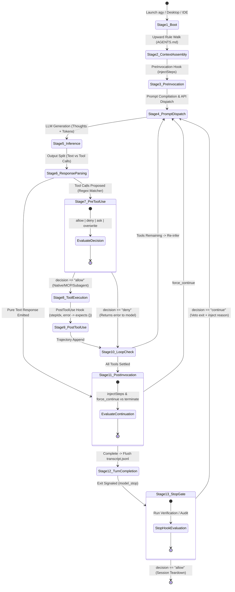

# AntiOS Research 2: Antigravity Execution Primitives & Lifecycle Reality

**Status:** Canonical Master Monograph  
**Research Phase:** AntiOS Research 2 — Execution Primitives & Lifecycle Reality  
**Author:** Antigravity Pairing Agent  
**Repository:** `naksh-07/AntiOS`  
**Evidence Standard:** `[OFFICIAL]` Upstream Docs/SDK, `[OBSERVED]` Runtime Harness (`test_lifecycle_primitives.py`), `[EXTERNAL_REPORT]` Verified Public GitHub Issues/Forums, `[INFERRED]` Deductive Architectural Analysis, `[HYPOTHESIS]` Proposed Theoretical Models

---

## 1. Executive Synthesis: The Core Question Answered

> **"What can Antigravity's actual execution lifecycle reliably observe, influence, transform, and enforce?"**

Research 1 overturned the naive assumption that Antigravity maintains an ambient background daemon or passive cognitive memory. It proved that Antigravity is an out-of-process LLM loop driven entirely by ephemeral turns, upward rule walks, and active tool use.

Research 2 now resolves the execution mechanics of this loop. Through rigorous inspection of upstream SDKs, public issue trackers, and our empirical runtime harness (`test_lifecycle_primitives.py`), we establish the following definitive answers:

```
┌──────────────────────────────────────────────────────────────────────────────────┐
│                    THE ANTIGRAVITY EXECUTION REALITY SUMMARY                     │
├───────────────┬──────────────────────────────────────────────────────────────────┤
│ OBSERVE       │ Passively blind during tool execution. PostToolUse receives      │
│               │ ONLY stepIdx and error code. Tool names, arguments, and outputs   │
│               │ must be reconstructed by parsing transcript.jsonl incrementally. │
├───────────────┼──────────────────────────────────────────────────────────────────┤
│ INFLUENCE     │ Dynamically agile via PreInvocation (injectSteps:               │
│               │ ephemeralMessage). Can steer model attention per turn with ZERO │
│               │ permanent token bloat and ZERO compaction pollution.             │
├───────────────┼──────────────────────────────────────────────────────────────────┤
│ TRANSFORM     │ Partially malleable via PreToolUse overwrite. Can perform        │
│               │ shallow top-level merges on tool arguments, but replaces nested   │
│               │ objects wholesale.                                               │
├───────────────┼──────────────────────────────────────────────────────────────────┤
│ ENFORCE       │ Asymmetrically deterministic:                                    │
│               │ - PreToolUse deterministically blocks native tools (deny).       │
│               │ - String regex CANNOT deterministically block shell writes      │
│               │   via run_command (The Shell Redirection Problem).               │
│               │ - Stop hook deterministically blocks session exit (continue).    │
│               │   True file protection is enforced at Stop Gate via Git diff!    │
└───────────────┴──────────────────────────────────────────────────────────────────┘
```

---

## 2. Complete Execution Lifecycle State Machine

The end-to-end execution loop of Antigravity transitions through thirteen distinct operational stages:



---

## 3. The Canonical Hook Specification Matrix

| Hook Name | Trigger Point | Matcher Regex? | Input Fields on `stdin` | Output Fields on `stdout` | Native Failure Mode | AntiOS 2.0 Status |
|---|---|---|---|---|---|---|
| **`PreInvocation`** | Immediately prior to LLM inference call | No | `invocationNum`, `initialNumSteps`, metadata | `injectSteps`: `ephemeralMessage`, `userMessage`, `toolCall` | **Fail-Open** (logs warning, turn proceeds) | Unregistered (Available for Dynamic Steering) |
| **`PreToolUse`** | Prior to physical tool execution | **Yes** (e.g. `run_command\|write_to_file`) | `toolCall` (`name`, `args`), `stepIdx`, metadata | `decision` (`allow`, `deny`, `ask`, `force_ask`), `overwrite`, `reason` | **FAIL-CLOSED** (Empty `{}` or crash $\rightarrow$ `invalid_args` deny all) | **Registered** (`pre_tool_guard.py`) |
| **`PostToolUse`** | Immediately following tool execution | **Yes** (e.g. `*`) | `stepIdx`, `error`, metadata (**NO toolName, NO args, NO result**) | **Strictly `{}`** (Must be empty JSON) | **Fail-Closed** (non-empty output fails step) | **NOT REGISTERED** (Telemetry Gap) |
| **`PostInvocation`** | After tool resolution settlement | No | `invocationNum`, `initialNumSteps`, metadata | `injectSteps`, `terminationBehavior` (`force_continue`, `terminate`) | **Fail-Open** (logs warning, proceeds) | Unregistered |
| **`Stop`** | Session termination request | No | `terminationReason`, `error`, `fullyIdle`, metadata | `decision` (`continue`, `allow`), `reason` | **Fail-Open** (Native crash exits) / **Fail-Closed** in Python | **Registered** (`stop_gate.py`) |

---

## 4. In-Depth Component Analysis

### 4.1 PreInvocation & Dynamic Injection Reality
- `[OFFICIAL]` `hooks.md:L238-278` defines `injectSteps`.
- **`ephemeralMessage`**: Placed into the active turn context immediately before model reasoning. Discarded at the end of the turn; **never written to `transcript.jsonl` or SQLite DBs**. Consumes prompt tokens only during that single turn. Immune to context compaction summarization.
- **`userMessage`**: Appended as a durable synthetic user turn. Persists across all future turns until compaction.
- **`toolCall`**: Appended as a synthetic tool step.

### 4.2 PostInvocation & Loop Continuation
- `[OFFICIAL]` `hooks.md:L284-285` introduces `terminationBehavior: "force_continue" | "terminate"`.
- Enables out-of-band feedback loops to force the agent back into reasoning even if the model generated a text response, but lacks the veto authority of the `Stop` hook.

### 4.3 PostToolUse & The Telemetry Reconstruction Requirement
- `[OBSERVED]` & `[OFFICIAL]` `hooks.md:L223-230`: `PostToolUse` input contains ONLY `stepIdx`, optional `error`, and session metadata.
- **The Blindspot**: The hook payload **omits `toolName`, `args`, and `result`**.
- **The Solution**: An external telemetry observer cannot act as an inline pipe. It must open `transcriptPath` (`transcript.jsonl`) and parse line `stepIdx` to reconstruct what occurred.

### 4.4 PreToolUse & The Shell Redirection Problem
- `[OFFICIAL]` `PreToolUse` can return `decision: "deny"` to abort tool execution deterministically.
- `[OFFICIAL]` `overwrite` executes a **shallow top-level merge**; nested dictionaries are wiped out.
- **The Shell Bypass Reality** `[OBSERVED]`: Blocking `write_to_file` and `replace_file_content` via regex fails if `run_command` is enabled. In Windows PowerShell alone, there are $>14$ distinct file-write patterns (`Set-Content`, `Out-File`, `>`, `>>`, `[IO.File]::WriteAllText`, `python -c "open('f','w').write(...)"`).
- Regex parsing of shell command strings cannot deterministically protect files without intolerable false positives.
- **Enforcement Conclusion**: True boundary enforcement must occur at the **Stop Gate**, where `git status` and `git diff` physically detect all file mutations regardless of how they were written.

### 4.5 Subagent Lifecycle & Execution Model
- `[OFFICIAL]` Subagents spawned via `invoke_subagent` operate under **Zero Context Inheritance**. They do not see parent history, variables, or chain-of-thought tokens. They inherit only filesystem state, root rules, and workspace hooks.
- `[OBSERVED]` Hooks fire recursively for child subagents, providing child `conversationId` and child `transcriptPath`.
- `[EXTERNAL_REPORT]` (GitHub Issue #569): Subagents currently fail to inherit `call_mcp_tool`, preventing child subagents from autonomously invoking Lazy MCP tools.

### 4.6 Workspace Isolation & Concurrency Safety
- `Workspace='inherit'`: Shares parent directory. High risk of Git index lock collisions (`.git/index.lock`) and file clobbering during concurrent writes. Safe strictly for read-only subagents.
- `Workspace='branch'`: Implemented via native **`git worktree`**. Completely isolates working trees and Git indexes. Safe for parallel code editing.
  - *Known Caveat* `[EXTERNAL_REPORT]` (Forum #137246): Repositories with `extensions.worktreeConfig = true` crash Antigravity with `"run state not found"`.
  - *Cold-Start Caveat*: Untracked directories (`node_modules/`, `.venv/`) are missing from new worktrees.

### 4.7 Hook Failure Semantics & Degraded Operation
- `PreToolUse` is **FAIL-CLOSED** `[OBSERVED]` `[EXTERNAL_REPORT]` (Issue #5358). Returning empty `{}` or invalid schema produces `invalid_args` and denies all tools.
- `Stop` natively fails open on script crash/timeout, but AntiOS engineers **FAIL-CLOSED** behavior by wrapping script execution in top-level `try...except` and returning `{"decision": "continue"}` on internal errors.
- Hook timeout defaults to 30 seconds. Heavy verification suites must override this via `"timeout": 120`.

---

## 5. Platform & Environment Compatibility Matrix

| Capability / Attribute | Antigravity CLI (`agy`) | Antigravity 2.0 (Desktop) | Antigravity IDE (VS Code-based) |
|---|---|---|---|
| **Hook Surface Parity** | Complete & Stable | Complete & Stable (Modal UIs) | Stable, but intermittent reports on Windows (Forum #176814) |
| **Windows Shell Wrapper** | `cmd /c <command>` | `cmd /c <command>` | `cmd /c <command>` |
| **Console Window Flashing** | Headless / Terminal | Minimized | **Flashes black console on every hook** (Issue #301) |
| **Working Directory (`cwd`)** | `.agents/` | `.agents/` | `.agents/` |
| **Subagent Concurrency** | Fully supported | Fully supported | Fully supported |
| **Workspace `branch` Mode** | Native Git worktree | Native Git worktree | Native Git worktree |
| **MCP Inheritance Bug (#569)** | Present | Present | Present |

---

## 6. Current AntiOS Implementation Reality Check

The table below contrasts theoretical AntiOS architectural assumptions against physical runtime realities discovered in Research 2:

| AntiOS Architectural Assumption | Antigravity Runtime Reality | Evidence | Alignment Verdict | Remediation Path |
|---|---|---|---|---|
| **"AntiOS continuously records sessions, turns, and tool calls into `experience.db` via background hooks."** | `.agents/hooks.json` registers ONLY `PreToolUse` and `Stop`. `PostToolUse` is **NOT REGISTERED**. `telemetry_bridge.py` is defaulted to `OFF`. Experience DB is completely idle during sessions. | `[OBSERVED]` `.agents/hooks.json`, `telemetry_bridge.py` | **CRITICAL GAP (False Assumption)** | Register `PostToolUse` in `hooks.json` or ingest `transcript.jsonl` post-session. |
| **"PostToolUse hook receives tool execution results and streams them to SQLite."** | `PostToolUse` receives ONLY `stepIdx` and `error` on `stdin`. Tool name, args, and stdout/stderr are **omitted**. | `[OFFICIAL]` `hooks.md:L223`, `[OBSERVED]` | **STRUCTURAL GAP (Blindspot)** | Hook must read `transcriptPath` at line `stepIdx` to extract tool execution data. |
| **"PreToolUse guard prevents unauthorized file edits by regex-matching `write_to_file|replace_file_content`."** | Any write can be trivially bypassed via `run_command` in PowerShell (`Set-Content`, `>`, `Out-File`, Python). | `[OBSERVED]` `test_lifecycle_primitives.py` | **SECURITY GAP (Partial Illusion)** | Demote PreToolUse to heuristic warning; enforce true file invariants at Stop Gate via Git diff. |
| **"Stop Gate physically halts session completion if tests fail."** | `Stop` hook returning `{"decision": "continue", "reason": "..."}` cleanly aborts exit and forces agent to continue fixing. | `[OFFICIAL]` `hooks.md:L305`, `[OBSERVED]` | **VERIFIED (100% Deterministic)** | Keep and strengthen `stop_gate.py` with Git diff boundary checking. |
| **"Subagents share parent memory and can collaborate on shared memory states."** | Subagents possess **Zero Context Inheritance**. They see none of the parent's memory, turns, or thoughts. | `[OFFICIAL]` SDK docs, `[OBSERVED]` | **ARCHITECTURAL CLARITY (By Design)** | Lean into Zero-Inheritance for unbiased Maker-Checker audits. Pass task context strictly via `Prompt`. |
| **"Subagents can autonomously invoke lazy-loaded MCP tools."** | Subagents do not inherit `call_mcp_tool` native dispatcher (GitHub Issue #569). Lazy MCP calls fail. | `[EXTERNAL_REPORT]` Issue #569 | **PLATFORM LIMITATION** | Keep lazy MCP execution in root orchestrator; delegate simple CLI or file tasks to subagents. |
| **"Hooks run with working directory set to workspace root."** | Hook `cwd` is `.agents/`. Relative paths like `python scripts/guard.py` fail immediately. | `[OFFICIAL]` `hooks.md:L126`, `[OBSERVED]` | **OPERATIONAL TRAP** | All hook scripts must dynamically resolve workspace root via `Path(__file__).resolve().parent.parent`. |

---

## 7. The Definitive Antigravity Execution Boundary

Based on our empirical and official findings, we divide Antigravity's capabilities into five deterministic operational tiers:

```
┌────────────────────────────────────────────────────────────────────────┐
│             THE 5-TIER ANTIGRAVITY EXECUTION BOUNDARY                  │
├────────────────────────────────────────────────────────────────────────┤
│ TIER 1: DETERMINISTIC HARD GATES (100% Enforceable)                    │
│ - PreToolUse blocking of native tools (write_to_file, invoke_subagent) │
│ - Stop hook veto of session exit (decision: "continue")                │
│ - Git status / Git diff boundary audits at Stop Gate                   │
│ - Subagent tool pruning (running subagents with enable_write_tools: 0) │
├────────────────────────────────────────────────────────────────────────┤
│ TIER 2: DETERMINISTIC INPUT TRANSFORMATION (100% Reliable)             │
│ - PreInvocation dynamic prompt injection (injectSteps: ephemeralMsg)   │
│ - Shallow top-level tool argument replacement (overwrite)              │
│ - Subagent prompt framing via invoke_subagent Prompt argument          │
├────────────────────────────────────────────────────────────────────────┤
│ TIER 3: PROGRAMMATIC OBSERVABILITY (Requires Transcript Assembly)      │
│ - Incremental parsing of transcript.jsonl at stepIdx                   │
│ - Subagent transcript tree indexing via conversationId                 │
│ - Git working tree state interrogation (status, diff)                  │
├────────────────────────────────────────────────────────────────────────┤
│ TIER 4: HEURISTIC / PROBABILISTIC INTERVENTIONS (Non-Deterministic)    │
│ - Regex inspection of run_command shell strings                        │
│ - Natural language steering instructions in GEMINI.md / AGENTS.md      │
│ - PostInvocation force_continue without hard validation assertions     │
├────────────────────────────────────────────────────────────────────────┤
│ TIER 5: PHYSICALLY IMPOSSIBLE / UNSUPPORTED CAPABILITIES               │
│ - Subagent inheritance of parent in-memory conversation history        │
│ - Deep-merging nested tool arguments in PreToolUse overwrite           │
│ - Receiving raw tool stdout/stderr on PostToolUse stdin                │
│ - Preventing shell file writes via write_to_file regex matchers        │
│ - Lazy MCP tool dispatch inside child subagents (Issue #569)           │
└────────────────────────────────────────────────────────────────────────┘
```

---

## 8. Strategic Bridge to Research 3

Research 2 has established the hard physics of Antigravity's execution loop. We now know exactly where deterministic control exists, where it fails, and where observability must be constructed.

This directly generates the core research questions for **AntiOS Research 3: Telemetry, Observability & Learning Reality**:

1. **How should AntiOS ingest `transcript.jsonl` without causing disk I/O bottlenecks or race conditions?**
2. **What is the exact JSON structure of `transcript.jsonl` across native tools, MCP tools, and subagents?**
3. **How can the Maker-Checker verification ledger be durably recorded if `PostToolUse` cannot modify trajectory state?**
4. **How can local learning (`experience.db`) be indexed and queried to feed `PreInvocation` ephemeral steering without exceeding turn latency limits (<100ms)?**

---

## 9. Conclusion

AntiOS cannot enforce security or engineering discipline by pretending Antigravity is a daemon with ambient cognitive monitoring. Antigravity is an out-of-process LLM loop with strict, synchronous interception contracts.

By aligning AntiOS architecture with these physical primitives—utilizing `PreInvocation` for ephemeral steering, `PreToolUse` for native tool gates, `Stop` for physical Git-level verification, and `transcript.jsonl` for observability—AntiOS 2.0 achieves authentic, unshakeable engineering governance.
